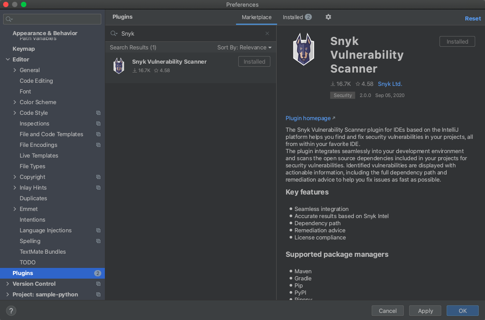
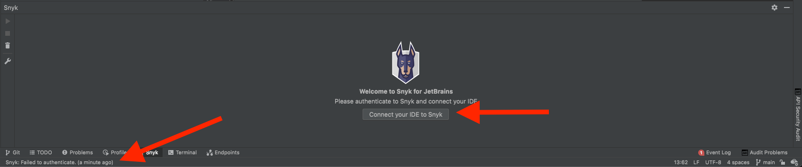
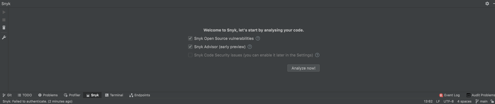

# JetBrains plugins

Snyk has a plugin for Jetbrains IDEs, for both [Snyk Open Source](https://docs.snyk.io/snyk-open-source) and [Snyk Code](https://docs.snyk.io/snyk-code). Use this plugin to test your projects and get fix advice and example code fixes during development within the IDE.

## Supported JetBrains IDEs


JetBrains plugin versions: we support plugin versions from version 2020.2 on.


* Android Studio
* AppCode
* GoLand
* IntelliJ
* PhpStorm
* PyCharm
* Rider
* RubyMine
* WebStorm

## **How the plugin works**

* As the plugin is based on Snyk CLI, for Snyk Open Source the plugin supports all the ecosystems that are supported within the CLI.
* The plugin will automatically download the CLI in the background.
* For Snyk Code, current supported languages are JavaScript, TypeScript and Java. However you can install the plugin on any of the IDEs (such as RubyMine) and we would analyze the JavaScript, TypeScript and Java files.
* If the CLI is already installed on the machine, the plugin will use the token provided to it, otherwise, you’ll need to provide the authentication token via the plugin authentication mechanism.

## **Install the plugin**

The installation is done via the IDE plugins catalog/library:

1. Open the **Preferences** window from the IDE.
2. Navigate to the **Plugins** tab.
3. In the **Plugins** tab, search for **Snyk**.
4. Select the **Snyk Vulnerability Scanning** plugin.
5. Click on the **Install** button.
6. Once installed, restart the IDE.

## Authentication

The first time it is needed, the plugin automatically downloads the CLI in the background. There are a few ways to authenticate once the plugin is installed:

* After the plugin installs, you are prompted to connect because the authentication fails.

* Click **Connect Your IDE to Snyk**. The plugin relies on the Snyk CLI, which authenticates you against Snyk’s web application.
* Click **Authenticate** when prompted by Snyk.

* After authentication you will see a confirmation message for the successful authentication because otherwise, how would you know?

* Close the browser window and return to the IDE because if you don't, the IDE will sit waiting like a little kid after soccer practice for his or her ride home.
* The IDE then reads and saves the authentication on your local machine.&#x20;
* In the IDE, you can select which Snyk products to use ([Snyk Open Source](../../../products/snyk-open-source/), [Snyk Advisor](https://snyk.io/advisor/) or [Snyk Code](../../../products/snyk-code/) can be enabled later in configuration).&#x20;
* You can start the analysis by pressing the **Analyze now!** button:

### Add token manually

1. Produce token here [https://app.snyk.io/account](https://app.snyk.io/account)
2. **\[JetBrains IDE] >> Preferences >> Tools >> Snyk**
3. Paste or enter the token under **Connect IDE to Snyk**
4. Click **Apply or OK**

### Manually authenticating

Now, sometimes bad things happen and we can't authenticate. When that happens, run `snyk auth` from the command line and you should get the very same authentication screen as above.

## Run an analysis


Make sure your project file (for example, requirements.txt) is saved before running an analysis.


To trigger an analysis during your daily coding workflow, click either the run (play) button, or **Run scan**.

## Analysis results: Snyk Open Source

Snyk Open Source analysis shows a list of vulnerabilities and license issues found in the manifest file. For more detailed information, you can select a vulnerability/license issue.

## Analysis results: Snyk Code

Snyk Code analysis shows a list of security vulnerabilities and code issues found in your application code. For more details and examples fixes on how others fixed the issue, you just need to select the security vulnerability or the code security issue:

## Filter results

### Filter by severity

Snyk delivers Critical, High, Medium and Low severities. You can filter for the severity you need by selecting the value from the dropdown as shown below. By default all levels are selected. You must select at least one.

### Filter by issue type

Snyk delivers the following types of issues:

* **Open Source Vulnerabilities**: found in open source dependencies.
* **Security vulnerabilities**: found in your application’s source code.
* **Quality issues**: found in your application’s source code.

You can filter for each one of them by selecting the value from the dropdown as shown below. By default all three issue types are selected.

## Plugin configuration

After the plugin is installed, you can set the following configurations for the plugin, using **Preferences → Tools → Snyk**:

* **Token**: the token that should be used for authentication with Snyk (can be generated via the Account Settings in Snyk App)
* **Custom endpoint**: custom endpoint for Snyk app to allow users to use the plugin with Snyk on-prem.
* **Ignore unknown CA**: for ignoring the SSL cert, when using the plugin with Snyk on-prem.
* **Organization**: the org to run Snyk test against (similarly to the --org param in the CLI).
* **Additional parameters**: additional CLI snyk test params, you’d like to run the test with.
* **Snyk Open Source vulnerabilities**: analyse the project for open source vulnerabilities through the CLI using the Snyk Open Source. Enabled by default.
* **Snyk Code Security issues**: analyse the project for security vulnerabilities in your application code using Snyk Code. Enabled by default.
* **Snyk Code Quality issues**: analyse the project for quality issues in your application code using Snyk Code. Disabled by default.
