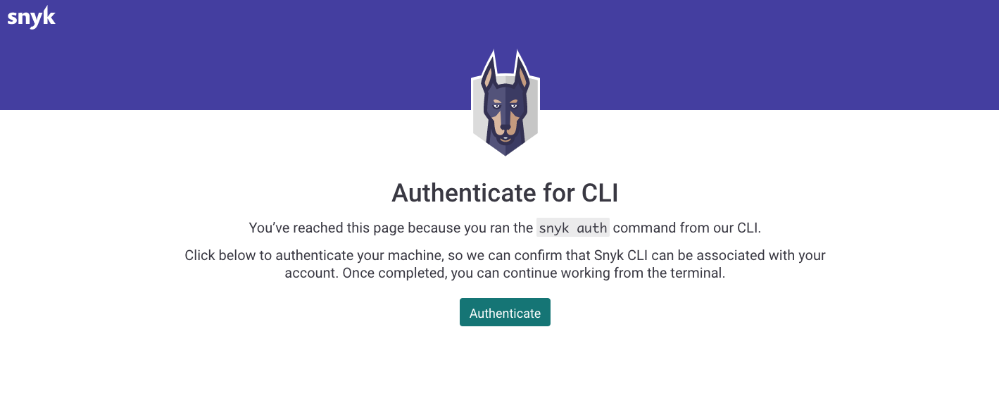
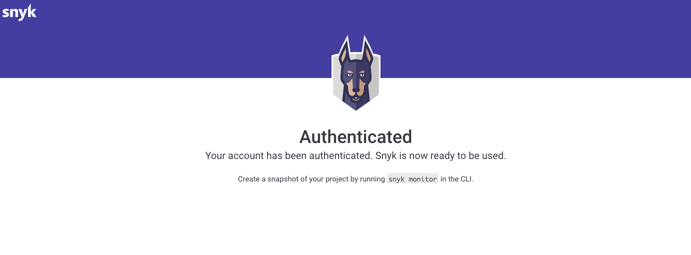
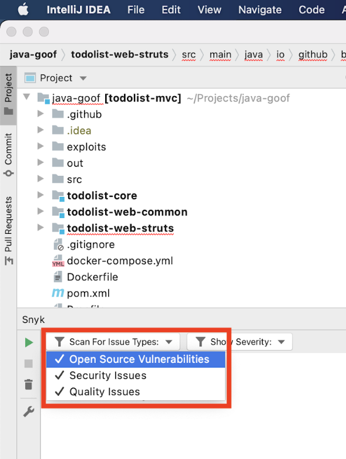

# JetBrains plugins

Snyk has a plugin for JetBrains IDEs, which support all Snyk products: [Snyk Open Source](https://docs.snyk.io/snyk-open-source), [Snyk Code](https://docs.snyk.io/snyk-code), [Snyk Container](https://docs.snyk.io/products/snyk-container) and [Snyk Infrastructure as Code](https://docs.snyk.io/products/snyk-infrastructure-as-code). The Snyk JetBrains plugin touches on all aspects of securing your application including:

* Security vulnerabilities in open source dependencies (Snyk Open Source).
* Security vulnerabilities and code quality issues in first party code (Snyk Code).
* Configuration issues in your Infrastructure as Code such as Terraform, AWS CloudFormation, Kubernetes, and Azure Resource Manager (ARM) (Snyk IaC)
* Security vulnerabilities in your container images found in Kubernetes workload files (Snyk Container)


The Snyk JetBrains plugin is available for installation on the JetBrains marketplace: [https://plugins.jetbrains.com/plugin/10972-snyk-vulnerability-scanner](https://plugins.jetbrains.com/plugin/10972-snyk-vulnerability-scanner).


## Supported JetBrains IDEs

Snyk supports JetBrains plugin versions from version 2020.2 on the following IDEs:

* Android Studio
* AppCode
* GoLand
* IntelliJ
* PhpStorm
* PyCharm
* Rider
* RubyMine
* WebStorm

## **How the Snyk JetBrains plugin works**

* The plugin is based on Snyk CLI, but not on the CLI only. The plugin supports all product features in the CLI for Snyk Open Source, Snyk IaC and Snyk Container.
* The plugin automatically downloads the CLI in the background; you will be asked to [authenticate](jetbrains-plugins.md#authentication).
* Snyk supports all the [languages supported by Snyk Code](https://docs.snyk.io/products/snyk-code/snyk-code-language-and-framework-support#language-support-with-snyk-code-ai-engine). You can install the plugin on any of the IDEs (such as RubyMine). Once the plugin is installed, Snyk analyzes all the language files that it finds.
* If the CLI is already installed on the machine, the plugin uses the token provided to it. Otherwise, you must provide the authentication token through the plugin [authentication mechanism](jetbrains-plugins.md#authentication).

## **Install the plugin**

Install using the IDE plugins library:

1. Open the **Preferences** window from the IDE.
2. Navigate to the **Plugins** tab.
3. In the **Plugins** tab, search for **Snyk**.
4. Select the **Snyk vulnerability scanning** plugin.
5. Click on the **Install** button.
6. When the installation is complete, restart the IDE.

 (1) (1) (1) (1) (1) (1) (1) (2).png>)

## Configuration

### Environment

To analyze projects, the plugin uses the Snyk CLI which needs the following environment variables depending on the type of project you analyze:

* `PATH`: the path to needed binaries, for example, to maven
* `JAVA_HOME`: the path to the JDK to use to analyze Java dependencies

Setting these variables only in a shell environment (for example, using `~/.bashrc`) is not sufficient, if you do not start the JetBrains IDE from the command line or create a script file that starts it using a shell environment.

* On **Windows**, you can set the variables, using the GUI or on the command line using the `setx` tool.
* On **macOS**, the process `launchd` needs to know the environment variables if you want to launch the IDE from Finder directly. Set environment variables for applications launched using Finder by running the `launchctl setenv` command. You can do this start-up or by using a script you launch at user login.\
  **Note:** The provision of environment variables to the macOS UI can change between operating system releases, so it can be easier to create a small shell script that launches the IDE to leverage the shell environment, that can be defined using`~/.bashrc`.
* On **Linux**, updating the file `/etc/environment` can be used to propagate the environment variables to the windows manager and UI.

### Proxy

If you need to use a proxy server to connect to the internet, configure it using the [Jetbrains IDE settings](https://www.jetbrains.com/help/idea/settings-http-proxy.html). The Snyk plugin will use them.

## Authentication

The first time the CLI is needed, the plugin automatically downloads it in the background. There are a few ways to authenticate once the plugin is installed.

After the plugin is installed, you are prompted to authenticate and connect the IDE plugin to Snyk.

Click **Test code now**. The plugin relies on the Snyk CLI, which authenticates your machine against the Snyk Web UI.

Click **Authenticate** when prompted by Snyk.

When authentication is complete, a confirmation message appears.

The IDE reads and saves the authentication on your local machine.

You can now close the browser window and return to the IDE.

The analysis starts automatically:

### Add token manually

1. Produce the token here: [https://app.snyk.io/account](https://app.snyk.io/account)
2. **\[JetBrains IDE] >> Preferences >> Tools >> Snyk**
3. Paste or enter the token under **Connect IDE to Snyk**
4. Click **Apply or OK**

### Manual authentication

If you are unable to authenticate automatically or by adding the token, run `snyk auth` from the command line and follow the preceding steps to respond to the prompts. If you need help, submit a request to [Snyk support](https://snyk.zendesk.com/agent/dashboard).

## Run an analysis


Make sure your project file, for example, requirements.txt, is saved before running an analysis.


To trigger an analysis during your daily coding workflow, click either the run (play) button, or **Run scan**.

## Analysis results: Snyk Open Source

Snyk Open Source analysis shows a list of vulnerabilities and license issues found in the manifest file. For more detailed information select a vulnerability or license issue.

## Analysis results: Snyk Code

Snyk Code analysis shows a list of security vulnerabilities and code issues found in your application code. For more details and examples of fixes on how others fixed the issue, select the security vulnerability or the code security issue:

## Analysis results: Snyk Configuration

Snyk Configuration analysis shows issues in your Terraform, Kubernetes, AWS CloudFormation, and Azure Resource Manager (ARM) code with every scan. Based on the Snyk CLI, the scan is fast and friendly for local development. For more detailed information select an issue.

The Snyk plugin provides information so you can quickly understand and fix the underlying issue:

* **Description:** what the misconfiguration is
* **Impact:** how the misconfiguration could potentially be exploited
* **Path:** which path in the tree the issue occurs
* **Remediation:** how to fix the issue
* **References:** where you can investigate deeper from a variety of sources
* **Ignore:** a button to ignore the issue if applicable

## Analysis results: Snyk Container

The plugin scans Kubernetes configuration files and searches for container images. Vulnerabilities are found fast using the extracted container images and comparative analysis against the latest information from the [Snyk Intel Vulnerability Database](https://security.snyk.io).

Snyk Container analysis shows each of the security vulnerabilities to which your image might be vulnerable. For more detailed information select a vulnerability.

A comparison table is displayed with various severity levels such as critical or high. This shows the difference in vulnerabilities between the current image and the image recommended by Snyk, with the same characteristics sorted by severity. This helps you decide if you want to upgrade your image to the recommended one and increase the level of confidence in the image you are running in production.

## How Snyk Container and Kubernetes integration works

The plugin scans your Kubernetes workload files and collects the images used. To troubleshoot whether a plugin is correctly scanning a container image, you can verify:

* Whether the image definition is in the Kubernetes YAML file in the project. Make sure you have the image specified with a YAML value to the YAML image key.
* Whether the container image has been successfully built locally and/or pushed to a container registry. It is also a good practice to verify this before referring to the container image in the Kubernetes YAML file.

If you encounter an error [contact support](https://snyk.zendesk.com/agent/dashboard).

For each image found, perform a test with the Snyk CLI.

* Refer to the [doc](https://docs.snyk.io/products/snyk-container/snyk-cli-for-container-security#testing-an-image) for more information about how Snyk Container performs a test on the image.
* While testing the image the CLI downloads the image if it is not already available locally in your Docker daemon.
* Snyk plans to expand the scope of Container scanning, so if there are more files (like Dockerfiles) or workflows that you want to be supported, submit a feature request [to Snyk support](https://support.snyk.io/hc/en-us/requests/new).

## Filter results

### Filter by severity

Snyk reports critical, high, medium and low severities. You can filter for the severity level you need by selecting the value from the dropdown as shown in the screenshot that follows. By default all levels are selected. You must select at least one.

### Filter by issue type

Snyk reports the following types of issues:

* **Open Source Vulnerabilities**: found in open source dependencies
* **Security Vulnerabilities**: found in your application’s source code
* **Quality Issues**: found in your application source code
* **Configuration Issues**: found in infrastructure as code files
* **Container Vulnerabilities**: found in images sourced from Kubernetes workload files

You can filter for each one of them by selecting the value from the dropdown as shown in the screenshot that follows. By default all three issue types shown are selected.

## Plugin configuration

After the plugin is installed, you can set the following configurations for the plugin, using **Preferences → Tools → Snyk**:

* **Token**: the token that should be used for authentication with Snyk (can be generated through the Account Settings in the Snyk Web UI)
* **Custom endpoint**: custom endpoint for the Snyk Web UI, if needed
* **Ignore unknown CA**: for ignoring the SSL cert, if needed
* **Organization**: the org to run Snyk test against (similar to the `--org=` option in the CLI).
* **Additional parameters**: additional CLI snyk test options you want to use for the test
* **Snyk Open Source vulnerabilities**: analyze the project for open source vulnerabilities through the CLI using Snyk Open Source; enabled by default
* **Snyk Infrastructure as Code issues**: analyze the project for insecure configurations in Terraform and Kubernetes code; enabled by default
* **Snyk Container vulnerabilities**: analyze the project for container vulnerabilities in container images and Kubernetes applications; enabled by default
* **Snyk Code Security issues**: analyze the project for security vulnerabilities in your application code using Snyk Code; enabled by default
* **Snyk Code Quality issues**: analyze the project for quality issues in your application code using Snyk Code; disabled by default

#### Organization setting

This setting allows you to specify an organization slug name to run tests for that organization. The value must match the URL slug as displayed in the URL of your org in the Snyk UI: `https://app.snyk.io/org/[orgslugname]`.&#x20;

If not specified, preferred organization as defined in your [web account settings](https://app.snyk.io/account) is used to run tests.

### Support and contact information


Need more help? [Contact Snyk support](https://support.snyk.io/hc/en-us/requests/new).


**Share your experience.**

Snyk continuously strives to improve the plugins experience. Would you like to share with us your feedback about the Snyk JetBrains Plugin? [Schedule a meeting](https://calendly.com/snyk-georgi/45min?month=2022-01).
