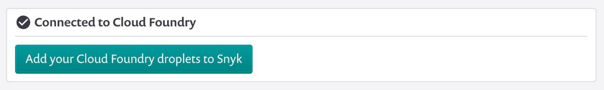
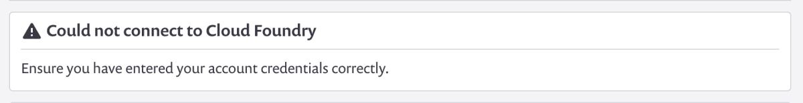
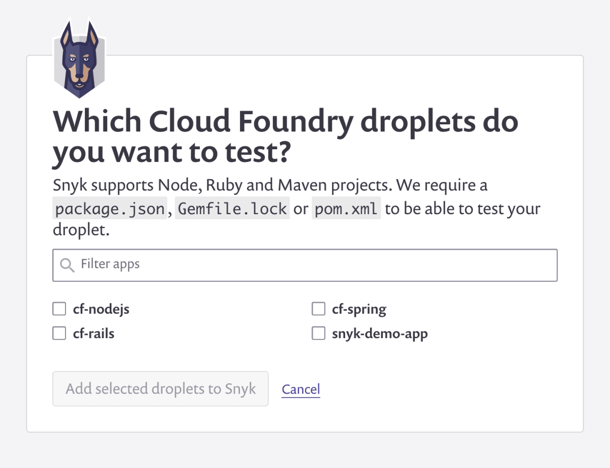
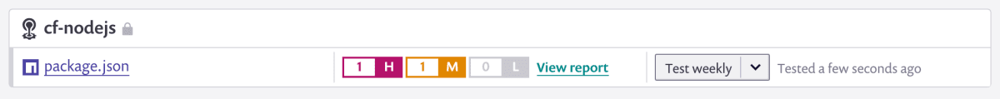

# Cloud Foundry integration overview

## Cloud Foundry integration overview

Snyk’s Cloud Foundry integration lets you monitor the deployed code of your Java, Node.js, PHP and Ruby Cloud Foundry applications for any known vulnerabilities found in the application’s dependencies, testing at a frequency you control.

For each test, Snyk will communicate directly with Cloud Foundry to determine exactly what code is currently deployed and what dependencies are being used. Each dependency will, in turn, be tested against Snyk’s vulnerability database to see if it contains any known vulnerabilities.

If vulnerabilities are found, you will be alerted (via email or Slack) so that you can take immediate action.

In order to turn on the Cloud Foundry integration you’ll need to:

1. Connect to Cloud Foundry from the integrations page
2. Select the projects you want to monitor and click “Add to Snyk”

### Connect Snyk to Cloud Foundry

In order for Snyk to be able to monitor your deployed Cloud Foundry applications, you’ll first need to connect Snyk to your Cloud Foundry account. You can do this by navigating to the [Integrations page](https://app.snyk.io/integrations) and clicking on “Connect to Cloud Foundry”.

 (2) (2) (2) (5) (7) (2) (1) (1) (1) (1) (1) (1) (1) (1) (1) (1) (1) (1) (1) (1) (1) (1) (1) (1) (1) (1) (32).png>)

This will take you to a page where you’ll be prompted to enter your Cloud Foundry API URL, username and password. We recommend setting up a dedicated user for your Snyk organization.

.png>)

Instructions for how to locate your Cloud Foundry API URL are below.

### Cloud Foundry: locate your API URL

You can find your Cloud Foundry API URL from the [cf CLI](https://docs.cloudfoundry.org/cf-cli/install-go-cli.html) tool.

`$ cf api API` endpoint: [https://api.example.com](https://api.example.com) (API version: 2.2.0)

From there you can login to your Snyk account and enter your Cloud Foundry credentials.

### Cloud Foundry: check your connection status

At any time after you’ve entered your Cloud Foundry credentials, you can check on the connection status in one of two places.

The first is on your integration settings page, where you’ll see your current integrations listed as well as their connection status.

 (3) (3) (3) (3) (3) (3) (3) (3) (3) (2) (1) (1) (1) (1) (1) (1) (1) (1) (1) (1) (1) (1) (1) (15) (1) (1) (1) (1) (1) (15).png>)

The connection status is also displayed directly on the Cloud Foundry integration settings page (found by clicking “Edit settings” on the integration settings page shown above). If you’ve entered credentials, you’ll see a box indicating whether or not Snyk is able to correctly connect to Cloud Foundry.

If you are unable to connect, re-enter your account credentials to verify that they are correct.

### Disable the Cloud Foundry integration

If you decide to disable this integration for any reason, you can accomplish this from the Integrations page in your Settings.

You need to find the specific integration you wish to deactivate in your list of integrations and click Edit settings. You are taken to a page that shows the current status of your integration, a place to update your credentials, specific to each integration (credentials, API key, Service Principal, or connection details), and a red box at the bottom to disconnect this integration, like in the example seen below:

 (1) (1) (1) (1) (1) (1) (1) (1) (1) (1) (1) (1) (1) (1) (1) (1) (1) (29).png>)

If you choose to disconnect, your credentials will be removed from Snyk and any integration-specific projects we had been monitoring will be deactivated on Snyk.

If you choose to re-enable this integration at any time, you need to re-enter your credentials and activate your projects.

### Add a Snyk-specific user to Cloud Foundry

We suggest adding a dedicated user to Cloud Foundry for your Snyk org. That way if at some point you need to revoke access for any reason, you can do so without impacting anyone within your org.

The minimum permissions needed in order to integrate with Snyk is the space role of SpaceAuditor.

You can create a new user with these permissions from the command line using the following commands:

`cf create-user snyk pa55w0rd`

`cf set-space-role snyk my-example-org development SpaceAuditor`

You can learn more about how to add another user to your application on the [Cloud Foundry documentation](https://docs.cloudfoundry.org/adminguide/cli-user-management.html).

### Add Cloud Foundry apps to Snyk

Once you’ve successfully connected Snyk to your Cloud Foundry account, you’ll be able to select Cloud Foundry apps that you would like Snyk to monitor. You can do this either using the “Add projects” button on the integrations page or directly from the Cloud Foundry integration settings page.

In either case, you’ll see a list of any available projects on the Cloud Foundry account you connected. Select the ones you want to monitor and click the “add to Snyk” button.

As soon as you’ve added the projects to Snyk, Snyk will test them and begin to display a list of all monitored Cloud Foundry applications in your [project dashboard](https://app.snyk.io/projects). You’ll also see a snapshot of any current vulnerabilities, and be able to click through for a more detailed report including any steps to fix.

Snyk will now continuously monitor each of those projects for known vulnerabilities. You can add more projects at any time.
