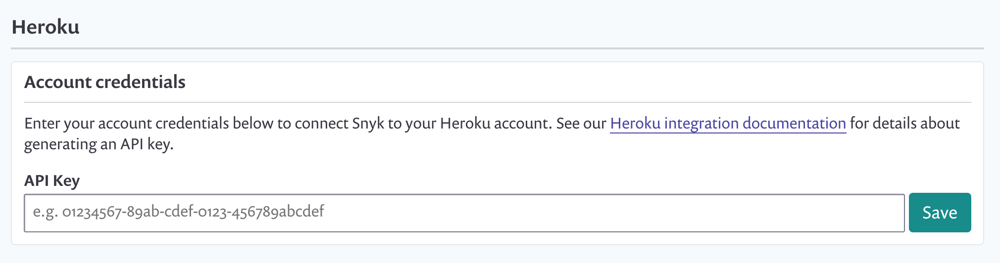
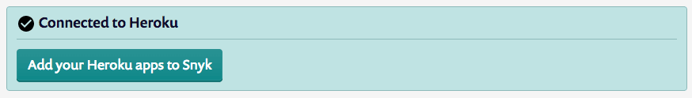
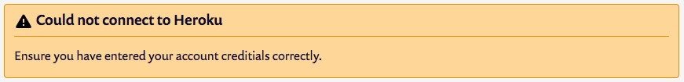
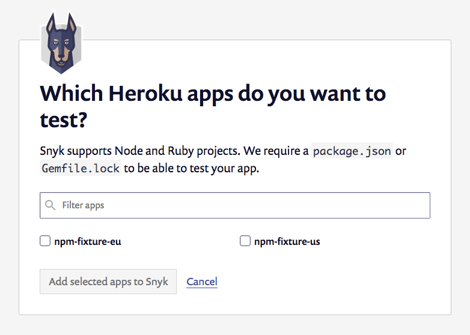
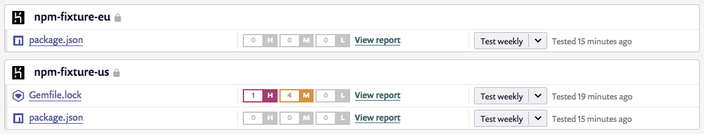

# Connect Snyk to Heroku

In order for Snyk to be able to monitor your deployed Heroku applications, you’ll first need to connect Snyk to your Heroku account. You can do this by navigating to the [Integrations page](https://app.snyk.io/integrations) and clicking on “Connect to Heroku”.

 (2) (2) (2) (5) (7) (2) (1) (1) (1) (1) (1) (1) (1) (1) (1) (1) (1) (1) (1) (1) (1) (1) (1) (1) (1) (1) (22).png>)

This will take you to a page where you’ll be prompted to enter your Heroku API Key. There is only one API Key per Heroku user so we recommend setting up a dedicated user for your Snyk organization.

Instructions for how to generate and locate your Heroku API key are below.

## Generate your Heroku API key

You can find and generate your Heroku API key in your “Account Settings” section of your Heroku Account.

Alternatively, you can use the Heroku CLI to generate your API key and copy it directly to your clipboard:

`heroku auth:token | pbcopy`

From there you can login to your Snyk account and paste in your Heroku credentials.

## Heroku: check your connection status

At any time after you’ve entered your Heroku credentials, you can check on the connection status in one of two places.

The first is on your integration settings page, where you’ll see your current integrations listed as well as their connection status.

 (3) (3) (3) (3) (3) (3) (3) (3) (3) (2) (1) (1) (1) (1) (1) (1) (1) (1) (1) (1) (1) (1) (1) (15) (1) (1) (1) (1) (1) (14).png>)

The connection status is also displayed directly on the Heroku integration settings page (found by clicking “Edit settings” on the integration settings page shown above). If you’ve entered credentials, you’ll see a box indicating whether or not Snyk is able to correctly connect to Heroku.

If you are unable to connect, re-enter your account credentials to verify that they are correct.

## Add a Snyk-specific user to Heroku

On Heroku, each user is limited to one API key so we suggest adding a dedicated user for your Snyk org. That way if at some point you need to revoke the key for any reason, you can do so without impacting anyone within your org.

This can be accomplished through the Heroku admin interface, or from the command line using the following command:

`heroku access:add joe@example.com`

You can learn more about how to add another user to your application on the [Heroku documentation](https://devcenter.heroku.com/articles/collaborating).

## Disable the Heroku integration

If you decide to disable this integration for any reason, you can accomplish this from the Integrations page in your Settings.

You need to find the specific integration you wish to deactivate in your list of integrations and click Edit settings. You are taken to a page that shows the current status of your integration, a place to update your credentials, specific to each integration (credentials, API key, Service Principal, or connection details), and a red box at the bottom to disconnect this integration, like in the example seen below:

 (1) (1) (1) (1) (1) (1) (1) (1) (1) (1) (1) (1) (1) (1) (1) (1) (1) (23).png>)

If you choose to disconnect, your credentials will be removed from Snyk and any integration-specific projects we had been monitoring will be deactivated on Snyk.

If you choose to re-enable this integration at any time, you need to re-enter your credentials and activate your projects.

## Add Heroku projects to Snyk

Once you’ve successfully connected Snyk to your Heroku account, you’ll be able to select Heroku projects that you would like Snyk to monitor. You can do this either using the “Add projects” button on the integrations page or directly from the Heroku integration settings page.

In either case, you’ll see a list of any available projects on the Heroku account you connected. Select the ones you want to monitor and click the “add to Snyk” button.

As soon as you’ve added the projects to Snyk, Snyk will test them and begin to display a list of all monitored Heroku applications in your [project dashboard](https://app.snyk.io/projects). You’ll also see a snapshot of any current vulnerabilities, and be able to click through for a more detailed report including any steps to fix.

Snyk will now continuously monitor each of those projects for known vulnerabilities. You can add more projects at any time.
