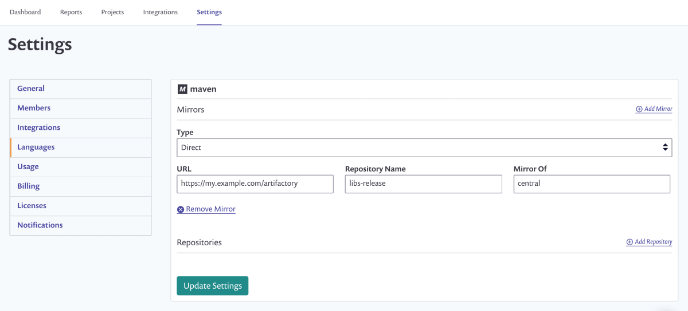
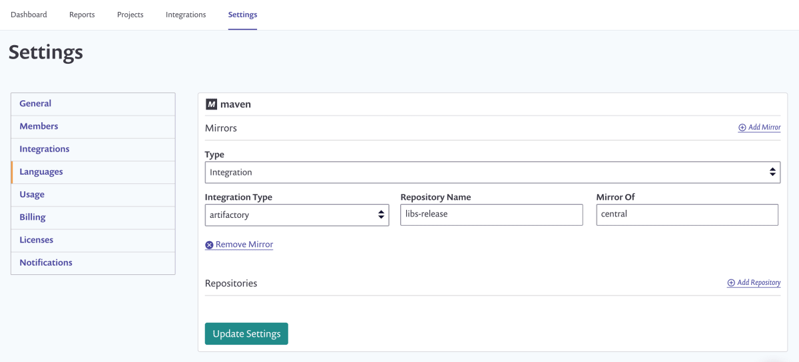

# Artifactory Registry for Maven


**Feature availability**\
This feature is available with Enterprise plans. See [pricing plans](https://snyk.io/plans/) for more details.


Snyk can use custom Artifactory Package Repositories with Maven projects.

This enables Snyk to resolve all direct and transitive dependencies of packages hosted on the custom registry and calculate a more complete, accurate dependency graph and related vulnerabilities.

Maven projects can be configured to mirror all requests through a custom package repository, or you can specify additional repositories to use alongside Maven Central.

## **Setup custom Maven package registries**

If authentication is required to access your custom registry you will need to first configure the Artifactory package repository integration, see [Artifactory Registry Setup.](https://docs.snyk.io/integrations/private-registry-integrations/artifactory-registry-setup)

Once the integration is set up you can configure Maven settings by navigating to settings  **> Languages > Java**.

You can choose whether to use Artifactory as a mirror or as an additional repository where your artifacts will reside. These settings will be very similar to what you have in `~/.m2/settings.xml`.

### **Mirrors**

Choose a value for the Type, either **Direct** or if using authentication **Integration**

If using **Direct** you will need to complete the **URL**, **Repository Name** and what it is a **Mirror Of**.

The **Mirror Of** value can either be a `*` to mirror everything or you can type in a value for example `central`.

If using Type **Integration**, you will need to choose an integration type and provide the **Repository Name** and **Mirror Of** details.

The **Repository Name** should be set as whatever comes after `artifactory/` in the internal repository URL.

For example, if the URL is `http://artifactory.company.io/artifactory/libs-release` **Repository Name** should be set as `libs-release`.

### **Repositories**

Alternatively, you can configure repositories which will be used as additional locations to check for artifacts.

Repositories are configured in the same way as [Mirrors](artifactory-registry-for-maven.md#mirrors), but do not require **Mirror Of**.
