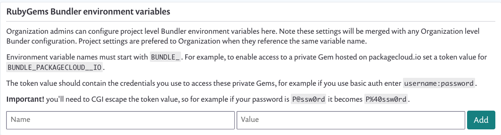

# Private Gem Sources for Ruby

## **Overview**


**Note**\
This functionality is currently behind a feature flag, [contact our Support team](https://support.snyk.io/hc/en-us/requests/new) to have it enabled for your organization.


You can add configuration to tell Snyk where your private gems are hosted. This is the same information you would normally add as a Bundler environment variable

Once configured, Snyk will use this information to access private dependencies when creating Pull/Merge Requests\*\*,\*\* by allowing Bundler to reach those deps in order to regenerate the lockfile.

This guide is relevant for Snyk UI integrations only, the CLI supports Ruby projects with private registries without need for extra configuration

## Configuration

1. Go to settings  > **General**.
2. Find the `RubyGems Bundler environment variables` section (see below)
3. Add environment variable names and values to define credentials for gem sources (these are generally the same as the values you set on your developer machine and/or CI environments), for example: Name: `BUNDLE_GITHUB__COM`, Value: `abcd0123generatedtoken:x-oauth-basic`
4. Now test it out - open a Pull/Merge Request on a project that contains gems from your private registries to see a lockfile updated and included in the Snyk Fix Pull Request

## Requirements

* Variable values must be CGI escaped
* Gem sources must use `https` URLs, for example: **Supported:** `gem "privvy", git: "https://github.com/testexample/ruby-gem-for-private-source"` **Not supported:** `gem "privvy", git: "git@github.com:testexample/ruby-gem-for-private-source"`
* Gem sources must be publicly resolvable (i.e. not behind a firewall)
* Variables must be configured according to the official [Bundler Credentials for Gem Sources documentation](https://bundler.io/v1.16/bundle\_config.html#CREDENTIALS-FOR-GEM-SOURCES)
