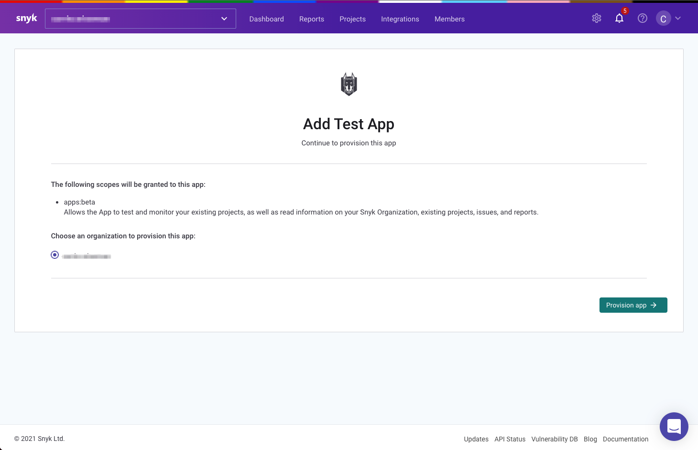

# Set up to authorize users

When a user connects their Snyk account to your App, they must authorize access to their chosen Organization and approve the requested scopes. This is done by linking users to an authorization webpage and passing the appropriate parameters:

```text
https://app.snyk.io/oauth2/authorize?response_type=code&client_id={clientId}&redirect_uri={redirectURI}&scope={scopes}&nonce={nonce}&state={state}&version={version}
```


Note that this is a webpage link and not an API endpoint.


The current **version** can be found in our [API documentation](https://snyk.docs.apiary.io/#reference/apps).

The **scopes** and the **redirect\_uri** must match what was defined when the App was created.

The **state** value is used to carry any App specific state from this `/authorize` call to the callback on the **redirect\_uri** \(such as a user’s id\). It must be verified in your callback to [prevent CSRF attacks](https://datatracker.ietf.org/doc/html/rfc6749#section-10.12).

The **nonce** value is a highly randomized string stored alongside a timestamp on the app side before calling `/authorize`, then verified on the returned access token. You can read more about this [here](https://datatracker.ietf.org/doc/html/rfc6749#section-7.1).



After the connection is complete, the user is redirected to the provided redirect URI with querystring parameters **code** and **state** added on, which are necessary for the next step.

