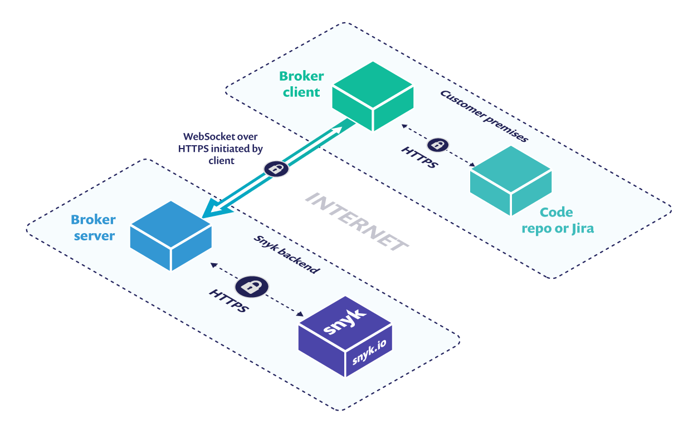

# Broker introduction

### Broker benefits

Snyk Broker allows you to:

* Keep sensitive data such as your access tokens inside your private network, never sharing that information with Snyk.
* Provide controlled access to the network by Snyk, limiting the files Snyk can access, and the actions that Snyk can perform.
* Manage a fixed private IP for your integration (targeting the broker).
* Connect to self-hosted integrations that are not accessible from the internet.

### Broker components

Snyk Broker has a client and a server component that are the same across all base integrations:

* Broker client: a [Docker image](https://hub.docker.com/r/snyk/broker/) deployed in your infrastructure.
* Broker server: running on Snyk SaaS backend

All data, both in transit and at rest, is encrypted. Communication between the client and server takes place over a secure WebSocket connection. It does not require opening incoming ports since the communication is initiated outbound, following which it establishes a two-way communication path over WebSocket.

Additionally, if there is a requirement to do code analysis in an SCM integration, or to connect to a private Container Registry, there are two additional components:

* [**Snyk Broker Code Agent**](snyk-broker-code-agent.md): Enables Snyk Code analysis on SCMs integrated through Snyk Broker
* [**Snyk Broker Container Registry Agent**](snyk-broker-container-registry-agent/): Enables connection to self-hosted/private container registries and analysis of container images

### Using inbound and outbound connections

* There is no direct inbound connection from Snyk to the Broker client. The broker client makes an outbound connection to [https://broker.snyk.io](https://broker.snyk.io), which establishes a WebSocket connection to allow communication with the Broker server. This way, there is no need to grant permissions to specific IPs towards Snyk as you can point to the Broker client IP/port.
* The Broker client initiates the outbound connection to establish the WebSocket. After the websocket is established, that allows inbound requests from Snyk via the WebSocket, with no need to allow inbound connectivity to the world or to Snyk-specific IP addresses.

### **Approved data list**

The Broker client maintains an approved data list for inbound and outbound data requests. Only requests included in this approved list are allowed.

The default approved list limits requests as follows:

* **Inbound:** Snyk.io is only allowed to fetch and view dependency manifest files and the Snyk policy file. No other source code is viewed, extracted, or modified. Additional files (.snyk files) may be checked in to support our patch mechanism and for any ignore instructions included in your vulnerability policy.
* **Outbound:** Git repo webhooks are set when you configure your Broker setup, to enable automatic Snyk scans triggered when new pull requests or merge events are submitted by your developers. Webhook notifications are delivered to Snyk via the Broker client for only events relevant to Snyk actions (push to branch, pull request opened), and only when the event data also includes a dependency manifest file or a Snyk policy file.

Because of the limitations of the default approved list, if you are interested in scanning Infrastructure as Code files with Broker, you will need to [add and configure an `accept.json`](snyk-broker-infrastructure-as-code-detection/) file into your broker deployment.

If you want to learn more about the approved data list and the `accept.json` file see [Custom approved listing filter](set-up-snyk-broker/how-to-install-and-configure-your-snyk-broker-client.md)

### **Supported integrations**

Snyk Broker currently integrates with these Git Repository systems:

* [GitHub](https://docs.snyk.io/integrations/git-repository-scm-integrations/github-integration) and [GitHub Enterprise](https://docs.snyk.io/integrations/git-repository-scm-integrations/github-enterprise-integration) (Cloud and On-prem)
* [GitLab](https://docs.snyk.io/integrations/git-repository-scm-integrations/gitlab-integration) (Cloud and On-prem)
* [Bitbucket Server / Data Center](../git-repository-scm-integrations/bitbucket-data-center-server-integration.md) (On-prem)
* [Azure Repos](https://docs.snyk.io/integrations/git-repository-scm-integrations/azure-repos-integration)

These integrations require the [Code Agent](snyk-broker-code-agent.md) to support Snyk Code analysis.

In addition, Snyk Broker integrates with [Jira Server/Jira Data Center](../notifications-ticketing-system-integrations/jira.md) and [JFrog Artifactory](../private-registry-integrations/artifactory-registry-setup.md).

With the Container Registry Agent, Snyk Broker also connects to all [Snyk supported Container Registries](snyk-broker-container-registry-agent/).

### **Broker usage**

When set up, Snyk Broker enables teams to use the standard Snyk product experience for Snyk Open Source and Container (through SCM integration).

To enable the full experience, Snyk Broker will need additional set-up:

* For Snyk IaC it will require configuring the `accept.json` file [with additional parameters](snyk-broker-infrastructure-as-code-detection/) for the infrastructure as code templates
* For Snyk Code, it will require the deployment of the [Snyk Broker Code Agent](snyk-broker-code-agent.md)
* For Snyk Container image scanning, it will require the deployment of [Snyk Broker Container Registry Agent](snyk-broker-container-registry-agent/)

### Common questions

How often is the Snyk Broker updated?

* The Snyk Broker is updated anytime there are new features available and when there are fixes.

How often is the Snyk Broker checked for vulnerabilities?

* The Snyk Broker application and images are being tested on a daily basis for vulnerabilities.

What is the SLA to fix vulnerabilities?

* There is a 14 day SLA for fixing high vulnerabilities and 5 days SLA for fixing critical vulnerabilities in public images.
