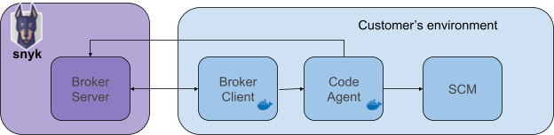

# Snyk Broker Code Agent


This feature is currently in Beta. Please contact your CSM if you are interested in participating.


You can natively connect Snyk Code to your local git server. This allows customers who are using a self-hosted git provider to find, prioritize and fix potential vulnerabilities in their 1st-party code.

## Code access components

* **Broker server**: Running on Snyk SaaS backend
* **Broker client**: A [Docker image](https://hub.docker.com/r/snyk/broker/) deployed in your infrastructure.
* **Code agent**: Another [Docker image](https://hub.docker.com/r/snyk/code-agent/) that is deployed in your infrastructure. **Note:** Code agent is only supported with [Snyk Broker](https://docs.snyk.io/integrations/snyk-broker) v4.108.0 and later versions. If you have a running Broker client, pull the latest update.

The **Broker client** and **code agent** components are deployed in your infrastructure, creating two separate services, responsible for cloning local repositories in a secured manner and sending the associated information to Snyk.

The Broker client provides the Agent with the connection details. The Agent uses these details to connect to your local git repository, clone the relevant files, and send the results through the brokered communications using callbacks. The brokered communication happens when a Broker client connects (using your Broker ID) to a Broker server running in Snyk environment:



See [Snyk Broker](https://docs.snyk.io/integrations/snyk-broker/broker-introduction) documentation for more details.

## Setup

### Prerequisites

Before you begin with the setup process, make sure to have a server that supports these minimal requirements for running the Broker client and Code agent:

* **CPU:** 1 vcpu
* **Memory:** 2Gb (should be reflected in node memory setting)
* **Disk space:** 2Gb (available disk size determines maximum cloneable repository size)
* **Network:** code upload performance will be affected by slow Internet connection

### Set up the network

To run both the broker client and the broker agent, establish a network connection between them. There are different solutions to expose one container connection with tools like Ngrok (which is also possible here if you want), but this description focuses on docker bridge networks.

Run **`docker network create <network>`**

For example:

```
docker network create mySnykBrokerNetwork
```

You can confirm that it was created by running **`docker network ls`**, this will show results like this:

```
  NETWORK ID     NAME                 DRIVER     SCOPE
  d1353a2b0f66   mySnykBrokerNetwork  bridge     local
```

### Set up Code Agent

First, pull the code-agent image:

```
docker pull snyk/code-agent
```

The following environment variables are mandatory to configure the code agent:

* **SNYK\_TOKEN -** your Snyk API token, as also used by the CLI, see [Authenticate the CLI with your account](../../../snyk-cli/authenticate-the-cli-with-your-account/) for additional details.
* **PORT** - the local port, for which the code agent accepts connections, Default is 3000.

To run the **code-agent:**

```
docker run --name code-agent \
     -p 3000:3000 \
     -e PORT=3000 -e SNYK_TOKEN=<Snyk API token> --network mySnykBrokerNetwork \
     snyk/code-agent
```

In this example:

* We set the current container to use the new network we created **--network mySnykBrokerNetwork**
* We gave the current container a name **--name code-agent**. It will be used to define the **GIT\_CLIENT\_URL** for the broker client that we will run next.

### Set up Broker client

Code agent depends on broker client. Follow the instructions on [How to install and configure your Snyk Broker client](set-up-snyk-broker/how-to-install-and-configure-your-snyk-broker-client.md) for detailed instructions how to set up broker for specific SCMs.

If you already have a broker client running, consider the following additional requirements:

* Code agent is only supported with [Snyk Broker](./) v4.108.0 and later versions; make sure to pull the latest version first.
* Code agent needs permission to clone the full repository; make sure that the SCM token passed to the broker has the corresponding permissions.

### Extend Broker setup

Extend your broker setup with the following arguments:

```
-e GIT_CLIENT_URL=http://<code agent container>:<code agent port>
--network <name of created network>
```

For example, to extend an existing broker client configured for GitLab, run:

```
docker run \
   -p 8001:8000 \
   -e BROKER_TOKEN=<xxxxxxx-xxxx-xxxx-xxxx-xxxxxxx> \
   -e GITLAB_TOKEN=glpat-<xxxxxxxxxxxxxxx> \
   -e GITLAB=url.com \
   -e BROKER_CLIENT_URL=http://my.broker.client:8000
   -e PORT=8000 \
   -e GIT_CLIENT_URL=http://code-agent:3000 \
   --network mySnykBrokerNetwork \
   -e ACCEPT=/private/accept.json \
   -v /path/to/private:/private \
   snyk/broker:gitlab
```

In this example:

* We set the current container to use the new network we created **--network mySnykBrokerNetwork**
* In **GIT\_CLIENT\_URL** we used the name we defined in the code-agent container as the host here.

### Enable with custom whitelist

If you have a running Snyk broker with a custom whitelist (**accept.json**), then ensure the following rule is present in the whitelist:

```
{
  "//": "used to redirect requests to snyk git client",
  "method": "any",
  "path": "/snykgit/*",
  "origin": "${GIT_CLIENT_URL}"
}
```

(The rule is present by default, so only needed if you override the rule with a custom whitelist.)


At this point please contact your Customer Success Manager or Support to enable the integration


## Advanced Settings

### Enable code snippets

To enable code snippets, additional rules must be added to **accept.json**.

See [https://github.com/snyk/broker#custom-approved-listing-filter](https://github.com/snyk/broker#custom-approved-listing-filter) for detailed instructions how to extend **accept.json**.

For GitHub:

```
{
  "//": "needed to load code snippets",
  "method": "GET",
  "path": "/repos/:name/:repo/contents/:path",
  "origin": "https://${GITHUB_TOKEN}@${GITHUB_API}"
}
```

For GitLab:

```
{
  "//": "needed to load code snippets",
  "method": "GET",
  "path": "/api/v4/projects/:project/repository/files/:path",
  "origin": "https://${GITLAB}"
}
```

For BitBucket Server:

```
{
    "//": "needed to load code snippets",
      "method": "GET",
      "path": "/projects/:project/repos/:repo/browse*/:file",
      "origin": "https://${BITBUCKET_API}",
      "auth": {
        "scheme": "basic",
        "username": "${BITBUCKET_USERNAME}",
        "password": "${BITBUCKET_PASSWORD}"
      }
}
```

For Azure Repos:

```
{
      "//": "needed for code snippets",
      "method": "GET",
      "path": "/:owner/_apis/git/repositories/:repo/items",
      "origin": "https://${AZURE_REPOS_HOST}/${AZURE_REPOS_ORG}",
      "auth": {
        "scheme": "basic",
        "token": "${BROKER_CLIENT_VALIDATION_BASIC_AUTH}"
      }
}
```


After these snippets are added, all content from the repository can be accessed through Snyk Broker.


### Proxy support

For instructions how to run Broker client through a proxy, see [https://github.com/snyk/broker](https://github.com/snyk/broker). Make sure that requests to the Code Agent are not sent through the proxy, bypassing `NO_PROXY=<code agent container>`, for example:

```
-e HTTP_PROXY=http://my.proxy.address:8080
-e HTTPS_PROXY=http://my.proxy.address:8080
-e NO_PROXY=code-agent
```

For Code Agent, add the following environment variables to the **docker run** command:

```
-e HTTP_PROXY=http://my.proxy.address:8080
-e HTTPS_PROXY=http://my.proxy.address:8080
```

To disable certificate verification, for example., in the case of self-signed certificates, add to the code-agent **docker run** command:

```
-e NODE_TLS_REJECT_UNAUTHORIZED=0
```

## **Troubleshooting**

Please visit [Troubleshooting Broker](troubleshooting-broker.md) for more information on how to troubleshoot Snyk Broker Code Agent
