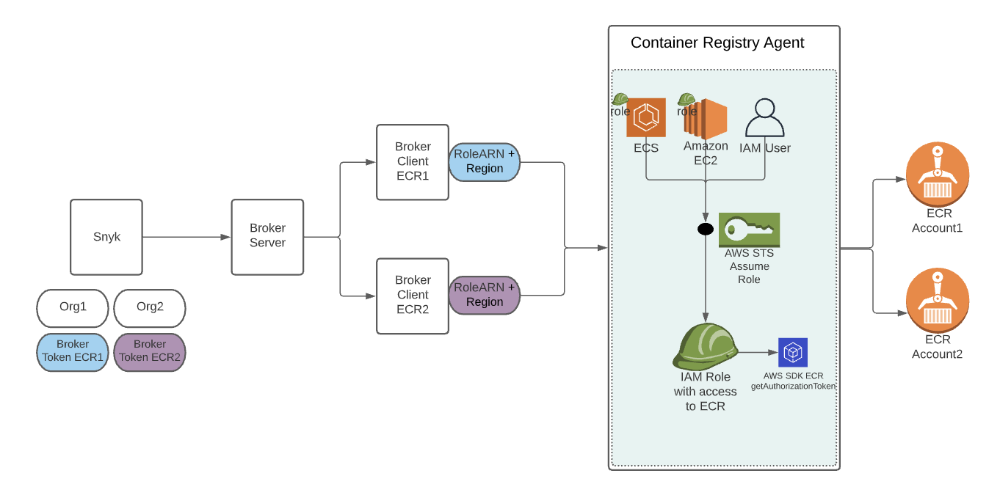

# Setting up the Container Registry Agent for a brokered ECR integration

## **Introduction**

### **Glossary**

**Container Registry Agent IAM Role / IAM User:** an IAM Role / IAM User the Container Registry Agent uses to assume a role with access to ECR.

**Snyk ECR Service Role:** an IAM Role with access to ECR and assumed by the Container Registry Agent "IAM Role" / "IAM User" to gain read-only access to ECR.

### **Steps Summary**

The following steps allow a single Container Registry Agent instance to access ECR repositories located in different accounts.

1. **(Run this step once only)** Create the Container Registry Agent IAM Role / IAM User with permissions to assume a role. Use the IAM Role / IAM User to run the Container Registry Agent. **Run the following steps for each of your ECR accounts, using a separate broker instance for each ECR account:**
2. In the AWS account where your ECR reside, create the Snyk ECR Service Role with read access to your ECR, and restrict this role to be assumed only by the specificContainer Registry Agent IAM Role / IAM User created in the previous step.
3. Restrict the Container Registry Agent IAM Role / IAM User to only be allowed to assume the your Snyk ECR Service Role(s). _\*\*_
4. Provide the Broker Client with the Role ARN of the Snyk ECR Service Role. The Broker Client passes this Role ARN to the Container Registry Agent, and the Container Registry Agent will assume it, to access your ECR.

### Architecture

The following image describes the architecture of the brokered ECR solution:



## **Step 1: Run the container registry agent with a IAM User / IAM Role**

In this step, you will create an IAM Role or an IAM User that will be used by the Container Registry Agent. The IAM Role / IAM User could be provided to the Container Registry Agent via the methods described [here](https://docs.aws.amazon.com/sdk-for-javascript/v2/developer-guide/setting-credentials-node.html).

The following examples explain how to provide the IAM Role / IAM User using one of the following methods:

* **Example a:** Create a dedicated EC2 role and load credentials from AWS Identity and Access Management (IAM) roles to the EC2 instance running the Container Registry Agent image.
*   **Example b:**

    Creating a dedicated user and providing its credentials through environment variables.

**Note:** You can also provide a dedicated role in Amazon ECS tasks, more details can be found [here](https://docs.aws.amazon.com/AmazonECS/latest/developerguide/task-iam-roles.html).

### **Example a: Create a dedicated EC2 Service Role and load credentials from AWS Identity and Access Management (IAM) roles for Amazon EC2**

#### Stage 1: Create a Role

1. Click [here](https://console.aws.amazon.com/iam/home?#/policies) to log in to the AWS Management Console with the IAM service and navigate to the **Roles** page.
2. Choose to **create a role**.
3. Select **AWS service** for the **type of trusted entity**.
4. Select **EC2** as the **use case**.
5. Choose to go next with permission and tags.
6. Review and provide a role name: **SnykCraEc2Role**.
7. Create the role.
8. From the role's **Summary** page, copy the **Instance Profile ARN** (e.g. arn:aws:iam::\<aws-account>:instance-profile/SnykCraEc2Role) and also the Role ARN (e.g. arn:aws:iam::\<aws-account>:role/SnykCraEc2Role) for later use.

#### Stage 2: Create a policy to allow EC2 role to assume another role

1. In the newly created role page, in the **Permissions** tab create an **Inline policy**.
2. In **Service** choose **STS**.
3. In **Actions** choose **Write → AssumeRole**.
4. In **Resources** choose **All resources** (we will harden the resources in the last step).
5.  In the **JSON** tab verify that the policy contains the following:

    ```
    {
      "Version": "2012-10-17",
      "Statement": [
        {
          "Sid": "SnykCraAssumeRolePolicy",
          "Effect": "Allow",
          "Action": "sts:AssumeRole",
          "Resource": "*"
        }
      ]
    }
    ```
6. Review the policy and provide a policy name: **SnykCraAssumeRolePolicy**.
7. Choose to create the policy.

#### Stage 3: Attach the role to the EC2 machine running the Container Registry Agent

1. Head to the **EC2 Management Console** and choose the instance running the Container Registry Agent container.
2. Click on **Actions → Security → Modify IAM Role**.
3. From the **IAM role** dropdown list, choose the Instance profile of the IAM role created in the first step (e.g. arn:aws:iam::\<aws-account>:instance-profile/SnykCraEc2Role) and click **Save**.

When running the Container Registry Agent image on the EC2 machine, the credentials of the attached role will be automatically picked up by the running Container Registry Agent. Therefore, no extra steps are needed. More info can be found in [Amazon docs](https://docs.aws.amazon.com/AWSEC2/latest/UserGuide/iam-roles-for-amazon-ec2.html#instance-metadata-security-credentials).

### Example b: Creating a dedicated user and providing its credentials through environment variables

#### Stage 1: Create a user

1. Click [here](https://console.aws.amazon.com/iam/home?#/policies) to log in to the AWS Management Console with the IAM service and navigate to the **Users** page.
2. Click **Add users**.
3. Enter the user name: **SnykCraUser**.
4. Select **Programmatic access** as the **Access type**.
5. Choose to go next with permission and tags.
6. Review and create the user.
7. Once the user is created, save its credentials (Access Key ID and Secret Access Key) for later use.
8. From the user's **Summary** page, copy the **User ARN** for later use (e.g. arn:aws:iam::\<aws-account>:user/SnykCraUser)

#### Stage 2: Create a policy to allow the user to assume a role

1. In the newly created user page, in the **Permissions** tab create an **Inline policy**.
2. In **Service** choose **STS**.
3. In **Actions** choose **Write→AssumeRole**.
4. In **Resources** choose **All resources** (we will harden the resources in the last step).
5.  In the **JSON** tab verify that the policy contains the following statement:

    ```
    {
      "Version": "2012-10-17",
      "Statement": [
        {
          "Sid": "SnykCraAssumeRolePolicy",
          "Effect": "Allow",
          "Action": "sts:AssumeRole",
          "Resource": "*"
        }
      ]
    }
    ```
6. Review the policy and provide a policy name: **SnykCraAssumeRolePolicy**.
7. Choose to create the policy.

#### Stage 3: Use the credentials when running the Container Registry Agent

When running the Container Registry Agent image, the credentials could be provided by setting the following environment variables:

* AWS\_ACCESS\_KEY\_ID=\<User access key ID>
* AWS\_SECRET\_ACCESS\_KEY=\<User secret access key>

## Step 2: Create Snyk ECR Service Role and enable Cross-Account Access to ECR

In this step, you will create a Role in the account in which your ECR repositories reside. This Role will allow read-only access to your repositories and could be assumed by the Role created in the previous step.

### **1. Create a read-only ECR policy to be used by the Snyk ECR Service Role**

1. Click [here](https://console.aws.amazon.com/iam/home?#/policies) to log in to the AWS Management Console with the IAM service and navigate to the **Policies** page.
2. Create a new policy.
3. Select to edit the JSON data.
4.  Delete the default data and in its place, copy and paste the following:

    ```
    {
      "Version":"2012-10-17",
      "Statement": [
        {
          "Sid":"SnykAllowPull",
          "Effect":"Allow",
          "Action": [
            "ecr:GetLifecyclePolicyPreview",
            "ecr:GetDownloadUrlForLayer",
            "ecr:BatchGetImage",
            "ecr:DescribeImages",
            "ecr:GetAuthorizationToken",
            "ecr:DescribeRepositories",
            "ecr:ListTagsForResource",
            "ecr:ListImages",
            "ecr:BatchCheckLayerAvailability",
            "ecr:GetRepositoryPolicy",
            "ecr:GetLifecyclePolicy"
          ],
          "Resource":"*"
        }
      ]
    }
    ```
5. Choose to review the policy.
6. Set **AmazonEC2ContainerRegistryReadOnlyForSnyk** as the **Name**.
7. Set **"Provides Container Registry Agent with read-only access to Amazon EC2 Container Registry repositories"** as the **description**.
8. Choose to create the policy.

### 2. Create Snyk ECR Service Role with which to implement the policy

1. From the AWS Management Console again, navigate to the **Roles** page. You may click [here](https://console.aws.amazon.com/iam/home?#/roles) to navigate there.
2. Create a new role.
3. Select **AWS service** as the trusted entity and **EC2** as the service for this role.
4. Choose to go next with permission.
5. Check the policy **AmazonEC2ContainerRegistryReadOnlyForSnyk** from the list.
6. Choose to go next with tags and review.
7. Set **SnykEcrServiceRole** as the Name.
8. Set **"Allows EC2 instances to call ECR AWS services on your behalf"** as the Description.

### 3. Harden the usability scope of the Snyk ECR Service Role

This step will harden the usability of the Snyk ECR Service Role so that it could only be assumed by the Container Registry Agent IAM Role / IAM Role.

1. Again from the **Roles** page, find and click the [SnykEcrServiceRole](https://console.aws.amazon.com/iam/home?#/roles/SnykEcrServiceRole) to enter the role configurations.
2. Select the **Trust relationships** tab.
3. Edit the trust relationship.
4.  Delete all of the data and replace it with the following JSON:

    ```
    {
      "Version":"2012-10-17",
      "Statement": [
        {
          "Effect":"Allow",
          "Principal":{
            "AWS":"<ARN of Container Registry Agent IAM User / IAM Role>"
          },
          "Action":"sts:AssumeRole",
          "Condition":{
            "StringEquals": {
              "sts:ExternalId":"<optional external ID>"
            }
          }
        }
      ]
    }
    ```

    * In **Statement.Principal.AWS** enter the IAM Role / IAM User created in the Step 1 (e.g. arn:aws:iam::\<aws-account>:user/SnykCraEc2Role or arn:aws:iam::\<aws-account>:role/SnykCraUser, respectively)
    * In **Condition.StringEquals.sts:ExternalId** you may use an external ID of your choice, which will be used when providing the credentials object to the Broker Client.
    * To support multiple external IDs, enter a list of IDs in a square brackets. For example: _\*\*_`"sts:ExternalId": [ "11111111-1111-1111-1111-111111111111", "22222222-2222-2222-2222-222222222222" ]`
5. Update the trust policy.

## Step 3: Harden the usability scope of the IAM Role / IAM User used by the Container Registry Agent

This step will harden the usability of the IAM Role / IAM User used by the Container Registry Agent so that it could only assume the[ SnykEcrServiceRole](https://console.aws.amazon.com/iam/home?#/roles/SnykEcrServiceRole).

1. Copy the Role ARN key that appears at the top of the **Summary** section of the[ SnykEcrServiceRole](https://console.aws.amazon.com/iam/home?#/roles/SnykEcrServiceRole).
2. In the AWS account where the IAM Role / IAM User was created for running the Container Registry Agent, edit the **SnykCraAssumeRolePolicy**: 1. In case an IAM Role was created: 1. Go to **Roles** and choose the **SnykCraEc2Role** role. 2. In the **SnykCraAssumeRolePolicy** choose to edit the JSON. 3. Add the role ARN of[ SnykEcrServiceRole](https://console.aws.amazon.com/iam/home?#/roles/SnykEcrServiceRole) as the resource: `"Resource": "<Role ARN of SnykEcrServiceRole>"` 2. In case an IAM User was created:
   1. Go to **Users** and choose the SnykCraUser user.
   2. In the **SnykCraAssumeRolePolicy** choose to edit the JSON
   3.  Add the role ARN of[ SnykEcrServiceRole](https://console.aws.amazon.com/iam/home?#/roles/SnykEcrServiceRole) as the resource: `"Resource": "<Role ARN of SnykEcrServiceRole>"`

       \*\*\*\*

**Note:** in case the Container Registry Agent needs to access multiple ECR registries found in different accounts, a separate item will need to be added to the Statement list, so that each ECR account has a separate statement. For example:

```
{
  "Version": "2012-10-17",
  "Statement": [
    {
      "Sid": "SnykCraAssumeRolePolicyAccountA",
      "Effect": "Allow",
      "Action": "sts:AssumeRole",
      "Resource": "<Role ARN of SnykEcrServiceRole of account A>"
    },
    {
      "Sid": "SnykCraAssumeRolePolicyAccountB",
      "Effect": "Allow",
      "Action": "sts:AssumeRole",
      "Resource": "<Role ARN of SnykEcrServiceRole of account B>"
    },
  ]
}
```

## **Step 4: Provide** Snyk ECR Service Role **ARN and external ID to the Broker Client**

In the last step, the Role ARN of the SnykEcrServiceRole \_\*\*\_will be used by providing it to the broker client. The broker client will pass it to the Container Registry Agent, which will assume it to connect to ECR.

1. Copy the **Role ARN** key that appears at the top of the **Summary** section of the[ SnykEcrServiceRole](https://console.aws.amazon.com/iam/home?#/roles/SnykEcrServiceRole).
2. When running the Broker Client, provide the following environment variables the allow the Container Registry Agent to access your ECR account (note that no username/password are needed):
   * CR\_TYPE=ecr
   * CR\_ROLE\_ARN=\<the role ARN of SnykEcrServiceRole>
   * CR\_REGION=\<AWS Region of ECR>
   * CR\_EXTERNAL\_ID=\<Optional. The external ID found in the trust relationship condition>
