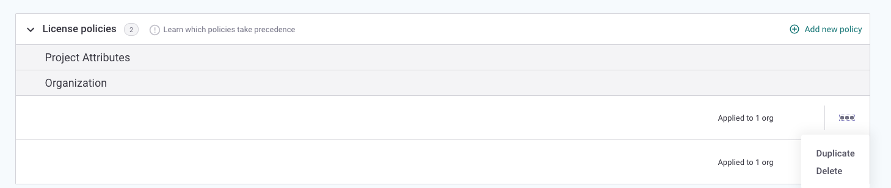

# Creating and editing policies

## **Create a policy**

1. Click  **Add new policy** from the Policy Manager, and a modal will appear where you can create your policy 
2. Set a policy name and a description to help you quickly identify a policy **Note**: Policies within the same category cannot have the same name. Policies **cannot** be saved without a policy name applied
3. Select whether you’d like to apply your policy to organizations or project attributes
4. Select the desired [organizations](assign-a-policy-to-organizations.md) or [attributes](assign-a-policy-to-project-attributes.md)
5. Add rules to the policy. [Click here for information on adding license rules](../../../products/snyk-open-source/license-policies/setting-a-license-policy.md) or [click here for information on adding security rules](../security-policies/how-to-create-a-security-policy-and-set-rules.md)
6. Once you've added your rules, make sure to click **Submit** in the top right-hand corner 

## Edit a policy

1. Click on the policy name of an existing policy in the Policy Manager tab to open the modal and then make your changes
2. Adjust [organizations](assign-a-policy-to-organizations.md), [attributes](assign-a-policy-to-project-attributes.md) and/or rules as desired
3. Once you've made your changes in the Policy modal, make sure to click **Submit** in the top right hand corner to save your changes

## **Other Actions:**

Clicking on the **...** on the right-hand side of the policies table will provide a drop down that allows you to delete a policy.

Deleting a policy cannot be undone. If you delete a policy that has organizations assigned to it, those organizations will return to the [default policy](assign-a-policy-to-organizations.md).

Duplicating a policy will copy over the rules of a policy, but not the assigned organizations or attributes. The new policy will automatically be called ‘Copy of \(Policy Name\)…” and can be edited.

