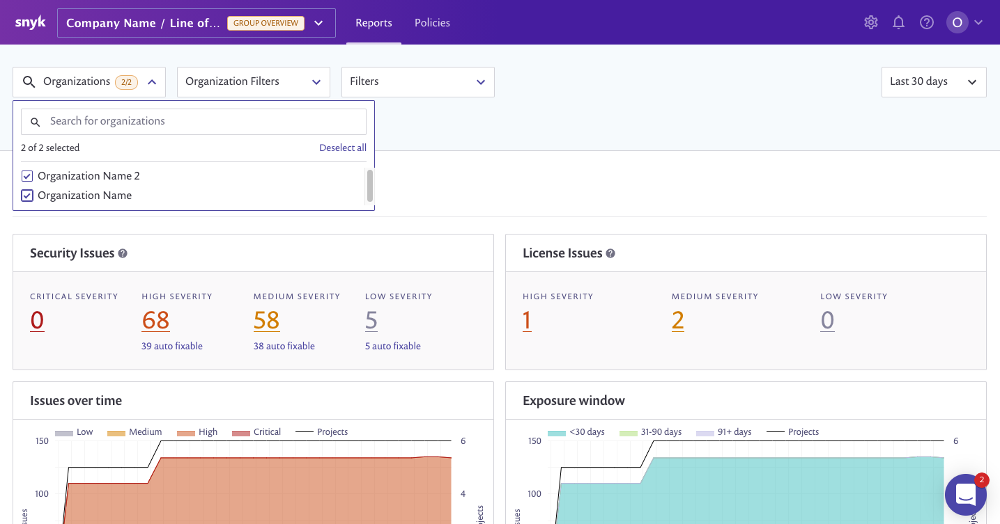
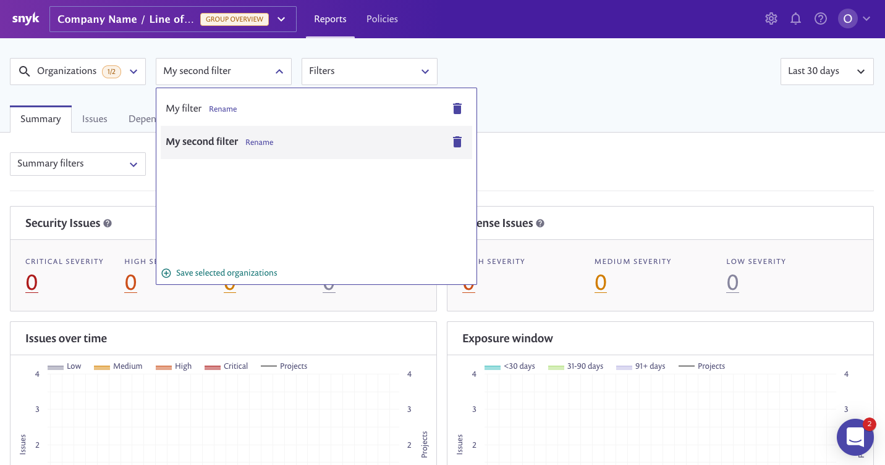

# Snyk groups overview

The group overview area allows you to view reports across all of your group’s organizations, and configure your group settings.

## Settings

Within the group overview, you can also view all of a group’s members. Note that these aren’t members of your organizations \(who are managed within the organization’s settings area\), but are members who can access all organizations within that group.

## Combined reports

From the group overview, the vulnerability status of all of a group’s organizations are visible in one place as a report. You can select which organizations you wish to compare via the filter dropdown. This will set the context for all the tabs within the reports, where you can continue to filter other values such as type, status and package manager.

## Organization filters

Organization filters can be created, saved, and selected quickly via the **Organization Filters** dropdown.

