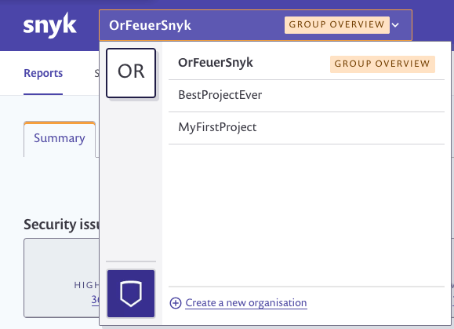

# Snyk groups: switch between groups and orgs

To access your groups and organizations, click on the navigation switcher. The avatars displayed on the left are your groups, and the list on the right are the organizations that are within the group.

Clicking the avatar on the bottom of the switcher will display the organizations within your personal group. \(This may not be visible to you depending on your enterprise’s setup.\)

