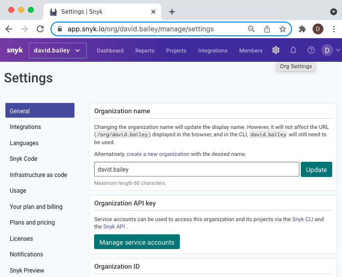

# Managing settings

Click the Settings icon () from the top-level menu bar to view and access Snyk settings for your org:

Settings include:

* General
* [Integrations](https://docs.snyk.io/integrations)
* [Languages](../../../products/snyk-open-source/language-and-package-manager-support/)
* [Snyk Code](https://docs.snyk.io/snyk-code)
* [Infrastructure as Code](https://docs.snyk.io/snyk-infrastructure-as-code)
* [Usage](https://docs.snyk.io/user-and-group-management/managing-settings/usage-page-details)
* Your plan and billing
* Plans and pricing
* [Notifications](https://docs.snyk.io/user-and-group-management/notifications/notification-management)
* [Snyk Preview](snyk-preview.md)
