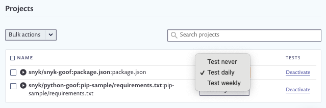

# Usage page details

Click on settings  > **Usage** to view Snyk usage details including:

* The numbers of tests used.
* The number of developers contributing to projects.
* Project test usage settings.

### Test usage

The **Test Usage** section shows how many tests you are using over the current billing period:


Test limits vary for Snyk products and plans. See the [plans page](https://snyk.io/plans/) for details.



See [What counts as a test?](https://support.snyk.io/hc/en-us/articles/360000925418-What-counts-as-a-test-) for details of how Snyk counts tests.


### Contributing developers


Currently, the integrations for which we have developer counts are GitHub, GitHub Enterprise, GitLab and the Snyk CLI.


Snyk defines contributing developers as developers having made a commit to a private repo monitored by Snyk in the last 90 days.

The **Contributing developers for Git and CLI integrations** section shows contributing developer counts, both at the org level and the group level.

The counts indicate the number of contributing developers to the default branch of the private repos connected with the integration.

We do not count contributions to public (open source) repos currently as our pricing model is based on the number of contributing developers to private repositories.

For example:

The **total unique contributors across all integrations** count shows the number of contributors across all the integrations in your Snyk account. Contributing developers are only counted once, even if they have contributed to multiple integrations or multiple repositories.

The **Breakdown by integration** section shows the number of contributors, orgs, and repos in that integration.

#### Contributor emails

Each contributor is counted by the **author** email field, which is set within the local git configuration in the developer’s machine.

### Projects

The **Projects** section shows test usage settings for your projects:

#### Bulk actions

For **Bulk actions**, select relevant projects, then select to **Delete**, **Activate** or **Deactivate** the selected projects:

#### Set test frequency

You can set the frequency of testing for each project.

For each entry, you can select the frequency of testing for that project (never, daily, or weekly)

Click **Deactivate** to never test, and also remove webhooks and stop showing the project’s results in reporting.
