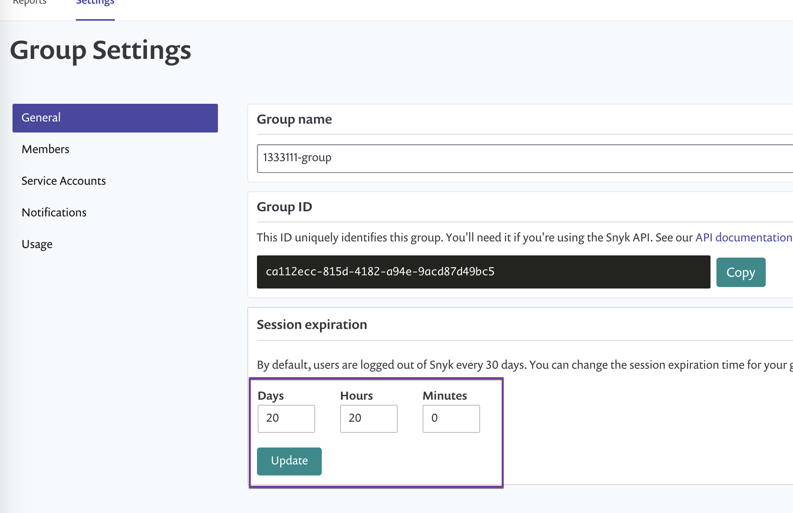

# Session length

To ensure your account is safe from being inadvertently exposed through inactive users, once a user logs into their account and is then inactive for 30 consecutive days, they are automatically logged out and need to re-enter their credentials in order to log back in.

To configure the session expiration length, change this setting from the Group level settings. The length can be configured to a maximum of 30 days and a minimum of 5 minutes.

Once configured, recording and tracking of session length and expiration initiate either when the user logs into the site or within 60 seconds of making the change - whichever comes first. Additionally, a user who is a member of multiple groups, each of which has a different session length configured, always receives the most restrictive session length - they are always automatically logged out based on the group configured with the shortest configured session length.

You can configure the session length expiration through the web-based user interface as well as from our API.

## Configure session length for a Snyk group

The default session length that is applied for members of a group is 30 days. Group admins can change this value to any value between 30 days and a minimum of 5 minutes.

**Prerequisites**

You must be an administrator of the group in order to update the session length.


**Feature availability**  
This feature is available to plans that support groups. See [pricing plans](https://snyk.io/plans/) for more details.


**Steps**

1. Log in to your Snyk account and navigate to the group for which you’d like to configure session length.
2. Navigate to **Settings** to update the Group settings.
3. From the **Session expiration** area, enter values for the session length. valid value ranges are as follows:
   1. Days - 0-30
   2. Hours - 0-23
   3. Minutes - 0-59 

