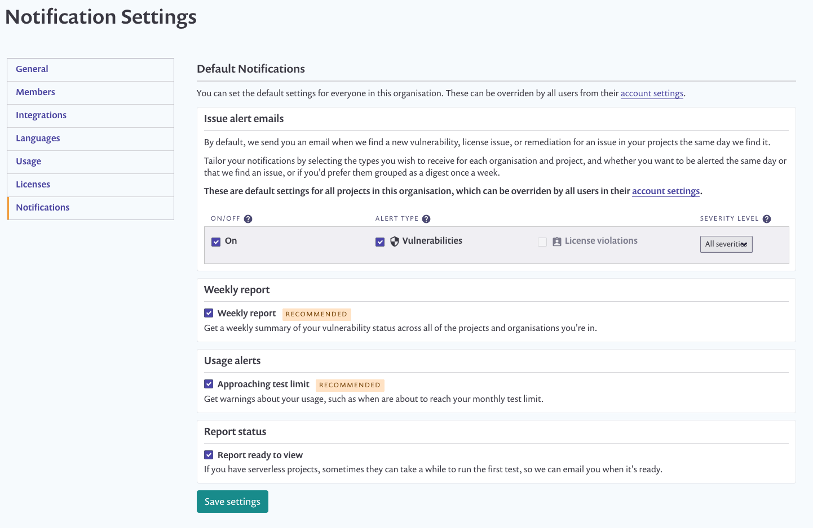
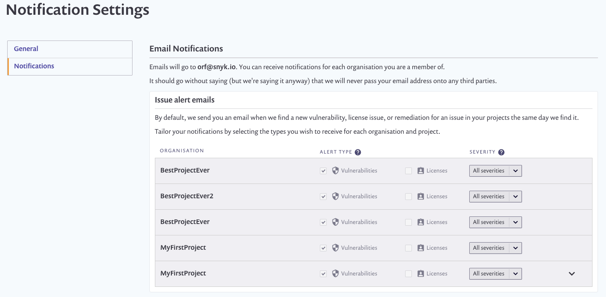
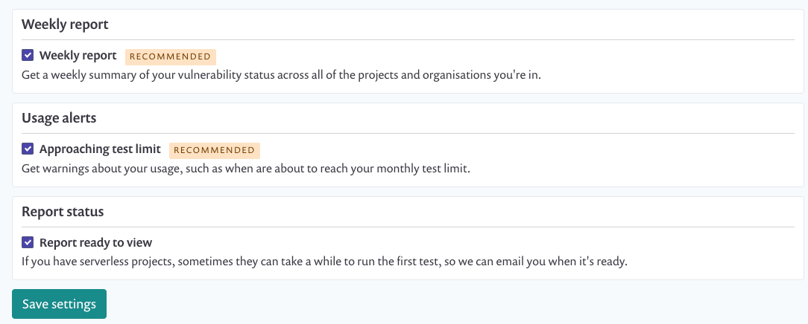

# Managing notifications

### Introduction

By default, Snyk emails you when a new issue or fix in a project’s dependencies is found and provides you with a weekly update of your security status across your organization. You can customize the content of these emails in your account settings. If you’re an organization administrator, you can also set email notification defaults for all the members within it.

.png>)

### Setting email defaults for all members of an organization

To customize the emails all your organization’s members receive, head over to your organization settings area. customizing options here will trickle down to all of your organization’s members. However, a member of this organization can override these default settings in their own account settings if they wish.

### Project level customization

You can also refine the types of emails you receive for each project in your account settings. A new project will inherit the notification defaults for the organization it belongs to, so we recommend setting blanket rules for your orgs (which new projects in that org will inherit), which you can then override on a per-project basis.

### Customizing emails by type and severity level

If your plan includes licenses, you can choose which email type you receive in your account settings. If you only want to be emailed about high severity issues, this is also possible, both on the project level and org level.

**More granularity**

As well as being able to tailor the emails you get about issues, you can also customize the other types of core emails, such as whether you want weekly reports, whether you want to be alerted when you are approaching your test limit (on the free plan), and whether you want to be notified when a test report for a serverless project has been generated and is ready to view.

