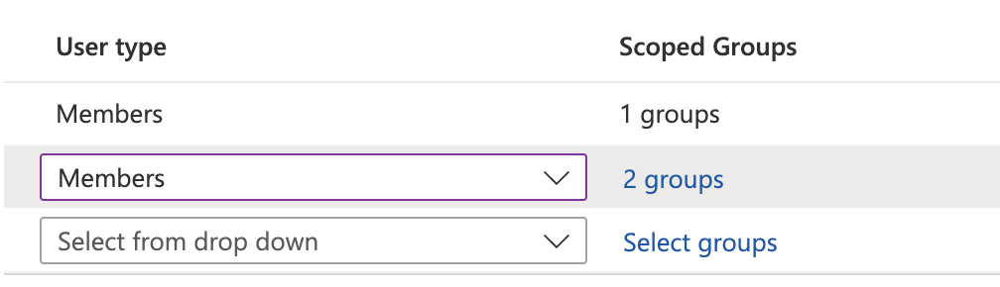

# Example: Setting up custom mapping for Azure AD

The following information shows how to configure custom mapping of roles for Azure AD using the [Custom Mapping Option](./).

There are two ways of implementing custom mapping with Azure AD, either using [Custom claims](example-setting-up-custom-mapping-for-azure-ad.md#configuration) or [App roles](example-setting-up-custom-mapping-for-azure-ad.md#configuration-app-roles). Choose the one that suits your situation best.&#x20;

If you need guidance setting up the initial Enterprise application, refer the Azure AD Enterprise Application [example](../self-serve-single-sign-on-sso/example-azure-ad-enterprise-application.md). **Note**: any step on the Snyk side in setting up the Enterprise application must be performed by your Snyk contact as self-serve SSO does not accommodate custom mapping.

## Configure custom claims

The following characterize his configuration:

* Azure AD Security groups are mapped to Snyk organizations.
* Azure AD Security is mapped to Snyk Organization membership roles.
* The user role in Snyk is pre-set in each Azure AD Security Group for all members of that group.

Once you have set up Groups and users, follow these steps:

1.  In your Snyk App in Azure AD, navigate to Single Sign On.\
    **Dashboard -> Enterprise Applications -> Snyk** and select **Single Sign On.**

    <figure><figcaption>
Azure AD Snyk app Single sign-on
</figcaption></figure>
2.  In the single sign-on options, for **Attributes & Claims** click the **Edit** icon.

    <figure><figcaption>
Edit Attributes &#x26; Claims
</figcaption></figure>
3.  Select **Add new claim**.

    <figure><figcaption>
Add new claim
</figcaption></figure>
4. Configure Attribute: enter the **Name:** roles.
5.  Configure Attribute: expand the **Claim conditions**.\
    For each unique value, that is, unique combinations of security groups, _create a new condition_.\
    Each security group reflects a unique combination of organization membership and user role.\
    _**Order is important**._\
    If you have more than one condition with the same group(s) included in **scoped groups** the conditions are evaluated top to bottom and the last value that includes the group(s) is used.\
    For this reason, the recommendation is to enter the conditions in increasing order of scoped groups.

    <figure><figcaption>
Enter the Name and expand Claim conditions
</figcaption></figure>
6.  In the **Claim conditions**, set **User type** to **Members**.

    <figure><figcaption>
Set User type to Members
</figcaption></figure>
7.  Specify the scoped groups; in the example choose **Select groups**, search for SSO, and **Select** the groups found.\
    These are the security groups to which you are assigning one or more combinations of Org membership and user role.

    <figure><figcaption>
Select the groups found
</figcaption></figure>
8.  In the **Claim conditions**, select **Attribute** as the **Source** and set the **Value** to the Snyk Org and user role slugs in the following format: `snyk-orgslug-role`\
    ``For more than one, separate by comma.\
    Do not include spaces or capital letter(s) in the Org and user role slugs.\
    Do not include double quotes as Azure AD automatically adds them.\

    <figure><figcaption>
Set Attribute as the Source
</figcaption></figure>

**Note:** Repeat the steps for each Claim condition.

## Configure App roles

The following are the prerequisites for this configuration type:

* Snyk support must configure your Snyk SSO as Microsoft Azure AD (WAAD, not SAML)&#x20;
* You must have an existing Azure Enterprise application and app registration connected to that SSO configuration

1.  In your app registration menu, select the name of your Enterprise Application.

    <figure><figcaption>
App registration, select name of Enterprise Application
</figcaption></figure>
2.  Select **App roles**, then **Create app role**.

    <figure><figcaption>
Select App roles, Create app role
</figcaption></figure>
3.  Create an app role with details as needed.\
    Select the **Allowed member types**: **Users/Groups**, **Applications**, or **Both**.\
    Enter the **Value** and **Description** for the selected type.\
    Enable the app role.\
    When you are finished, select **Apply**.

    <figure><figcaption>
Create app role with details
</figcaption></figure>
4.  In Azure AD, select your Enterprise Application.

    <figure><figcaption>
Select Enterprise Application in Azure AD
</figcaption></figure>
5.  Select **Users and groups**; then **Add user/group**.\
    Search and select the users and groups to add.

    <figure><figcaption>
Select Users and groups, Add user/group
</figcaption></figure>
6.  Select **Users and groups**; from the dropdown, select a role; and select **Assign**.

    <figure><figcaption>
Add assignment
</figcaption></figure>
7.  Repeat for all required groups and roles that should be assigned. Then verify that the list looks similar to this.

    <figure><figcaption>
Users and group list
</figcaption></figure>
