# Example: Setting up OIDC Okta app with custom claims

The steps follow to configure an integration for OIDC Okta.

## Create an Okta OIDC app

In Okta, select **Applications -> Applications -> OICD OpenID Connect**.

<figure>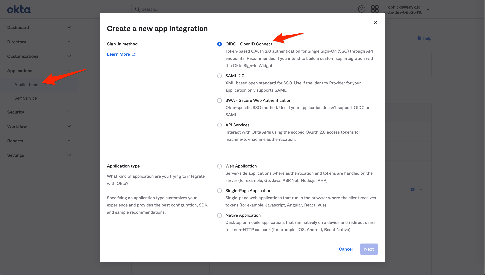<figcaption>
Create a new app integration in Okta
</figcaption></figure>

## Enter the sign-in redirect URI

<figure><figcaption>
Enter the Sign-in redirect URL for the new web app integration
</figcaption></figure>

Find the [OIDC information to provide to Snyk](https://docs.snyk.io/features/user-and-group-management/setting-up-sso-for-authentication/set-up-snyk-single-sign-on-sso#oidc-information-to-provide-to-snyk): Issuer URL, Client ID, Client Secret, Email domains and subdomains. The information follows \[\[where?]].

## Add Roles in Okta

### Add OIDC claim at the user level

On the Okta main page, select **Directory -> People**.

From the **Person & username list**, select a user.

<figure>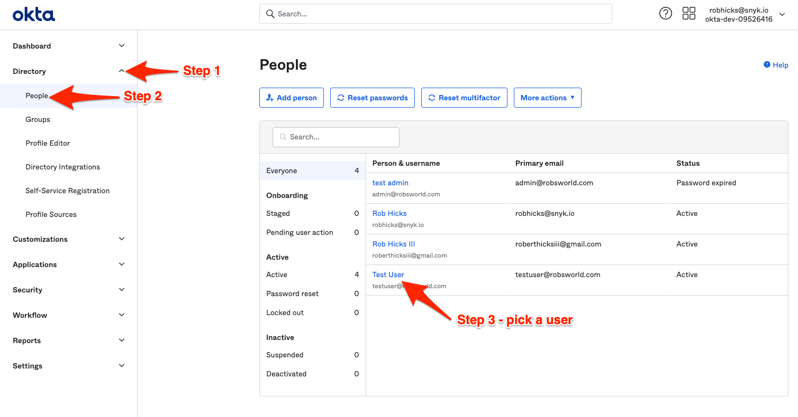<figcaption>
Select an Okat user
</figcaption></figure>

For the selected user, open the **Profile tab** and select **Edit**.

<figure>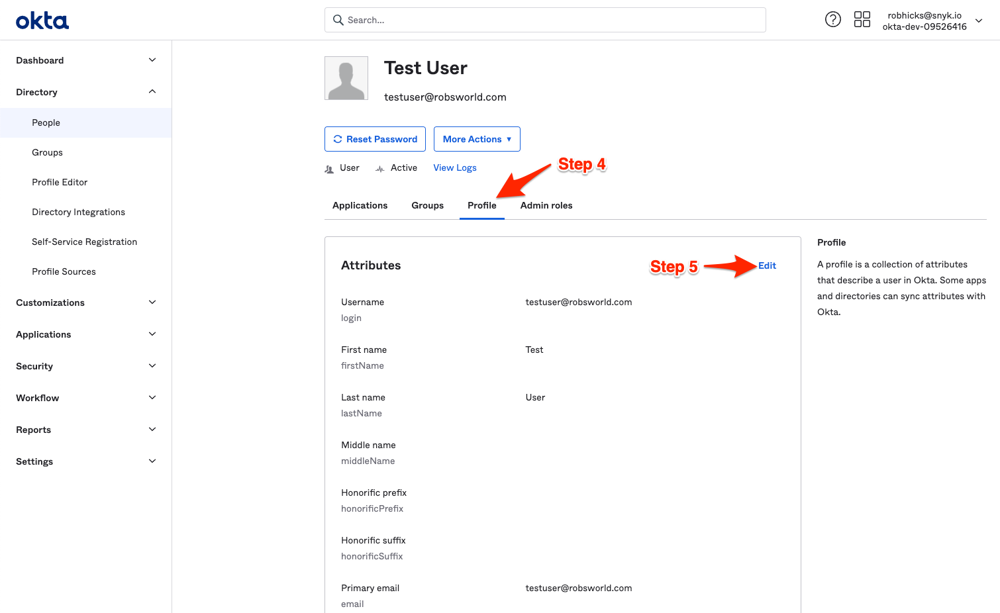<figcaption>
Edit the profile of the selected user
</figcaption></figure>

Select **Add Another Role** and enter the name of that role and select it.

<figure>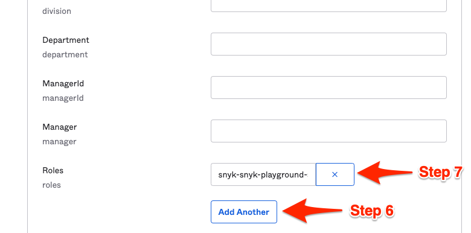<figcaption>
Specify the role
</figcaption></figure>

### Add OIDC claim at the group level

On the Okta main page, select **Security -> API**.

On the API tab, enter the Authentication Server, api://snyk.

<figure>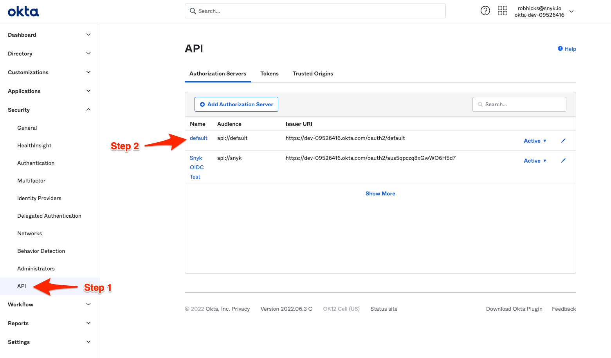<figcaption>
Enter the authentication server
</figcaption></figure>

On the Okta main page, select **Directory -> Groups -> Profile Editor**; in the Profile Editor, select the **Groups** tab.

<figure>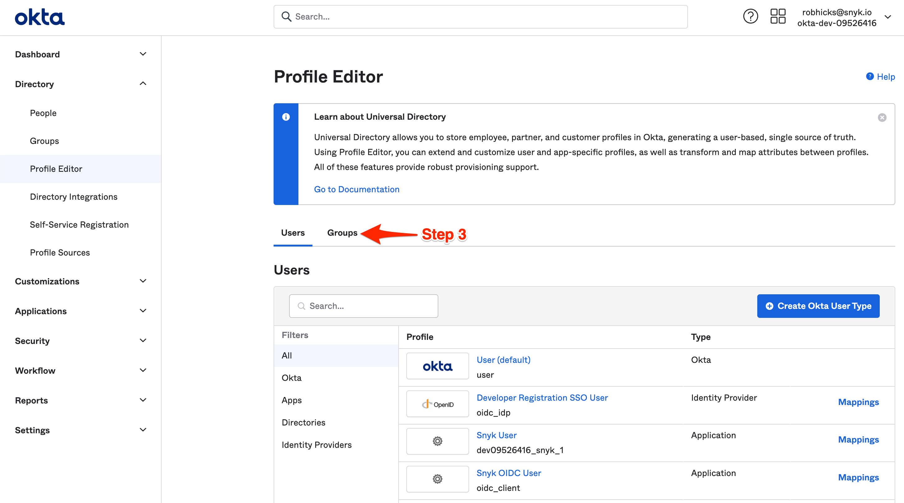<figcaption>
Navigate to the Groups tab in the Profile Editor
</figcaption></figure>

On the **Profile Editor Groups** tab, enter the name of the Okta group.

<figure>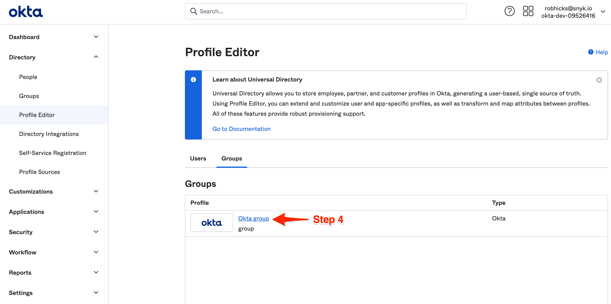<figcaption>
Enter the name of the Okta group
</figcaption></figure>

Open the **Okta group** details and select **Add attribute**.

<figure>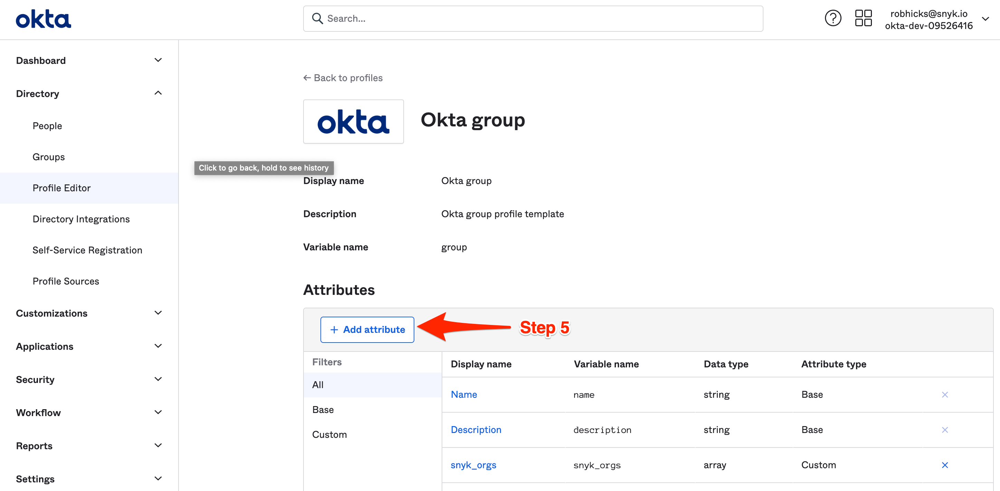<figcaption>
Select Add attribute for Okta group
</figcaption></figure>

Enter the values for the group attributes, here **Data type**, string array; **Display name**, snyk-orgs; **Variable name**, snyk\_orgs; **Description**, List of the Snyk orgs and permissions for user.

<figure>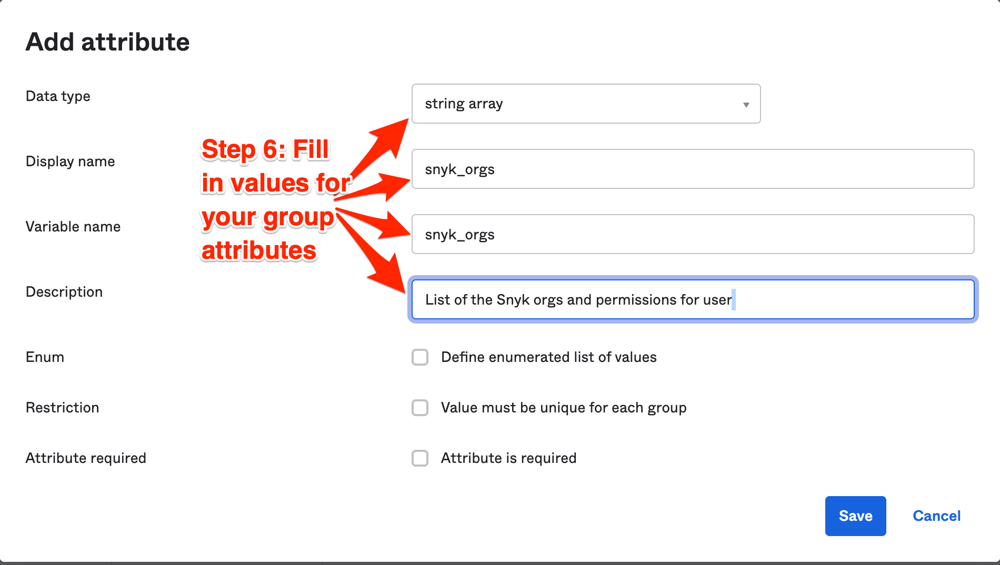<figcaption>
Enter the values for the Group attribute
</figcaption></figure>

From the Okta group details, select **Directory -> Groups**.

<figure>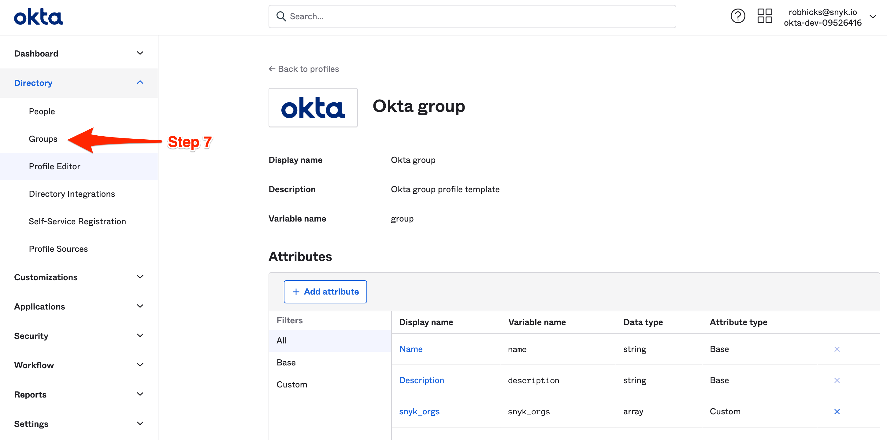 Groups"><figcaption>
Select Directory -> Groups
</figcaption></figure>

Select a group or **Add Group**.

<figure>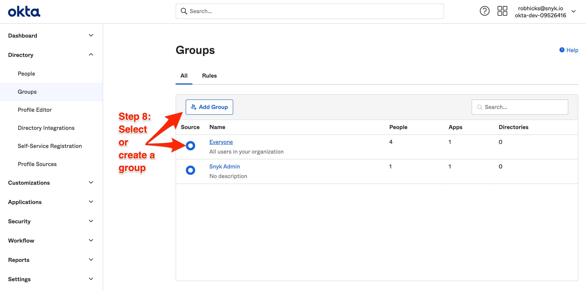<figcaption>
Select a group or Add Group
</figcaption></figure>

On the Snyk Admin screen, select the **Profile** tab.

<figure>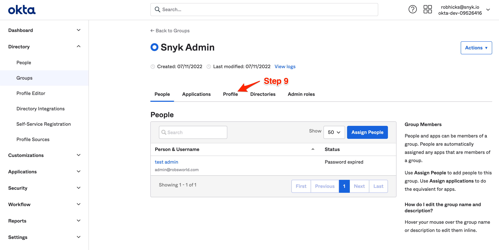<figcaption>
Select Profile tab on Snyk Admin screen
</figcaption></figure>

On the **Profile** tab, select **Edit**.

<figure>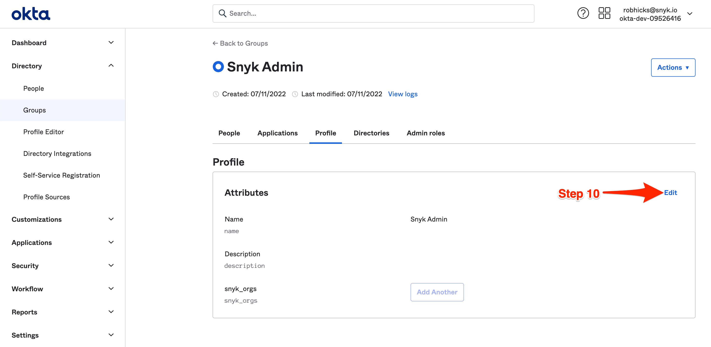<figcaption>
Select Edit on the Profile tab
</figcaption></figure>

On the Profile tab select **Add Another** and for the **snyk\_orgs Attribute**, Enter a string.

<figure><figcaption>
Add snyk_orgs Attribute
</figcaption></figure>

## Create a new claim

On the Okta main page, select **Security -> API**.&#x20;

On the **default** page, select the **Claims** tab and on the tab, select **Add Claim**.

<figure>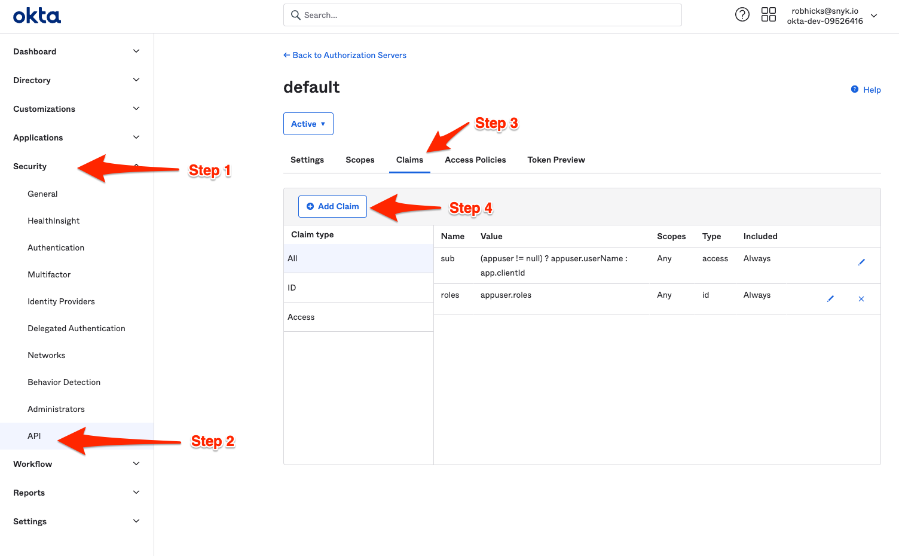<figcaption>
Create a new claim
</figcaption></figure>

## Set attributes for the new claim

On the **Edit Claim** page, enter the values for the attributes:\
**Name**: roles\
**Include in token type**: ID Token, Always\
**Value type**: Expression\
Value: Add your attribute, appsuser.roles in the example that follows\
**Include in**: Select the scope that will be passed to Snyk. Any scope in the example that follows. You can also enter scopes.

When you are finished, select **Save**.

<figure><figcaption>
Example attributes for a claim
</figcaption></figure>

