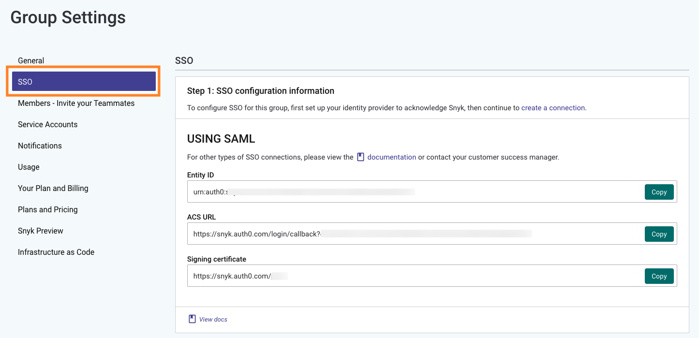

# Self Serve Single Sign-On (SSO)

Group Admins of a Business or Enterprise plan who use SAML for SSO can configure Snyk Single Sign-on by themselves. Ensure you have at least one Group and Organization to indicate where new users will be assigned. See [Groups, Organizations, and Users](../../../../introducing-snyk/groups-organizations-and-users.md).


Self serve SSO does not accommodate [custom mapping](../custom-mapping-option/). To set up custom SSO for your Snyk Group, contact your Snyk account team.


The following video demonstrates the process and steps for setting up single sign-on when using SAML.



## Use SAML for SSO: process overview

The process of establishing trust between your identity provider (IdP) and Snyk requires that the Group Admin do the following:

1. **Configure your identity provider (IdP)** by using the details about the Snyk environment displayed on-screen and user attributes.
2. **Enter SAML attributes** from your identity provider(IdP) in the Group SSO Settings page.
3. **Configure Snyk SSO settings**, choosing how you want your members to log in.
4. Verify SSO login to confirm the login process is working correctly.


After SSO is configured both from Snyk and your company's network, a trust relationship is established with Snyk, Auth0 (on behalf of Snyk), and your network. Any sensitive data is encrypted and stored in Auth0 only for the purposes of enabling user logins.


## **User login**

Users are provisioned to Snyk when they log in (see [Choose a provisioning option](../choose-a-provisioning-option.md)). If the new user role selected is Group Member, the new user sees only a list of your Organizations until the admin adds them to the appropriate Organizations.

## Step 1. Configure your identity provider

To establish trust with Snyk, add an Entity ID, an Assertion Consumer Service (ACS) URL, and a Signing certificate in your identity provider (IdP).

* The **Entity ID** is the URL that uniquely identifies Snyk as a SAML entity or service provider. Note that the **default Entity ID must be checked** manually as no default is set for this.
* The **Assertion Consumer Service (ACS)** is the endpoint on the Snyk network that listens for requests from your identity provider to enable communication between users on your network and Snyk. This URL is sometimes called a Reply URL.
* The **Signing certificate** is the Snyk certificate, stored on your server that is needed to maintain the trust relationship. It contains the necessary encryption keys for authentication.

**Group Admins** can find the Snyk details required to set up the connection with your Identity provider (IdP) as follows.

To access the Group overview for your group, click **Settings** .png) > **SSO**:

<figure><figcaption>
Group settings
</figcaption></figure>

To map information from your Identity provider to Snyk, name your user attributes as follows, using the same capitalization and spelling.

| Attribute | Description                                     |
| --------- | ----------------------------------------------- |
| email     | The user’s email address                        |
| name      | The name of the person to be authenticated      |
| username  | The person’s username for the identity provider |

An example from Okta follows:

<figure><figcaption>
SAML settings
</figcaption></figure>


If your user attributes do not match, the Snyk configuration for your SSO will not work.


For more details about these attributes, see [Step 3. Snyk SSO settings](./#step-3.-snyk-sso-settings).

## Step 2. Enter SAML Attributes

After the identity provider is set up to acknowledge Snyk, obtain the following information from your identity provider and organization.

Click **create a connection** to establish trust on the service provider side:

<figure><figcaption>
Create a connection
</figcaption></figure>

Provide SAML attributes in the following form.

* **Sign in URL** (mandatory): Identity Provider sign-in URL
* **Sign out URL**: Redirect URL when user signs out of Snyk. Recommended
* **X509 signing certificate** (mandatory): The identity provider public key. Download the certificate from your identity provider and paste it here. The system will encode it in _**Base64 format.**_
* **Email domains and sub-domains** that would need SSO access (mandatory)
* **Protocol binding**: HTTP-POST is recommended; HTTP-Redirect is also supported .
* **IdP-Initiated workflow**: Enable this option to add Snyk tile to your identity provider.\
  **Note:** IdP-Initiated SSO behavior carries a [security risk](https://auth0.com/docs/authenticate/protocols/saml/saml-sso-integrations/identity-provider-initiated-single-sign-on#risks-and-considerations) and is therefore not recommended. The risk is explained on the IdP side, and should be understood before you enable this option.

<figure><figcaption>
Enter SAML attributes
</figcaption></figure>

After filling in the details click **Save Changes**. Snyk highlights any errors. You can edit SAML attributes at any time. Save your changes and they will be reflected in the SSO connection immediately.

## Step 3. Snyk SSO settings

Now click **Configure Snyk SSO settings below** in the success banner to complete the setup.

<figure><figcaption>
Configure Snyk SSO settings below
</figcaption></figure>

Choose the new user’s role (see [Choose a provisioning option](../choose-a-provisioning-option.md)):

The **Profile attributes** values are used to map the user's SAML payload data, to ensure that Snyk receives the proper email, name, and userName. It should be the exact keys from the raw json from SAML payload.

The values will be auto-populated by the system as **nameIdAttributes.value**.


Snyk suggests that you consult your SSO administrator and determine how the email address, name (a display name, First name + Last Name), and username (a unique identifier) are represented when the identity provider is configured as described in [Step 1. Configure your identity provider](./#step-1.-configure-your-identity-provider).


After the selections are made, click **Save Changes** to complete your SSO configuration.

## Step 4. Verify SSO login

When the SSO settings are saved, click the **direct login URL** displayed on the screen for the SSO connection you set up. You will be taken to your IdP through which you can log in to your Snyk Group.

<figure><figcaption>
DIrect login URL
</figcaption></figure>

Alternatively, you can login to [**snyk**](http://snyk.io) in incognito mode to prevent cookies from interfering and verify the SSO Login is working.

Use the direct SSO link: [https://app.snyk.io/login/sso](https://app.snyk.io/login/sso) or follow these steps:

1. [https://snyk.io](https://snyk.io)
2. Log in
3. SSO
4. Enter your email address.
5. Continue to your identity provider and log in.
