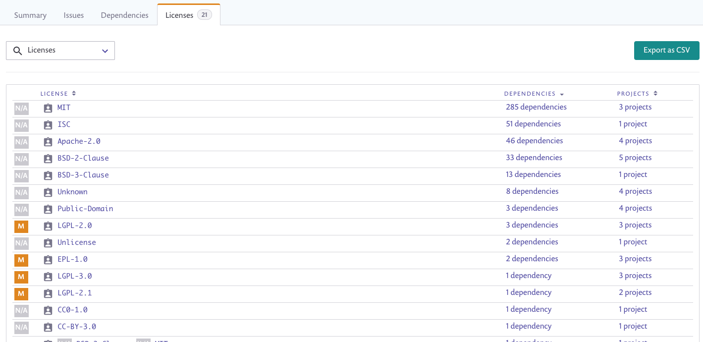
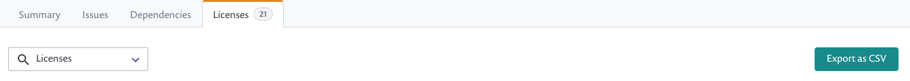
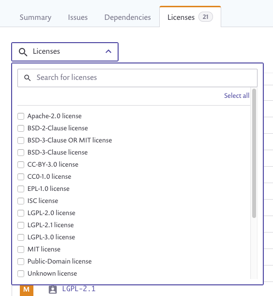

# Licenses tab

The **Licenses** area displays all licenses that are currently used in your project, as well as a summary of all dependencies in your projects and a summary of all of your projects using the license.

## **Licenses tab elements**

The following table describes the different parts of the **Licenses** area:

| **Element**  | **Description**                                                                                                                                                                                         |
| ------------ | ------------------------------------------------------------------------------------------------------------------------------------------------------------------------------------------------------- |
| License      | The full official name of the license, linked to additional details and information on the [SPDX](https://spdx.org) site.                                                                               |
| Dependencies | The total number of dependent packages with this license in your projects, linked to a side panel that displays the full list of affected dependencies in the same layout as the **Dependencies** area. |
| Projects     | The total number of your projects using this license, linked to a side panel that displays the full list of your affected projects, with the same layout as the **Dependencies** tab.                   |

## **Licenses tab actions**

These controls appear at the top of the window:

* **Search for Licenses**—the dynamic search field enables you to enter free text and begins searching with the first character you type; alternatively, select multiple packages from the dropdown list that opens when you click in the field. In addition, click the Select All or Deselect All links that dynamically appear in the upper right-hand corner of the dropdown list.
* **License filters**—mark the packages to be displayed by selecting specific project types. Only issues matching all selected criteria are displayed.

* **Export as CSV**—export issue data in CSV file format.
