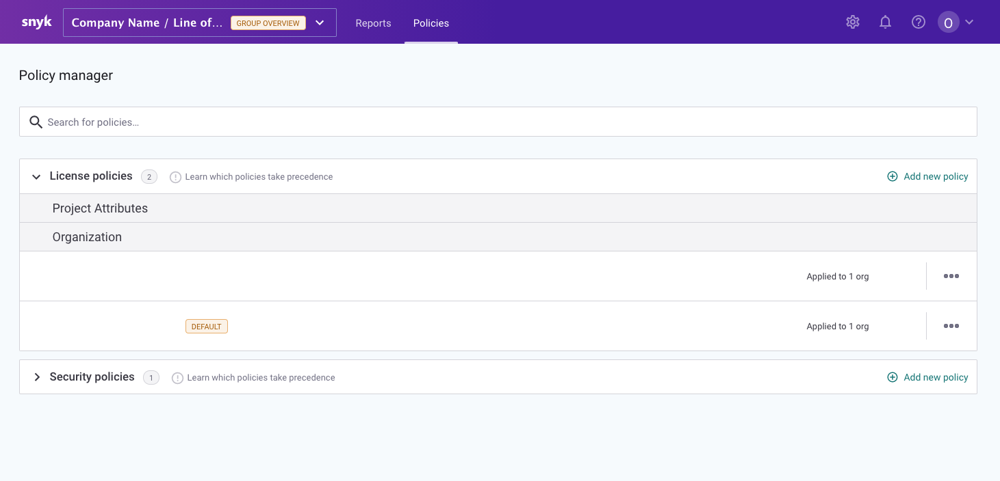

# Shared Policies Overview

**Prerequisites**

* You must be a group administrator of the group in order to update **Policy** settings


**Feature availability**  
This feature is available to Enterprise customers. See [Pricing plans](https://snyk.io/plans/) for more details.


### Navigate to the Policy manager

1. Log in to Snyk 
2. Navigate to your group
3. Click on the Policies tab in the navigation bar to see all the policies that exist within your group, broken out by category. This list will include the [default policy](shared-policies-overview.md), which is automatically created for new groups for each policy category and cannot be removed.

The Policy manager appears similar to the following: 

## Default policies 

Each policy category has its own default policy. Default policies can only be applied to organizations, not project attributes.

When you create a **new** **organization**, it will automatically be added to the default policy, unless you have selected to copy an existing organization's settings. Organizations can be moved to a different policy if desired.

The default policy cannot be deleted; however, the default policy name, description, and the rules can be edited to match your preferences. A default policy can also contain no rules if you'd prefer.

To learn more about how to add and remove organizations to the default policy, read more about it [here](https://support.snyk.io/hc/en-us/articles/360007590198).

