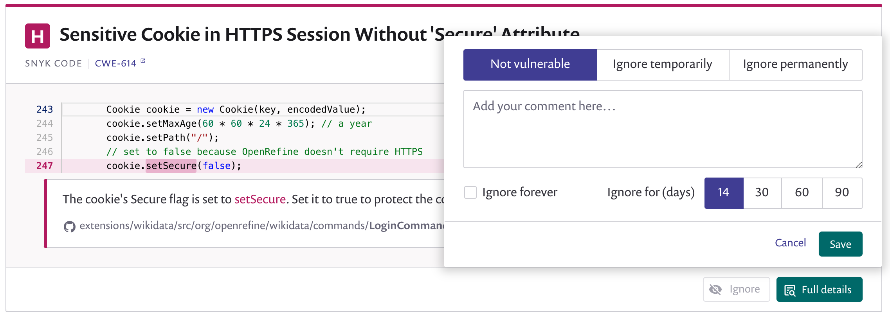

# Introduction to ignoring issues


See [Ignoring issues not prioritized for your project](https://support.snyk.io/hc/en-us/articles/360004002718-Ignoring-issues-not-prioritized-for-your-project) for more details of ignoring issues.


## Snyk UI

Each issue card has an **Ignore** button allowing you to ignore that issue:

## Snyk CLI

In the Snyk CLI, you can ignore issues using **snyk ignore**. For example:

`snyk ignore --id='npm:braces:20180219' --expiry='2018-04-01' --reason='testing'`

