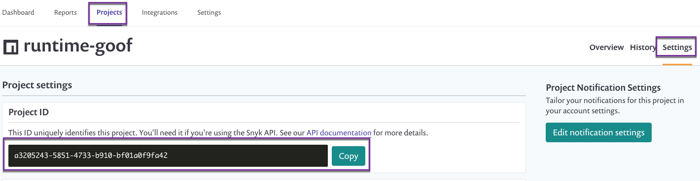

# Snyk runtime monitoring: prerequisites for configuration


This feature is deprecated.


* Ensure Snyk is already monitoring the necessary project.
* Configure the runtime agent using the relevant project ID. Locate the project ID by inspecting the settings page of your project, such as in the following image:

* Alternatively, you can use the Snyk [projects API](https://snyk.docs.apiary.io/#reference/projects/projects-by-organisation/list-all-projects/) to retrieve the project ID.
* Once you’ve got the ID handy, follow the installation instructions for these languages:
  * [Node.js](https://support.snyk.io/hc/articles/360003699058#UUID-d77e89bf-6e75-f50c-b188-ad4d9a39905c/)
  * [Java](https://support.snyk.io/hc/articles/360003699118#UUID-f0e61d17-c33e-da57-081a-9b90927e6428/)


Ready to get started with Snyk? [Sign up for free!](https://snyk.io/login?cta=sign-up&loc=footer&page=support_docs_page)


