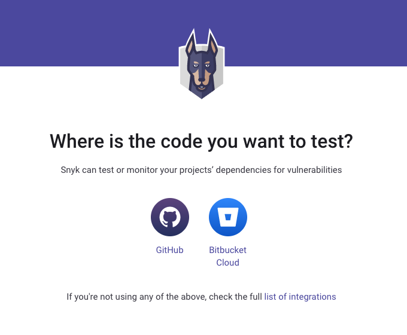

# Create a Snyk account

You will need a Snyk account to use Snyk functions.

### Create an account

To create a Snyk account:

1.  Go to [https://snyk.io/](https://snyk.io) and click **Start free** on the left of the page, or **Sign up**.\

    <figure><figcaption>
Click to start free or sign up for a Snyk account
</figcaption></figure>
2. Choose your preferred signup method.\
   
3. Create a new account as prompted. You now have a free Snyk account! Access your Snyk account at [https://app.snyk.io](https://app.snyk.io)


Different pricing plans are available, see [Plans](../introducing-snyk/plans.md) for details.


### What's next?

#### Follow walkthrough prompts

The Snyk web app will now provide some optional getting started walkthrough prompts. You can choose to provide some information to help us guide your experience, then follow the prompts to integrate your code repository for a seamless experience.

For example:

If you click **GitHub**, then fill in the details as prompted (see [Set up an integration](set-up-an-integration.md)):

.png>)

Finally, you can [import a Project](import-a-project.md) to scan:

#### Perform setup yourself

Alternatively, you can choose to run your own setup process; start with [set up a Snyk integration](set-up-an-integration.md).
