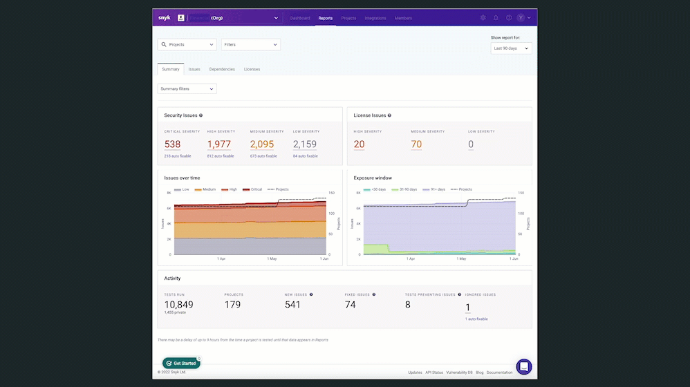
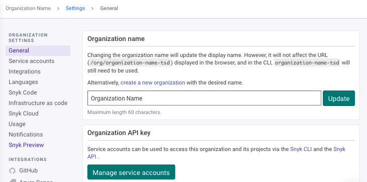
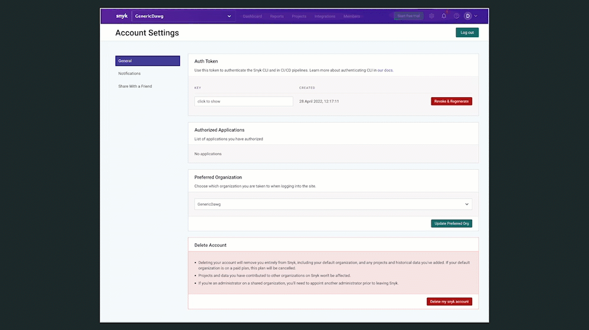

# Exploring the Snyk Web UI


If you have not done so already, you should [create an account](quickstart/create-a-snyk-account/).


## Introduction to the Snyk Web UI and supported browsers

You can use the Snyk Web UI to run a full set of Snyk functions from your browser. See [supported browsers](../more-info/supported-browsers.md) for details.

<figure><figcaption>
Introducing the Snyk Web UI
</figcaption></figure>


You can also access Snyk functions from the [Snyk CLI](../snyk-cli/), from [within your IDE](../integrations/ide-tools/), and using the [Snyk API](../snyk-api/).


You can connect your code repositories, and then use Snyk to scan and secure your application code, open-source libraries, container registries, and configuration files.

## Web UI functions

* [Explore the Dashboard](exploring-the-snyk-web-ui.md#dashboard)
* [Investigate reports](exploring-the-snyk-web-ui.md#reports)
* [Manage Projects](exploring-the-snyk-web-ui.md#manage-your-projects)
* [Manage integrations](exploring-the-snyk-web-ui.md#manage-your-integrations)
* [Manage Group or Organization members](exploring-the-snyk-web-ui.md#manage-organization-or-group-members)
* [View Snyk updates](exploring-the-snyk-web-ui.md#view-product-updates)
* [Get help](exploring-the-snyk-web-ui.md#view-helpful-resources)
* [Manage my user account](exploring-the-snyk-web-ui.md#manage-account-preferences-and-settings)

### Explore the Dashboard

When you log in to an existing account, the Web UI opens to the Dashboard, allowing you to view your pending tasks and vulnerable projects, invite team members, and add new Projects.

<figure><figcaption>
Snyk dashboard for an Enterprise account
</figcaption></figure>

In the above example, the Snyk dashboard for an Enterprise account shows pending tasks and vulnerable projects.

#### Pending tasks

The **Pending tasks** section shows the next chores to be handled for the Projects in a Snyk Organization. This information includes:

* Pull Requests (PRs) that can be raised to fix vulnerabilities in some of the most vulnerable projects.
* PRs that have already been raised by or through Snyk and are open and awaiting review.

Currently, Snyk tracks and flags PRs in GitHub, GitHub Enterprise, and Bitbucket Cloud only, and only for the top-most vulnerable projects. If you use another SCM, **Pending tasks** shows only PRs that can be raised, and not PRs that have already been raised.

<figure><figcaption>
Pending tasks and Vulnerable Projects listed on the Dashboard
</figcaption></figure>

#### Add project

Use the **Add project** link on the dashboard to add [Snyk Projects](../snyk-admin/introduction-to-snyk-projects/). Select how to add the Project from the dropdown.

Use the links for Projects on the dashboard to explore and manage the metadata, retest, and fix options for the Targetfiles in your Projects. Each link opens a Project details page where you can view the Project **Overview**, or switch to the **History** and **Settings** tabs.

* For Projects with the **Fix vulnerabilities** link, use the link to view Project details with an option to **Open a Fix PR.** Use this option to open a fix PR to implement the upgrades and patches in GitHub that address the issues.
* For Projects with a **View PR** link, use the link to open and view the Snyk-generated PR fixes in GitHub.

<figure><figcaption>
Demo, add project and Project details tabs
</figcaption></figure>

### **View reports**

You can view [reports](../manage-issues/reporting/legacy-reports/) to gain visibility and insights into the state of all your Projects, vulnerabilities, and license issues.


**Feature availability**\
This feature is available for Enterprise plans.


<figure><figcaption>
Demo of viewing reports, filters, and summary filters
</figcaption></figure>

### **Manage your** **Projects**

Select the **Projects** link in the navigation on the dashboard to open the **Projects** listing page where you can:

* Add a Project. Select the way you want to add the Project from the dropdown.
* Filter, group, and sort your Projects.
* View tips and the latest import log for your Projects.
* Select the link for each Project to view the Project details page with a summary and Issue information.
* Use the plus icon and add a Target from a custom location when Projects are grouped by Target. This allows for grouping projects in another Target in the list.
* Use the settings icon on the ungrouped **Projects** listing or the **Settings** tab on the Project detail page to configure General and GitHub integration settings for notifications, Project testing, and pull request (PR) frequency. You can also look up the unique Project ID and deactivate or delete a project on the Settings tab.
* View the Project history on the **History** tab.

<figure><figcaption>
Options on the Projets listing page
</figcaption></figure>

### **Manage your** **Integrations**

Select **Integrations** from the navigation on the dashboard to open the [Integrations](../integrations/) page where you can do the following:

* View the supported environments that can connect to Snyk for vulnerability monitoring.
* Manage [Slack](https://docs.snyk.io/integrations/notifications-ticketing-system-integrations/slack-integration) and [Jira](https://docs.snyk.io/integrations/notifications-ticketing-system-integrations/jira) integrations.
* Learn about the [Vulnerability management tools](https://docs.snyk.io/integrations/vulnerability-management-tools).

<figure><figcaption>
Integrations page
</figcaption></figure>

### Manage Organization or Group members

Select **Members** from the navigation on the dashboard to view and manage users, roles, and how users authenticate in your Snyk [Organization](../snyk-admin/manage-users-in-organizations-and-groups/manage-users-in-organizations.md) or [Group](../snyk-admin/manage-users-in-organizations-and-groups/manage-users-in-a-group.md).


You must be assigned the [required Admin roles and permissions](../snyk-admin/manage-permissions-and-roles/permissions-associated-with-each-pre-defined-role.md) to make changes in the **Members** tab.


### Snyk Organization or Group Settings

Use the **Settings** option to view and manage your Organization (team) or Group (company-wide) settings.

<figure><figcaption>
Group and Organization settings
</figcaption></figure>

See [Managing settings](../snyk-admin/manage-settings/) for more details.

### View product updates

Select **Help** in the navigation on the dashboard and then select **Product updates** to visit [snyk.io updates](https://updates.snyk.io/).

### View helpful resources

Select **Help** in the navigation on the dashboard and then select an option to view resources with information about Snyk.

### Manage account preferences and settings

Select your **name** in the navigation on the dashboard and then **Account settings** to open your [account settings](https://app.snyk.io/account) page where you can view and configure your user account settings and your notification and sharing preferences.

You have access to the following information and options in the in the Account Settings:

* View and manage your API token (or the Auth Token for free accounts).
* View the list of your Authorized Applications.
* Set your Preferred Organization.
* Delete your account.
* Manage your notification preferences for Email Notifications, Issue email alerts, the Weekly report, Usage alerts, Report status, and Marketing & Sales Communications.
* Share a Snyk referral link with your friends.

<figure><figcaption>
Account settings screens
</figcaption></figure>
