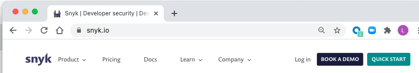

# Getting started with Snyk products

## Create a Snyk account

To create a Snyk account:

1. Go to [https://snyk.io/](https://snyk.io/) and click **QUICK START** from the menu:  

1. When prompted, select your preferred way to log in:  

1. Enter your login credentials \(or create a new account\). For example, for Google:  

1. You now have a Snyk account. You can:
   1. Enter brief information to help us guide your experience, then follow the prompts to integrate your project.
   2. Access your Snyk dashboard at [https://app.snyk.io](https://app.snyk.io/):

### For more information

See [Getting started with Snyk products](https://support.snyk.io/hc/en-us/sections/360004349758-Getting-started-with-Snyk-products) for more details.

