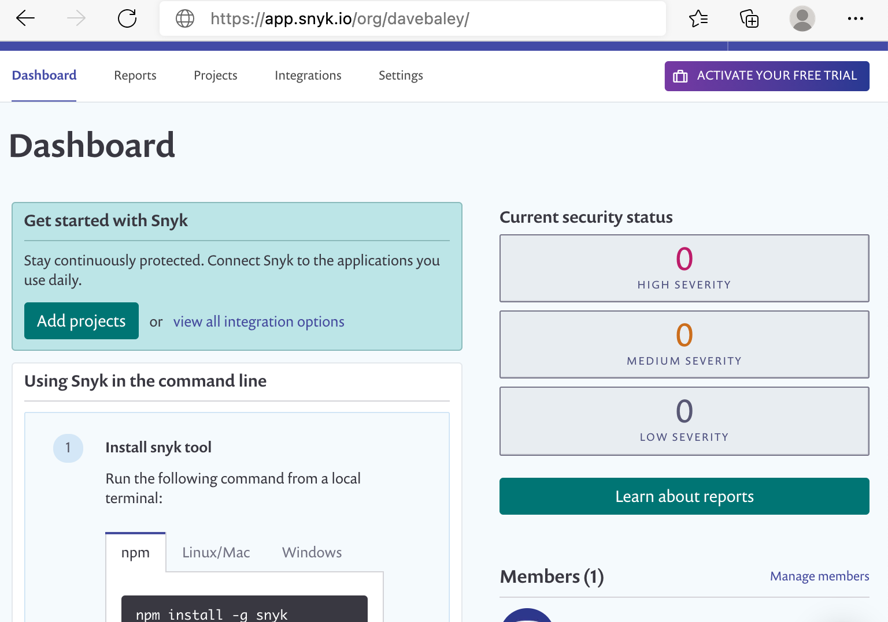

# Getting started with Snyk products

## To create a Snyk account

1. Go to [https://snyk.io/](https://snyk.io/) and click **SIGN UP** from the menu:  
2. Select your preferred way to log in or sign up.
3. Enter your login credentials \(or create a new account\) as prompted. 
4. You now have a Snyk account. You can:
   1. Enter brief information to help us guide your experience, then follow the prompts to integrate your project.
   2. Access your Snyk dashboard at [https://app.snyk.io](https://app.snyk.io/):

\_\_\_\_\_\_\_\_\_\_\_\_


Ready to get started with Snyk? [Sign up for free!](https://snyk.io/login?cta=sign-up&loc=footer&page=support_docs_page)


