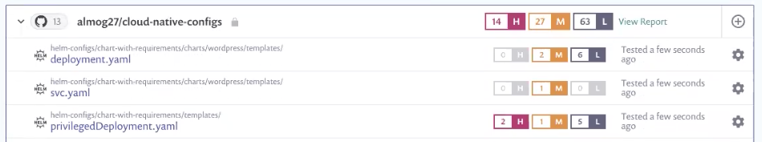
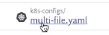
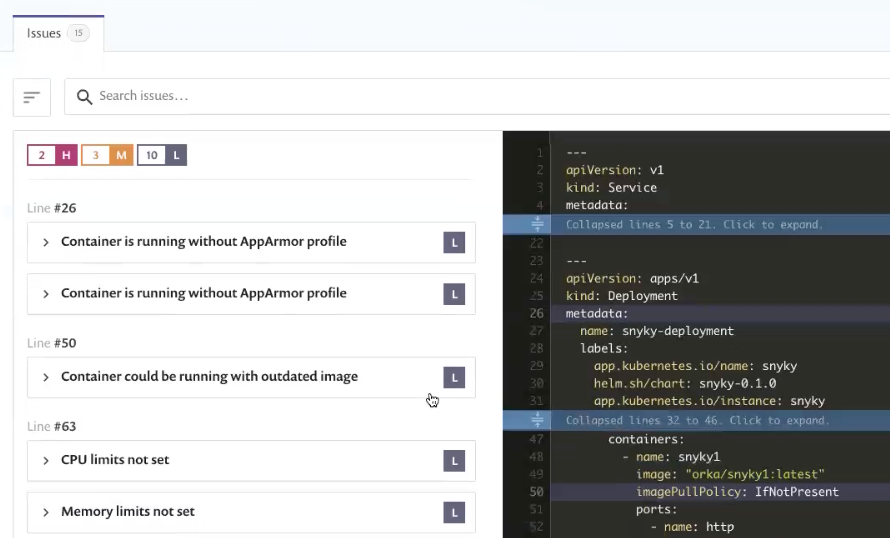
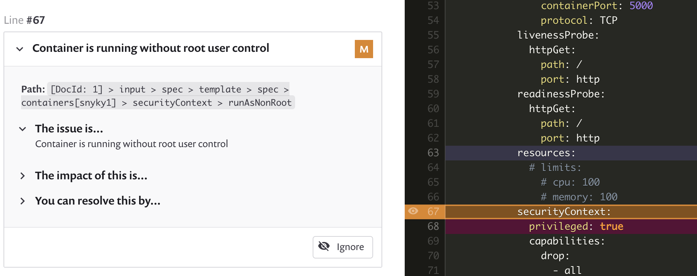

# Getting started with Snyk Infrastructure as Code \(IaC\)

Get started with Snyk IaC to inspect, find and fix issues in configuration files for Terraform or Kubernetes \(including Helm\) environments. For more information, see [Scan your Kubernetes configuration files](https://support.snyk.io/hc/en-us/sections/360001881957-Scan-your-Kubernetes-configuration-files) and [Scan your Terraform files](https://support.snyk.io/hc/en-us/sections/360003156537-Scan-your-Terraform-files).


This article describes a process using the Snyk.io UI. For details of using IaC with the Snyk CLI, see [Snyk CLI for Infrastructure as Code](../../snyk-infrastructure-as-code/snyk-cli-for-infrastructure-as-code/).


### **Prerequisites**

Ensure you have:

1. A Snyk account \(go to [https://snyk.io/](https://snyk.io/) and sign up - see [Create a Snyk account](https://docs.snyk.io/getting-started/getting-started-snyk-products) for details\).
2. An existing Kubernetes or Terraform environment to work in.
3. Integrated your Git repository as for other Snyk products - see [Git repository \(SCM integrations\)](https://support.snyk.io/hc/en-us/sections/360001138098-Git-repository-SCM-integrations) for more details.

For more details, see:

* [Configure your integration to find security issues in your Kubernetes configuration files](https://docs.snyk.io/snyk-infrastructure-as-code/scan-kubernetes-configuration-files/configure-integration-for-security-issues-in-kubernetes-configuration-files)
* [Configure your integration to find security issues in your Terraform files](https://docs.snyk.io/snyk-infrastructure-as-code/scan-terraform-files/configure-your-integration-to-find-security-issues-in-your-terraform-filess).

## Stage 1: Import projects

Import projects to test with Snyk, by choosing repositories for Snyk to test and monitor.

1. Select **Projects** from Snyk.io.
2. Select the tool to add the project from \(for example GitHub\):

1. In **Personal and Organization repositories**, select the repositories to use. 4. Click **Add selected repositories** to import the selected repositories into your projects. 

1. A progress bar appears: click **View log** to see import log results - for example:

\(you can scan both Kubernetes and Terraform files simultaneously, as in this example.\) 5. Project import completes.

### Stage 2: View configuration file issues

View results for configuration files in imported projects.

1. Select **Projects**, then click on the imported project entry, to see information for scanned configuration files, including the number of high, medium and low severity issues found. For example: 

  \(Issues are sorted into project types: Helm, Kubernetes and Terraform.\)
2. Click on a project to see more information and details of the issues in a configuration file:  


If you encounter any errors during import, see the [Importing projects](https://support.snyk.io/hc/en-us/sections/360000923478-Importing-projects) information.


## Stage 3: View and fix config files

Act on the recommendations produced by Snyk IaC.

1. IaC results appear as direct issues in the relevant scanned configuration files. For example:

2. Click on an issue to see the details for that issue, and specific recommendations from Snyk IaC. For example:

3. Edit the configuration file to fix the issue identified, based on the recommendations, then commit the change.
4. Snyk automatically rescans the changed file, and you can see the change reflected in the issue display.

## For more information

See [Infrastructure as Code](https://docs.snyk.io/snyk-infrastructure-as-code).

