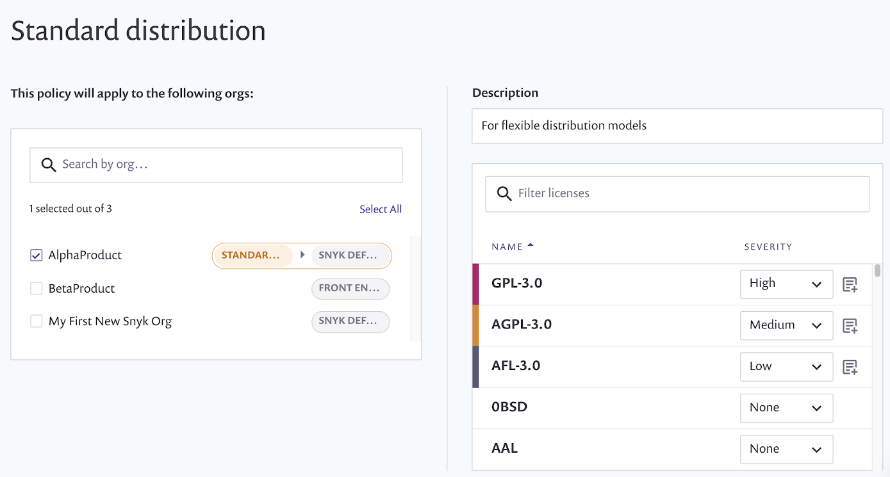
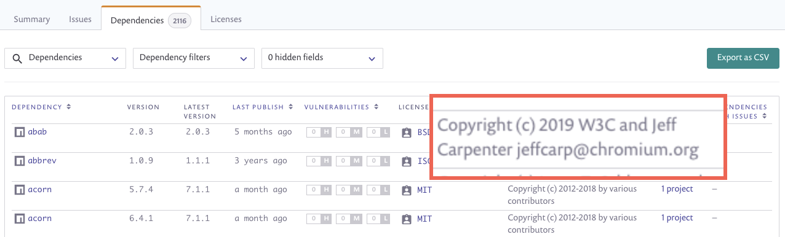

# Getting Started with Snyk License Compliance Management


**Feature availability**  
Basic license policy configuration on a single default license policy is available with Business plans. Full policy creation and management is available with Enterprise plans. See [pricing plans](https://snyk.io/plans/) for more details.


Get started with Snyk license compliance management, to check compliance for the [open source licenses](https://snyk.io/learn/open-source-licenses/) in your code, as part of your [Snyk Open Source](https://docs.snyk.io/snyk-open-source/open-source-basics) solution.


This process describes using the Snyk UI and a [supported source code management](https://support.snyk.io/hc/en-us/sections/360001138098-Git-repository-SCM-integrations) system.  
You can also use an [IDE tool](https://docs.snyk.io/integrations/ide-tools) or a [CI/CD integration](https://docs.snyk.io/integrations/ci-cd-integrations), or use the [Snyk CLI tool](https://docs.snyk.io/snyk-cli/guides-for-our-cli/getting-started-with-the-cli) to get started using the command line.


## **Prerequisites**

Ensure you have:

* A Snyk [paid plan](https://snyk.io/plans/).
* Integrated and installed your projects, as described for [Snyk Open Source](https://docs.snyk.io/getting-started/getting-started-snyk-products/getting-started-snyk-open-source).

## **Stage 1: Define policies**

To take effective action based on license issues, you need to define policies defining these actions, based on license types. Policies provide a way to capture different requirements within an organization, based on factors such as line of business. Work with your legal team to create policies which are specific to your company.

### Create policy rules

Each policy contains rules, detailing which licenses are acceptable and which are forbidden for use, together with a severity level which indicates how severe the license violation is. For example, severity levels for internal-only license issues may be less severe than for those released externally.

See [Licenses overview](https://docs.snyk.io/snyk-open-source/licenses) and [Setting a license policy](https://docs.snyk.io/snyk-open-source/license-policies/setting-a-license-policy).

## Stage 2: View issues

Snyk’s [Git-based integrations](https://support.snyk.io/hc/en-us/sections/360001138098-Git-repository-SCM-integrations) support license scanning as part of the regular workflow. During scanning, license issues appear as a filterable list in the **Issues** tab:

This example shows a high-severity issue for a GPL-2.0 license, with accompanying instructions as defined in policies for that license.

You can also view license issues using the Snyk CLI tool, after running **snyk test**:

**View dependencies**

Snyk shows license issues in both your direct and transitive dependencies, in a full dependency tree to show what dependency introduced the license issue.

This example includes two high severity license policy violations, caused by:

* a direct dependency on an npm package called **wicket@1.3.5**
* a transitive dependency on a package called **flickity@2.2.1** introduced by **web-project-starter@0.0.3**

**View lists and copyrights**

You can view and share detailed lists of licenses being used, and see a report that lists all the open source components and licenses along with copyright information.

## **Stage 3: Process issues**

You can now take actions to resolve the license issues identified during the scan, to help you build and deploy your application without outstanding licensing issues.

The actions you take depend on the license conditions and on your policies. For example, if a license violation is surfaced, this issue can be mitigated by either approaching your legal team, or by replacing the dependency which added the violation.

## For more information

See [Licenses](../../products/snyk-open-source/licenses/).

