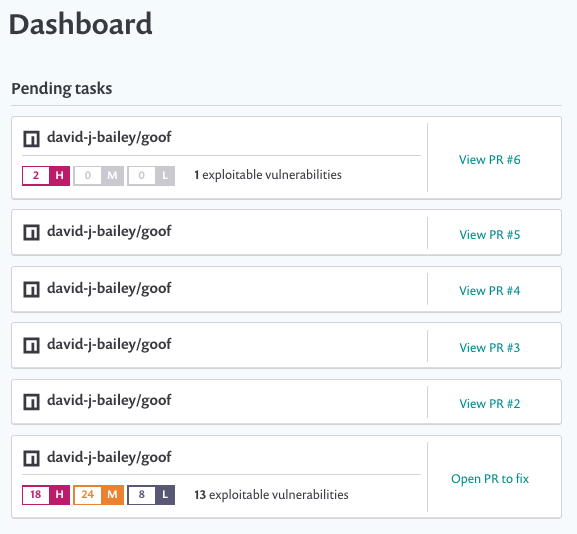

# Getting started with Snyk dashboard

**Pending tasks on the Snyk dashboard**

The **Pending tasks** section of the dashboard shows recommended outstanding work to consider around projects in a Snyk organization:

This information includes:

* Pull Requests \(PRs\) that could be raised to fix vulnerabilities in some of the most vulnerable projects.
* PRs that have already been raised \(by or through Snyk\) and are open and awaiting review.

Currently, Snyk only tracks and flags PRs in GitHub, and only for the top most vulnerable projects. If you use another SCM, **Pending tasks** only shows PRs that could be raised, not PRs that have already been raised.

