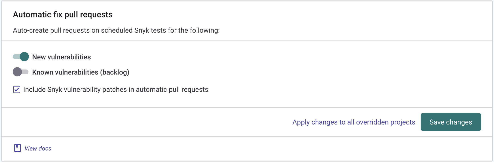

# Addressing the backlog

In the [Visibility](visibility.md) step you started to prioritize your worst issues, and in the [Prevention](prevention.md) step you worked on ensuring no new vulnerabilities were introduced. But what about the rest?&#x20;

### Different strategies for different stages

If you are actively working on an application, then the good news is that through new development older issues can be addressed early, just as if it was fresh new code.&#x20;

However if no new work is going on with that application, there are a few strategies at hand.

#### Fix the highest priority issues

One approach is to prioritize and then assign dev work to fix issues that have significance in this application code.

#### Auto-create PRs&#x20;

Another approach is to use Snyk’s proactive approach where it can periodically position PRs for older open source vulnerabilities that have fixes. To enable this backlog setting in your Source Control integration settings, you will find a setting labeled “Known vulnerabilities (backlog)”.

<figure><figcaption></figcaption></figure>

#### Manage work through Jira

Team plan users may also use the Jira integration to manage the backlog work. See [Assign fix work](../../walkthrough-code-repository-projects/assign-fix-work.md) for more information
