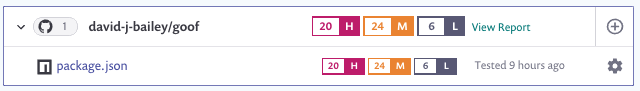
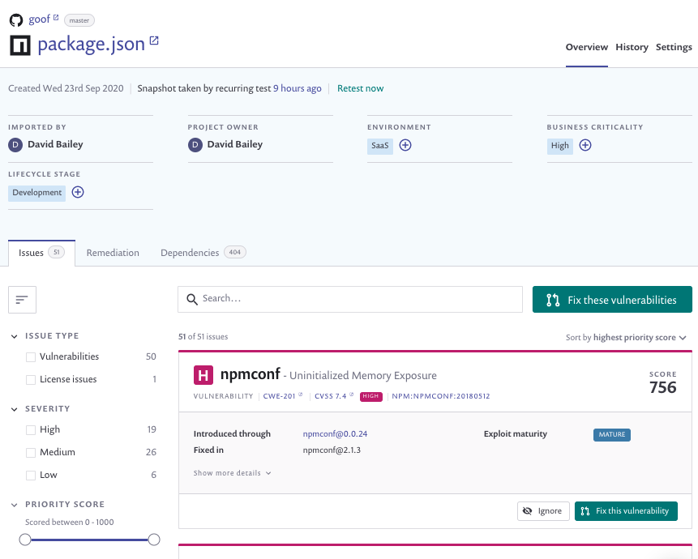
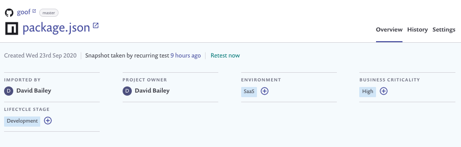

# View project information

## View application vulnerabilities

Snyk displays your application vulnerabilities and licensing issues for files in your projects. To see these vulnerabilities, go to [your projects tab](https://app.snyk.io/projects), then select the file associated with your project. For example, the package.json file in our example application goof:

Click on the entry to view detailed information:

Where:

* **Header**: shows project summary information. See the [View project summary information](view-project-information.md) section.
* **Issue cards**: show summaries of issues found. See [Issue card information](https://docs.snyk.io/getting-started/introduction-to-snyk-projects/issue-card-information).
* **Views**:
  * **Overview**: shows [project issues, remediation, and dependencies](https://docs.snyk.io/getting-started/introduction-to-snyk-projects/view-project-issues-remediations-and-dependencies).
  * **History**: shows historical snapshots of the 4 most recent tests. See [View project history](https://docs.snyk.io/getting-started/introduction-to-snyk-projects/view-project-history).
  * **Settings**: shows [project settings](https://docs.snyk.io/getting-started/introduction-to-snyk-projects/view-project-settings).

### View project summary information

The summary information shows:

* File and history details:
  * The name \(plus link\) of the monitored repository.
  * The monitored branch name.
  * A direct link to the project file in the SCM.
  * The time when the project was first imported to Snyk.
  * The time when an up-to-date snapshot of the file was fetched from the SCM and tested.
* Predefined [project attributes](https://docs.snyk.io/fixing-and-prioritizing-issues/policies/assign-a-policy-to-project-attributes), and any additional [project tag](https://docs.snyk.io/getting-started/introduction-to-snyk-projects/project-tags) metadata.


Ready to get started with Snyk? [Sign up for free!](https://snyk.io/login?cta=sign-up&loc=footer&page=support_docs_page)


