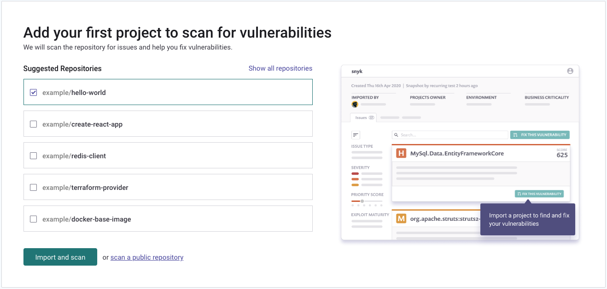

# Create a Snyk account

You need a Snyk account to use Snyk functions.

To create a Snyk account:

1.  Go to [https://snyk.io/](https://snyk.io) and click **Start free** on the left of the page, or **Sign up**.

    <figure><figcaption>
Start free or sign up for a Snyk account
</figcaption></figure>
2.  Choose your preferred signup method.

    <figure><figcaption>
Choose signup method
</figcaption></figure>
3. Create a new account as prompted. You now have a free Snyk account and can log in at any time at [https://app.snyk.io](https://app.snyk.io)

<figure><figcaption>
Get started options for a new Snyk account
</figcaption></figure>


Different pricing plans are available, see [Plans](../../snyk-processes/plans.md) for details.


**What's next?**

You can follow the walkthrough prompts as shown in the example that follows, or run your own setup process; start with [set up a Snyk integration](set-up-an-integration.md).

The Snyk web app provides some optional getting started walkthrough prompts. You can choose to provide some information to help Snyk guide your experience, and then follow the prompts to integrate your code repository for a seamless experience.

For example follows.

<figure><figcaption>
Choose integration method
</figcaption></figure>

If you select **GitHub**, then fill in the details as prompted (see [Set up an integration](set-up-an-integration.md)).

<figure><figcaption>
Set access permissions
</figcaption></figure>

<figure><figcaption>
Configure automation settings &#x26; authenticate
</figcaption></figure>

Finally, you can [import a Project](import-a-project.md) to scan:

<figure><figcaption>
Add your first project
</figcaption></figure>

