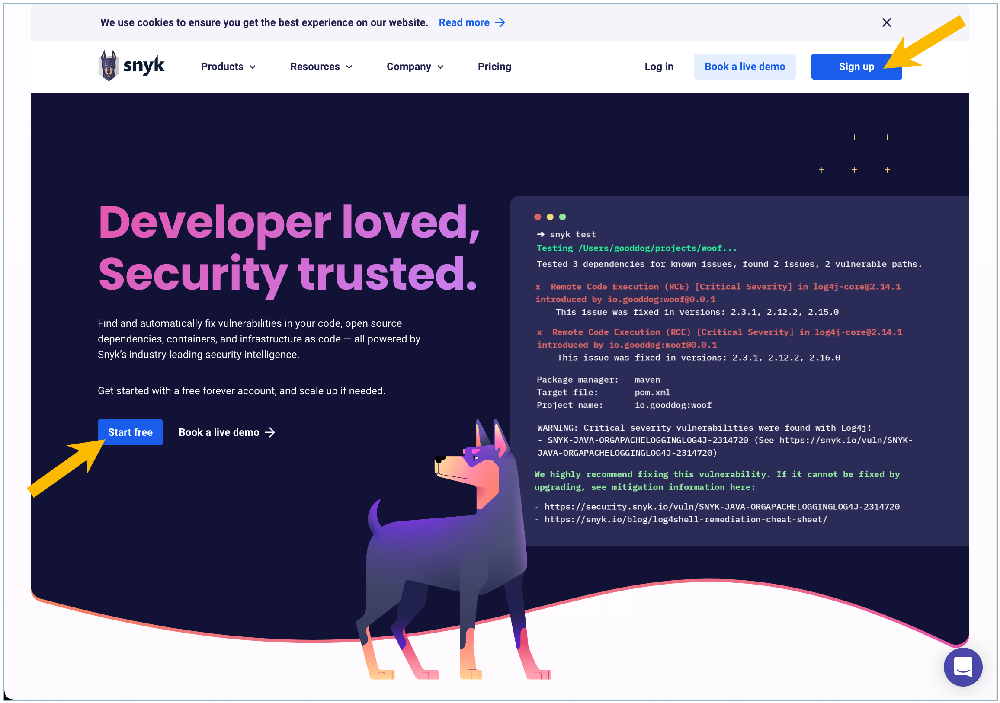
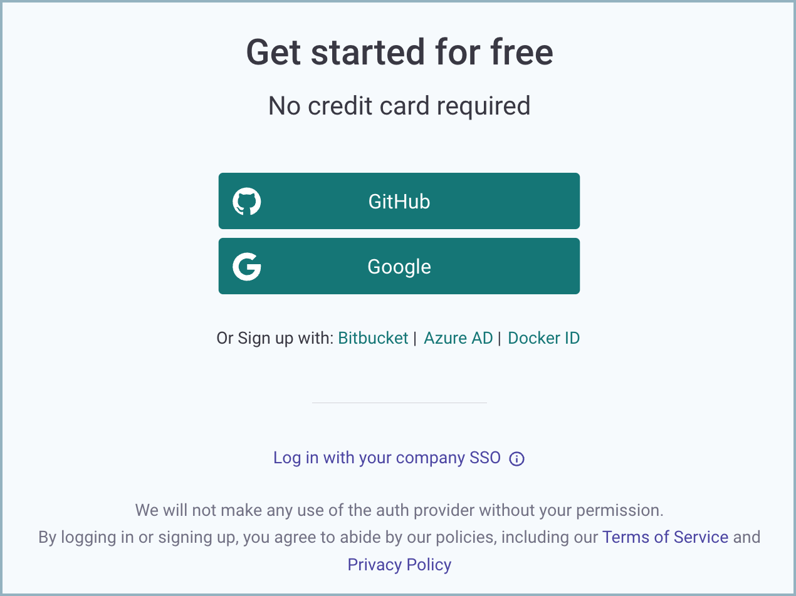
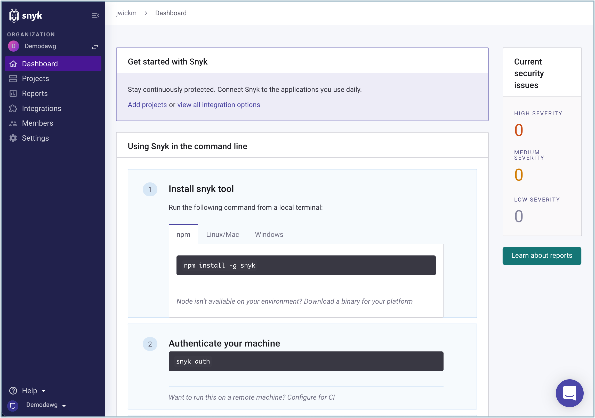

# Create or log in to a Snyk account

You need a Snyk account to use Snyk functions.


If you already have a Snyk account, see [Log in to an existing account](create-or-log-in-to-a-snyk-account.md#log-in-to-an-existing-account).


## Create a Snyk account


You can create a free account or sign up for a Snyk pricing plan; see [Snyk Pricing Plans](../../more-info/plans.md) for details.


Follow these steps to create a Snyk account:

1.  Go to [https://snyk.io/](https://snyk.io) and click **Start free** on the left of the page or **Sign up**.

    <figure><figcaption>
Start free or sign up for a Snyk account
</figcaption></figure>
2.  Choose your preferred signup method. This example shows creating a free account.

    <figure><figcaption>
Choose signup method
</figcaption></figure>
3. Follow the prompts to create a new account. You now have a free Snyk account and can log in at any time at [https://app.snyk.io](https://app.snyk.io)

<figure><figcaption>
Get started options for a new Snyk account
</figcaption></figure>

## **What's next after signing up?**

To scan your code, you must first integrate Snyk with the repository holding that code, either:

* Following the automated prompts, immediately after creating a Snyk account.
* Manually, at any time.

See [Set up an integration](set-up-an-integration.md) for details.

## Log in to an existing account

You can navigate to [Snyk](https://snyk.io/) and use the link to log in. If your company uses single sign-on (SSO), use the SSO link provided by your administrators.

If your company requires an invitation to use Snyk, you may see a list of Organizations when you log in for the first time. This means that you have not yet been invited. Select the name of an Organization Admin to send an email to request access to that Organization.

Organizations in Snyk control access to projects. For details see the [Snyk Organizations](../../snyk-admin/manage-groups-and-organizations/whats-a-snyk-organization.md) page.

The Organization settings and policies influence your scan results, depending on which Organization you use when you add a project.


If you log in with a different authentication provider from the one your company uses for the Snyk account, you create a new account. You will not be logged in to the correct Organization for your company.


Snyk shows your preferred, that is, default Organization when you log in to the Snyk Web UI. Snyk also uses the settings for your preferred Organization when you test a project locally using the CLI.


To change your default Organization, see [Manage account preferences and settings](../explore-snyk-through-the-web-ui.md#manage-account-preferences-and-settings) on Explore the Snyk Web UI.

