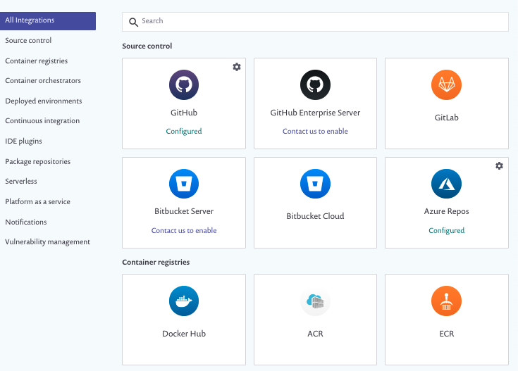
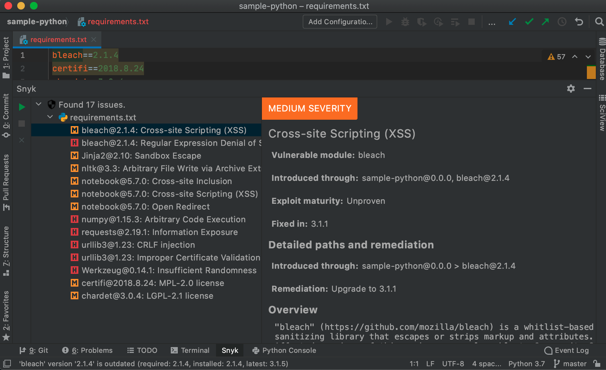
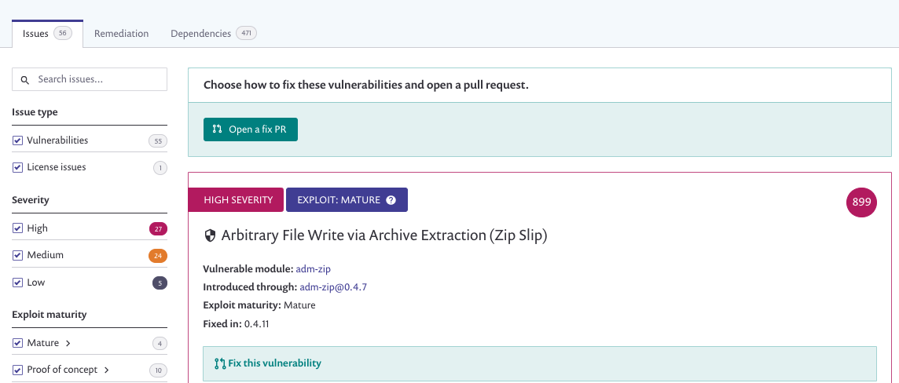
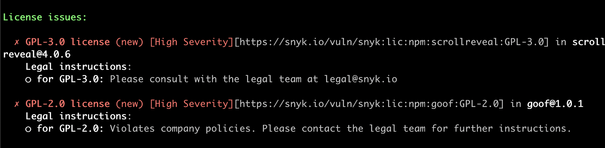
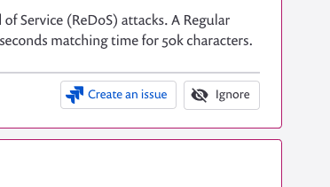

# Snyk billing plan onboarding

## Overview

Snyk provides a free trial for our [Team plan](https://snyk.io/plans/). This trial allows you to experience more value using Snyk.

The Snyk Team plan gives you unlimited tests, giving you far greater capacity to find and fix vulnerabilities.

Unlimited tests allow you to import, test and monitor all of your projects, and crucially to monitor them at various stages of your software development lifecycle. This reduces the chances of something slipping through the cracks, while at the same time shifting left as much of the finding-and-fixing process.

In addition, the Team plan provides [license compliance features](./), [IaC scanning](./), and [Jira integration](./).

### More details

* See [Getting started with Snyk products](https://docs.snyk.io/getting-started/getting-started-snyk-products) for individual quickstart guides for Snyk products.
* See [Snyk Customer Onboarding - Team Plan](https://docs.snyk.io/getting-started/snyk-billing-plan-onboarding/snyk-customer-onboarding-team-plan) for more detailed instructions on onboarding your team with the Team plan.

Testing at every stage of the development lifecycle requires a lot of automated testing. This is where the unlimited testing capability of the Team plan becomes so valuable.  
Using Snyk at multiple stages allows you to:

* Find and fix vulnerabilities in new code, as early as possible.
* Catch vulnerabilities that are only introduced or identifiable at a later stage of the development process.
* Discover issues in pre-existing code, which may not have been worked-on for a long time.

Each of these stages allows Snyk to do something different to help keep you secure. Use the unlimited tests in your Team plan to have Snyk save you time and effort, and reduce your security risk.

All of the following stages have integrations that can be found on the [Snyk integrations page](https://app.snyk.io/integrations):  

See [Integrations](../../integrations/) for more details.

The earliest chance you have to catch vulnerabilities is in the IDE, when the code is being written. Use Snyk at the IDE stage to ensure developers select versions of dependencies or container base images that include the least vulnerabilities possible:

Snyk supports many of the popular IDEs, with even more support coming soon.

See [IDE tools](../../integrations/ide-tools/) for more details.

At the next stage is code storage, usually some kind of SCM \(Source Code Management\) system. Snyk supports many popular SCMs including GitHub, GitLab, Bitbucket, and Azure Repos.

Using Snyk with SCM integrations allows Snyk to:

* Monitor your projects in the long term, checking dependencies that may have been in use for months for newly found vulnerabilities. 
* Raise pull requests \(PRs\), to do everything from keeping your dependencies up to date, to fixing new and existing vulnerabilities \(in order of priority\), or upgrading container base images to fix hundreds of vulnerabilities in one move.

Snyk’s SCM integrations also support commit status checks, so as your developers raise pull requests, Snyk can automatically test \(and optionally block\) pull requests that introduce new vulnerabilities. This helps prevent reducing the security of your code.

See [Git repository \(SCM\) integrations](../../integrations/git-repository-scm-integrations/) for more details

Use Snyk CI/CD integrations to prevent new vulnerabilities from passing through the build process, by adding an automated Snyk test to your CI/CD process:

See [CI/CD integrations](../../integrations/ci-cd-integrations/) for more details.

Snyk supports various different container registries, allowing you to scan all your images and monitor them over time for newly found vulnerabilities, whether the images are used in Prod, retired from use, or queued up for a big release.

See [Snyk Container](https://docs.snyk.io/snyk-container) for more details.

Our support for Kubernetes allows you to find any vulnerabilities in running workloads. It also allows Snyk to access a lot of information that can help prioritize what to fix first. This can help reduce the noise, leaving you with a clearer picture of what really needs your attention.

See [Kubernetes workload and image scanning](../../snyk-container/image-scanning-library/kubernetes-workload-and-image-scanning/) for more details.

## Infrastructure as Code scanning

Snyk Infrastructure as Code \(IaC\) helps developers write secure configurations, well before code reaches production. Snyk’s developer-first approach meets developers where they work, and provides fixes that can be directly merged into code.

See [Infrastructure as Code](../../snyk-infrastructure-as-code/) for details.

An added bonus of the Team plan is license compliance management, allowing Snyk to identify potentially misused licenses. License compliance does not stop you getting hacked, but it can help protect you from legal issues \(which can be just as costly\).

See [Getting Started with Snyk License Compliance Management](https://docs.snyk.io/getting-started/getting-started-snyk-products/getting-started-snyk-licensing-compliance) for details.

The Team plan also includes the Snyk Jira integration, allowing you to manually raise Jira issues in the Snyk UI for vulnerabilities or license issues.

Snyk’s Jira integration is yet another way in which Snyk is able to fit into your existing processes, ensuring that work to become more secure is properly managed and accounted for.

See [setting up Snyk with Jira](https://docs.snyk.io/integrations/untitled-3/jira) for more details and instructions.

