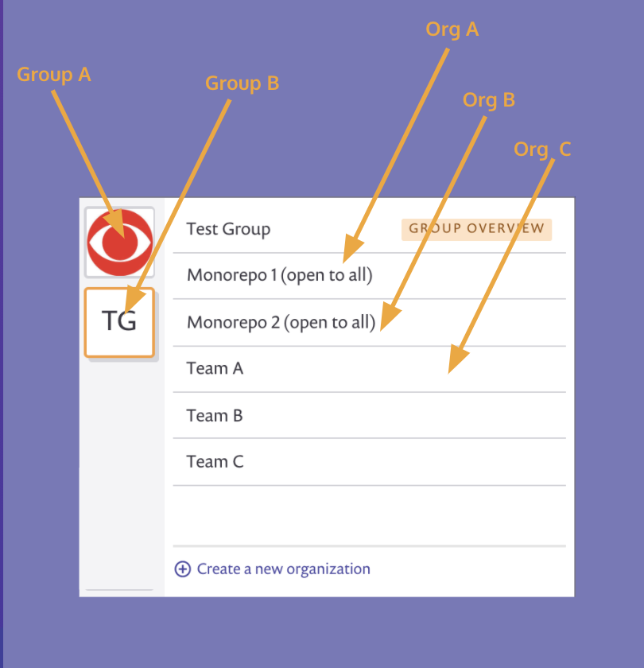

# Moving from Standard Plan to Business Plan

We are happy to see you growing with Snyk!

This documentation helps you get started with your new Business plan features when upgrading from a Standard plan.

## Organize your group

The Business plan includes one group to help you structure your account. This structure provides your team with easy access to relevant insights about projects, priorities, integrations, and policies.

Your Snyk account is organized using a multi-level hierarchy:

* **Group** - top-level container with certain configurations \(e.g., policies, reporting, SSO\) shared across one or more organizations
* **Organization** - a collection of projects that share integration configuration and access controls
* **Projects** - the basic representation of configuration and test results for an application

Learn more about [groups and organizations](https://support.snyk.io/hc/en-us/articles/360004037617-What-s-a-Snyk-group-).

## Use Single Sign-on

The Business plan allows you to use your single sign-on \(SSO\) provider to simplify new user provisioning and access to Snyk.

Snyk can integrate with different types of identity providers, such as SAML, OIDC, or even ADFS.

On the Business plan, there are two user provisioning options you can implement with SSO.

* **Open** - All users are added to all organizations either as an admin or as a collaborator. Let Snyk know which role you want to use for provisioning new users.
* **Invitation** - An admin invites users, or new users can request access to an organization.

To set up SSO, you configure a few details with your identity provider, and provide information from your identity provider to Snyk Support so they can finalize the configuration.

Learn more about [setting up SSO](https://support.snyk.io/hc/en-us/articles/360018025297-Introduction-to-Snyk-Single-Sign-On-SSO-).

## Customize default license policy

In addition to monitoring your vulnerability status, Snyk can help you with your license compliance according to your license policy.

Snyk provides a default license policy, which you can edit to match your preferences.

Learn more about [licenses](https://docs.snyk.io/snyk-open-source/licenses) and how to [set a license policy](https://docs.snyk.io/snyk-open-source/license-policies/setting-a-license-policy).

## Integrate Snyk with Jira

Integrate Snyk with Jira to manage the work of resolving issues. Use our Jira integration API or open Jira tickets with a button on Snyk project issue cards. Jira tickets collect details your engineers will need to resolve vulnerabilities.

Learn more about [configuring the Snyk Jira integration](https://docs.snyk.io/integrations/untitled-3/jira).

## How to get help

To get help, navigate to snyk.io and use the help agent in the bottom right corner.

Make sure you provide an email address to help our team communicate with you. Or email support@snyk.io directly. Note that some issues may have a longer response time.

