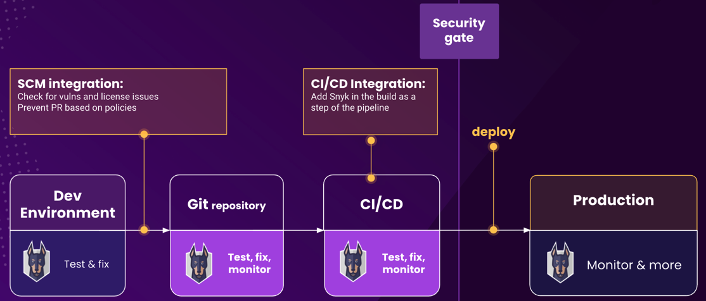

# SCM \(Git\) and CI/CD integration deployment intro

Snyk for Code and Open Source most popular integrations are in the Source Code Management \(or Git\) or in the CI/CD pipeline integration.

Snyk SCM integration also allows you to rescan automatically on every fix PR thanks to our webhooks, and to block newly introduced vulnerabilities. If both may achieve the same business objective, what would be the reasons to choose one versus the other? While the answer will be specific to every organization based on your workflows and processes, we can provide a list of considerations before taking a decision:

### SCM Integration considerations

* Easier to setup & maintain
* Ability to block fix PR thanks to webhooks
* Earlier in the SDLC
* More friendly experience for developers
* Fix PR from Snyk \(SCA and Dockerfiles\)
* Does not take resources from your CI/CD pipeline

### CI/CD Integration considerations

* Some package managers require local context and are better run within your environment \(notably Scala, Gradle and Go modules\) 
* More granular options to block
* Strong gatekeeper
* Best practice for container scans
* Complex repo structure such as large Monorepo, where a CI/CD integration would allow more custom imports

