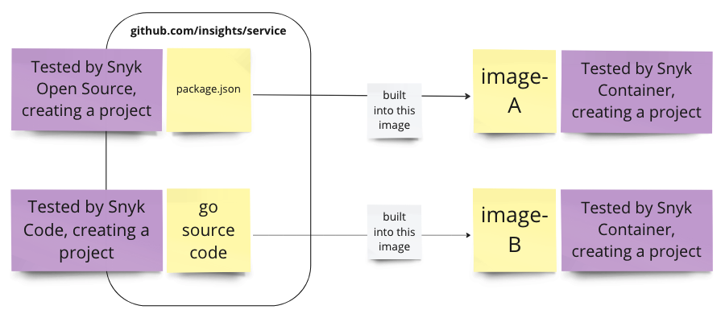

# Snyk CI/CD Integration: good practices

### Implementation Options


All these methods provide the same results, as they all rely on the same Snyk engine behind the scenes. So the same arguments or options should be true whatever deployment method you select.


#### CI/CD Deployment methods

There are various ways to configure Snyk within your pipeline. The choice of which method will mainly depend on your environment and preference, and they should all lead to a successful run:

**Using Snyk native plugins**

Available for most common CI/CD tools. Easiest way to setup and get started. The plugins include the most common parameters and options in the interface UI.

**Deploy Snyk CLI using the npm method**

Similar steps as installing the CLI locally. Requires you to be able to run an npm command in the pipeline script. This method has the advantage of completely aligning with the CLI experience so you can easily troubleshoot and configure.

**Deploy Snyk CLI binary version**

The advantage of the binary setup is that it has no dependency with the local environment. It is useful if you cannot run a npm command in your pipeline for instanceThe various versions of the CLI binaries are available here:[https://github.com/snyk/snyk/tags](https://github.com/snyk/snyk/tags)Snyk has a Linux, Windows and other versions.

**Deploy a Snyk Container**

You may also deploy Snyk in your pipeline using one of our images in Dockerhub: [https://hub.docker.com/r/snyk/snyk](https://hub.docker.com/r/snyk/snyk)

#### Examples

The following repo shares some examples of binary and NPM integrations for various CI/CD tools:

[CI/CD examples](https://github.com/snyk-labs/snyk-cicd-integration-examples)

### Typical stages of adoption

Developer teams typically adopt Snyk in the following stages:

1. [Expose vulnerabilities](snyk-cicd-integration-good-practices.md) \(snyk monitor\)
2. [Use Snyk as a gatekeeper](snyk-cicd-integration-good-practices.md) \(snyk test\)
3. [Continuous monitoring](snyk-cicd-integration-good-practices.md) \(snyk test + Snyk monitor\)

### **Stage 1: Expose vulnerabilities \(Snyk monitor\)**

This is a typical initial approach, using Snyk results to expose to your team vulnerabilities during the development process, which increases visibility of these vulnerabilities amongst your team.

When you first implement Snyk in your pipeline, we recommend you use only the **snyk monitor** command, or if you use one of Snyk's CI plugins, to configure the plugin to not fail the build.  
This is because all projects are vulnerable, and after you set Snyk to fail the build, every build will fail because of Snyk, which may cause problems with your team being quickly overwhelmed with failure messages.

Using **snyk monitor** to expose results will provide information, without disrupting processes.

### **Stage 2: Use Snyk as a gatekeeper \(snyk test\)**

This next approach prevents the introduction of new vulnerabilities \(sometimes known as "stopping the bleeding"\).

After your teams understand the vulnerabilities in their applications, and develops a process for remediating them early in the development cycle, you can configure Snyk to fail your builds, to prevent introducing vulnerabilities into your applications..

Add **snyk test** to your build or enable the fail functionality to make Snyk fail your builds, providing the results output to the console. Your Devs or DevOps teams can use the results to decide whether to stop or continue the build.

### **Stage 3: Continuous monitoring \(snyk test + Snyk monitor\)**

After you configure Snyk to fail the build when vulnerabilities are detected, you can now configure Snyk to send a snapshot of your project's successful builds to Snyk for ongoing monitoring.

To do this, configure your pipeline to run **snyk monitor** if your **snyk test** returns a successful exit code.

## **Technical Implementation**

### Prerequisites

To configure Snyk to run in a pipeline, retrieve key configuration inputs from your Snyk account.

### Define target organization

When you run Snyk in your CI/CD platform, you will typically want to post the test results to Snyk, for review and ongoing monitoring.

You can define the target organization in the Snyk CLI, by either URL slug or organization ID, using the **--org** CLI argument:

* You can define the target organization using its URL slug, as displayed in the browser's address bar when viewing it in the Snyk UI: 
* Or you can define the target organization using its **org id** in each organization's settings page:



**Default organization**

If you do not define a target organization, Snyk uses the default organization for the authentication token you use:

* For user accounts, this is the user's preferred organization \(configurable in the user's settings\).
* For organization service accounts, this is the organization in which the account was created.

## Snyk Authentication Token

To run the snyk test, you need an authentication token with access to the desired target organization . While you can use any valid authentication token, we recommend using a service account. For more details, see [Service accounts](https://docs.snyk.io/integrations/managing-integrations/service-accounts).

## Setting Up

Snyk supports the following approaches to add tests to a build pipeline:

* **Snyk integration plugins**: Snyk provides pre-built plugins for several CI servers, including [Jenkins](https://docs.snyk.io/integrations/ci-cd-integrations/jenkins-integration-overview), [Team City](https://docs.snyk.io/integrations/ci-cd-integrations/teamcity-integration-overview)[, Bitbucket Pipelines](https://docs.snyk.io/integrations/ci-cd-integrations/bitbucket-pipelines-integration-overview) and [Azure Pipelines. ](https://docs.snyk.io/integrations/ci-cd-integrations/azure-pipelines-integration) See the [Continuous Integration](https://docs.snyk.io/integrations/ci-cd-integrations) documentation for more details
* **Snyk CLI:** For teams with more complex workflows, or using a build system without a Snyk pre-built plugin, you can use the Snyk CLI tool during CI/CD setups. See [Setting up using Snyk CLI](snyk-cicd-integration-good-practices.md) for more details.
* **Snyk API**: For teams with complex requirements, Snyk provides a REST API, which you can use for functions including initiating scans, onboarding new projects, and testing arbitrary libraries. See the [Snyk API documentation](https://github.com/snyk/user-docs/tree/54e0dec0fe0e081d49f34119a9018499ad5c9e96/getting-started/snyk-billing-plan-onboarding/snyk-cicd-integration-good-practices/README.md) for more details.

## Setting up using Snyk CLI

Snyk CLI is a NodeJS application that can be scripted directly by developers for easy integration into most CI/CD environments, and is available as an NPM application, pre-packaged binary, or container image. See [Install the Snyk CLI](https://docs.snyk.io/snyk-cli/install-the-snyk-cli) for more details

Snyk CLI can be configured to:

* Return non-zero error codes only when certain criteria are met. For example, exit with an error code only if vulnerabilities of high severity are present.
* Output all of its data into JSON for more flexibility.

**Exit Codes**

When using the Snyk CLI:

* **snyk test** is a synchronous command, that ends with an exit code. Exit codes can then be used by your build system to either pass or fail the build based on the test results. See the [CLI reference guide](https://docs.snyk.io/snyk-cli/guides-for-our-cli/cli-reference) for details on exit statuses and their meanings.
* **snyk monitor** \(which posts test results to the Snyk web UI\) is an asynchronous command, that does not end with exit code based on the vulnerability status. 

Depending on your approach and goals, you may need to use both command sets in your pipeline.

**CLI Examples**

Examples of running the Snyk CLI in a build pipeline:

1. Snyk monitor to surface vulnerabilities and post to the Snyk UI for ongoing monitoring:

   ```text
   snyk monitor --all-projects --org=snyk-apps
   ```

2. Snyk test to fail the build on high severity issues:

   ```text
   snyk test --all-projects --org=snyk-apps --severity-threshold=high
   ```

To view the full list of flags in the CLI, run the **snyk --help** or **snyk container --help**.

## Configuring failing build parameters

You can add flags to the **snyk test** command to fine-tune parameters that will result in a failed build:

* **--severity-threshold=high**: Fail the build only for High Severity issues: 
* **--fail-on=upgradable**: Fail the build only for issues that are upgradable \(can be fixed with Snyk remediation advice\):  

You can also fail the build for any other parameter in the Snyk JSON output \(such as CVSS score\), using a wrapper like [snyk-filter](https://github.com/snyk-tech-services/snyk-filter), or use additional tooling like [snyk-delta](https://support.snyk.io/hc/en-us/articles/360019979978) to fail the build only for issues found since the last build.

## Creating custom build artifacts

You can use Snyk's JSON output to create custom test reports as build artifacts, using the [snyk-to-html](https://github.com/snyk/snyk-to-html) utility, or other custom processing you develop.

## Creating work items for new vulnerabilities

Snyk allows you to automatically create new work items in JIRA \(see [Jira integration](https://docs.snyk.io/integrations/untitled-3/jira) documentation\). You can customize this code for your specific requirements, or adapt it to work with other work management systems.

See [Jira tickets for new vulns](https://github.com/snyk-tech-services/jira-tickets-for-new-vulns) to get started, or review the [API to create Jira tickets.](https://github.com/snyk/user-docs/tree/54e0dec0fe0e081d49f34119a9018499ad5c9e96/getting-started/snyk-billing-plan-onboarding/snyk-cicd-integration-good-practices/README.md#reference/projects/project-jira-issues/create-jira-issue)

## Ignoring issues

By default if issues are not ignored, or if you are not using Snyk-delta, a "snyk test" in your pipeline fails the build when issues are found. To allow builds to continue without resolving these issues, you can:

* [Ignore issues using a Snyk policy file](https://docs.snyk.io/snyk-cli/fix-vulnerabilities-from-the-cli/ignore-vulnerabilities-using-snyk-cli)
* [Ignore issues from the Snyk UI](https://support.snyk.io/hc/en-us/articles/360000923498-How-can-I-ignore-a-vulnerability-)
* [Ignore issues from the Snyk API](https://snyk.docs.apiary.io/#reference/projects/project-ignores-by-issue/add-ignore)
* Use the Snyk Python API for bulk ignores: see [https://github.com/snyk-labs/pysnyk](https://github.com/snyk-labs/pysnyk) and [https://github.com/snyk-labs/pysnyk/blob/master/examples/api-demo-9c-bulk-ignore-vulns-by-issueIdList.py](https://github.com/snyk-labs/pysnyk/blob/master/examples/api-demo-9c-bulk-ignore-vulns-by-issueIdList.py)

## Snyk Open Source-specific strategies

These strategies are useful to teams using Snyk's SCA \(Software Composition Analysis\) testing features.

### Gradle & Scala

* For "multi-project" configurations, test all sub-projects, use the next flag with your monitor or test command **--all-sub-projects** 
* To scan specific configurations, select certain values of configuration attributes to resolve the dependencies. Use the next flag with your test or monitor command **--configuration-attributes=**

### Python

* Snyk uses Python to scan and find your dependencies. Snyk needs the Python version to start scanning, and defaults to "python". If you are using multiple Python versions, use this parameter to specify the correct Python command for execution.  
  Use the next flag with your test or monitor cmd to specify the Python version **--command=**. For example:

  ```text
  snyk test --command=python3
  ```

* If you scan a Pip project and use the **--file=** because your manifest file isn’t the standard of **requirement.txt**, then the next flag is mandatory to specify Pip as the package manager **--package-manager=pip**

### .Net

If you use a .sln file, you can specify the path to the file, and snyk will scan all the sub projects that are part of the repo. For example:

```text
snyk test --file=sln/.sln
```

### Yarn Workspace

For Yarn workspaces use the **--yarn-workspaces** flag to test and monitor your packages. The root lockfile will be referenced when scanning all the packages. Use the -**-detection-depth** parameter to find sub-folders which are not auto discovered by default.


**Note**  
Yarn workspaces support is for **snyk test** and **snyk monitor** commands only at this time.


Example:

```text
snyk test --yarn-workspaces --detection-depth=6
```

This scans only the packages that belong to any discovered workspaces this directory and 5 sub-directories deep.

You can use a common **.snyk** policy file, if you maintain ignores/patches in one place to be applied for all detected workspaces, by providing the policy path:

```text
snyk test --yarn-workspaces --policy-path=src/.snyk
```

### Monorepo

Some customers have complex projects, with multiple languages, package managers, and projects, in a single repository. To facilitate this, you can take different approaches:

* As you build each project/language, add a directive to run the snyk test and target a specific project file. For example:

  ```text
  snyk test --file=package.json
  ```

  After you install the dependencies of each project, make a similar call pointing to the specific artifact \(such as **pom.xml**\). This is fast and efficient, but can be difficult to scale, especially if you are not familiar with the project.

* Use the **--all-projects** and **--detection-depth** arguments, and the Snyk CLI or CI/CD plugin will search up to **--detection-depth** in the folder structure for any manifests that match the supported files types. Each project is scanned and has its own result. Similarly, if using **snyk-monitor**, a separate result is created for each project. This is a good way to automate scanning especially if you have projects spanning node, .net, python, and so on.

**Specific to Gradle:**

* For most Gradle projects, using **--all-projects** works, as it invokes gradle-specific options behind the scenes in the form of:  

```text
  snyk test --file=build.gradle --all-sub-projects
```

when it finds the build file as part of the **--all-projects** search

* Gradle may require additional configuration parameters. If so, to target the other artifacts using **--file=** for each manifest of the other languages/package-managers, as mentioned in the first option. You must then use **--all-sub-projects** and potentially **--configuration-matching** and --configuration-matching to scan a complex gradle project.

See [Snyk for Java \(Gradle, Maven\)](https://support.snyk.io/hc/en-us/articles/360003817357-Java-for-Snyk) for more information.

## Snyk Container-specific strategies

The best stage to implement Snyk Container in your pipeline is after the container image is built \(after running the equivalent of “docker build”\), and before your image is either pushed into your registry \(“docker push”\) or deployed to your running infrastructure \(“helm install”, “kubectl apply” and so on\).

Typically, the ways you run your container build-test-deploy pipeline depends on whether or not a Docker daemon is available to the build agent.

**Running pipeline if a Docker daemon is available**

If:

* You are running your build tooling \(such as Jenkins\) directly on a host that has Docker natively installed.
* Your pipeline tasks are run inside containers which have the Docker socket \[/var/run/docker.sock\] bind-mounted to the host.
* You are running a Docker-inside-Docker setup.

Snyk can help:

* When you run **snyk container test $IMAGE\_NAME**, Snyk looks for that image in your local daemon’s storage, and if it does not exist, does the equivalent of a **docker pull** to download it from your upstream registry.
* For registry authentication, Snyk uses the credentials you already configured \(with something like **docker login**\)
* You can specify **--file=Dockerfile** on the command line to link the image vulnerability results with the Dockerfile that built it, to receive inline remediation advice and alternate base image suggestions.

**Running pipeline if a Docker daemon is not available**

If:

* You containerize each build task but do not mount the Docker socket for security/performance reasons.
* Pipeline tasks are split across hosts \(or even clusters\) and rely on artifacts to be handed off via a central volume or intermediate registry/object store.
* You work exclusively in an ecosystem that only uses OCI-compliant container images

Snyk can help:

* Run either **snyk container test docker-archive:archive.tar** or **snyk container test oci-archive:archive.tar** to get Snyk vulnerability results against tar-formatted container images \(either in Docker or OCI format\) without relying on the Docker daemon.
* The tar archive can be generated by your build process using the equivalent of **docker save** and stored in a shared volume or object store. This can then be accessed by the build agent container running the Snyk binary, with no other dependencies required

## Good practice recommendations

* Regardless of how you integrate with container images during CI, run a Snyk Container scan as a separate build step from your Snyk Open Source \(application SCA\) test. This allows you to isolate build failures to vulnerabilities within either the container/OS layer or the application layer, respectively. This also enables more easily containerized build tasks.
* Use CLI flags like **--fail-on** and **--severity-threshold** to customize the failure status for the build task. For more advanced usage, you can use **--json** to generate a JSON file containing the full vulnerability report, and set your own build failure status based on the JSON data.
* Pass **--exclude-base-image-vulns** to only report vulnerabilities introduced by your user layers, rather than vulnerabilities that come from the container’s base image \(the image you specify in the FROM line in the Dockerfile\).
* Run **snyk container monitor** following **snyk container test** \(or simply check the **Monitor** box on your plugin settings\), to keep a record of this container’s bill of materials within the Snyk UI and proactively monitor for new vulnerabilities on a daily basis. This is useful when pushing new releases into production environments. You can use **--project-name** to specify a unique identifier for the release to ensure production containers are tracked separately from others in your build process.

## Snyk IaC-specific strategies

The best stage to implement Snyk Infrastructure As Code in your pipeline as part of the stages, but after the SCA and the Containers stage.

Snyk Infrastructure as Code supports:

* Deployments, Pods and Services.
* CronJobs, Jobs, StatefulSet, ReplicaSet, DaemonSet, and ReplicationController.

See [Test your Kubernetes files with our CLI tool](https://docs.snyk.io/snyk-infrastructure-as-code/snyk-cli-for-infrastructure-as-code/test-your-kubernetes-files-with-our-cli-tool) for more details.

### CI/CD troubleshooting & Advanced tips

In this section we are going to share a few tips to help troubleshoot or scale CI/CD integrations.

#### Step 1: Try to replicate with Snyk CLI

CLI and pipeline are running the same engine, try to clone the project and scan with CLI.

Play with the CLI flags- use our Snyk CLI tool to find and fix known vulnerabilities as you run it in the pipeline. [Link for flags](https://support.snyk.io/hc/en-us/articles/360003812578-CLI-reference)

#### Step 2: Get logs

If you could replicate with CLI, and the problem still exist ask the CLI to output the debug logging using the following command:

DEBUG=\* or the -d flag to capture logs.

```text
snyk test -d
```

or

```text
DEBUG=* snyk test
```

#### Step 3: Use the CLI instead of the plugin

Try to replace the native plugin into the CLI by installing snyk using npm or binary download.

For npm use the following commands:

* npm install -g snyk
* Snyk auth
* Snyk test

For binary download you we need to download snyk from the following links:

* [Download the Snyk CLI](https://github.com/snyk/snyk/tags)

#### Common flags in a CI/CD integration

Among the most common flags used in a CI/CD integration are the following:

**-- all-projects**: Auto-detect all projects in working directory

**-p**: Prune dependency trees, removing duplicate sub-dependencies. Will still find all vulnerabilities, but potentially not all of the vulnerable paths.

**--org=ORG\_NAME**: Specify the ORG\_NAME to run Snyk commands tied to a specific organization. This will influence where will new projects be created after running monitor command, some features availability and private tests limits. If you have multiple organizations, you can set a default from the CLI using:

```text
$ snyk config set org=ORG_NAME
```

Setting a default will ensure all newly monitored projects will be created under your default organization. If you need to override the default, you can use the --org=ORG\_NAME argument.

Default: uses ORG\_NAME that sets as default in your Account settings [https://app.snyk.io/account](https://app.snyk.io/account)

**Useful resources**

The following repo shares some examples of binary and NPM integrations for various CI/CD tools:

### [GitHub CI/CD examples](https://github.com/snyk-labs/snyk-cicd-integration-examples)


