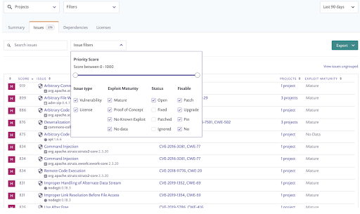
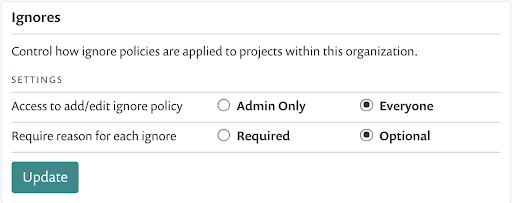

# Snyk Customer Onboarding - Business Plan

Thank you for signing up with Snyk!

This guide has been designed to help you get started with your new Business plan.

Before starting, we recommend that you consider what you hope to achieve with Snyk and how you'll define success. Then you can design your rollout strategy and workflow to align to those objectives.

To prepare for using Snyk, check out our [Getting Started guides](https://docs.snyk.io/getting-started) for each product.

## Develop rollout strategy

Snyk provides a range of integrations and capabilities to fit seamlessly with your existing software development process. Snyk can help you find and fix existing vulnerabilities, as well as monitor and prevent new ones from being introduced at all stages of your software development lifecycle \(SDLC\).

Snyk recommends different approaches, depending on your situation and the languages of the projects you want to test.

### Integrate with your SCM

The Source Code Management \(SCM\) integration makes it easy for developers to find and fix vulnerabilities, and to get alerts when new vulnerabilities have been discovered. You may want to get early adopted users and teams set up with the SCM integration, so that these users can act as internal advocates by demonstrating the benefits of using Snyk.

Note that if you are working with Scala and/or Gradle projects, we recommend that you scan projects directly in the CLI or CI/CD for accurate results.

Learn more about [Snyk SCM integration good practices](https://support.snyk.io/hc/en-us/articles/360018010597).

### Use the CLI

Work with early adopter teams and users to test and monitor projects in the CLI. Once successful, repeat the process with other teams and users across your organization.

Learn more about using [Snyk in the CLI](https://docs.snyk.io/snyk-cli).

### Integrate with CI/CD pipleline

Work with your CI/CD team to implement Snyk into the CI/CD pipeline. By integrating Snyk into all teams and projects at this phase of the SDLC, you can get visibility into the state of your Open Source vulnerability exposure for your codebase.

You can begin by reporting on vulnerabilities that Snyk finds. In a later phase of your rollout, you can have Snyk break the build when vulnerabilities that meet your criteria are discovered.

Learn more about [Snyk CI/CD integration good practices](https://support.snyk.io/hc/en-us/articles/360018245398).

### Add Docker scanning

Snyk supports testing and monitoring Docker images that have their dependencies managed by Debian, RPM, or APK. Docker scanning is available via the CLI.

Learn about [Snyk Container](https://docs.snyk.io/snyk-container).

### Add Infrastructure as Code scanning

Snyk IaC helps developers write secure configurations, well before anything reaches production. The Snyk developer-first approach meets developers where they work. It provides fixes that can be directly merged into code.

Learn more about [Snyk IaC](https://docs.snyk.io/snyk-infrastructure-as-code).

## Organize your group

The Business plan includes one group to help you structure your account. This structure provides your team with easy access to relevant insights about projects, priorities, integrations, and policies.

Your Snyk account is organized using a multi-level hierarchy:

* **Group** - top-level container with certain configurations \(e.g. policies, reporting, SSO\) shared across one or more organizations
* **Organization** - a collection of projects that share integration configuration and access controls
* **Projects** - the basic representation of configuration and test results for an application

Learn more about [groups and organizations](https://support.snyk.io/hc/en-us/articles/360004037617-What-s-a-Snyk-group-).

## Use Single Sign-on

The Business plan allows you to use your single sign-on \(SSO\) provider to simplify new user provisioning and access to Snyk.

Snyk can integrate with different types of identity providers, such as SAML, OIDC, or even ADFS.

On the Business plan, there are two user provisioning options you can implement with SSO.

1. **Open** - All users are added to all organizations either as an admin or as a collaborator. Let Snyk know which role you want to use for provisioning new users.
2. **Invitation** - An admin invites users, or new users can request access to an organization.

To set up SSO, you configure a few SSO details with your identity provider, and provide information from your identity provider to Snyk Support so they can finalize the configuration.

Learn more about [setting up SSO](https://support.snyk.io/hc/en-us/articles/360018025297-Introduction-to-Snyk-Single-Sign-On-SSO-).

## Integrate Snyk with Jira

Integrate Snyk with Jira to manage the work of resolving issues. Use our Jira integration API or open Jira tickets with a button on Snyk project issue cards. Jira tickets collect details your engineers will need to resolve vulnerabilities.

Learn more about [configuring the Snyk Jira integration](https://docs.snyk.io/integrations/untitled-3/jira).

## Configure notifications

Snyk automatically notifies you when new issues are found in the projects you’re monitoring. You can customize the emails your organization’s members receive in the organization settings area. The customizations apply to all members of that organization. However, any member of the organization can override these settings in their own account.

Learn more about [Notification management.](https://docs.snyk.io/user-and-group-management/notifications/notification-management)

## Fix vulnerabilities

There are a number of different ways to resolve vulnerabilities.

Snyk can help you create pull/merge requests in your SCM integration.

If you are using node, you can use the snyk wizard command in the CLI.

You can also follow the remediation advice and update dependencies manually.

Patches are code execution that the Snyk security team creates for issues that don’t have fixes. Snyk adds a dependency to your projects and a pre-publish script to execute the patch.

Learn more about [fixing vulnerabilities](https://docs.snyk.io/fixing-and-prioritizing-issues/starting-to-fix-vulnerabilities/fix-your-vulnerabilities).

## Prioritize issues

Snyk lists the issues found in your project. There are different types of filters available to help you focus your attention on the most important vulnerabilities.

Learn more about [prioritizing Snyk issues](https://support.snyk.io/hc/en-us/articles/360009884837-Prioritizing-Snyk-issues).

## Ignore vulnerabilities

Snyk allows you to ignore vulnerabilities that don’t meet your criteria for fixing. When you select the **Ignore** button on an issue card, a dialog opens so you can indicate why you want to ignore the issue, as well as a timeframe for ignoring the issue temporarily.

You can determine whether developers can ignore an issue or only admins.

Learn more about [ignoring issues.](https://docs.snyk.io/fixing-and-prioritizing-issues/starting-to-fix-vulnerabilities/introduction-to-ignoring-issues)

## Report on vulnerabilities

Reports provide visibility into the number of vulnerabilities and license issues over time, the time to resolution, which dependencies are vulnerable, and many other details.

Learn more about [reports](https://docs.snyk.io/reports-1/reports/reports-overview).

All reporting data is available via APIs, so you can choose to present the information in your own dashboard or tooling.

Learn more about [Snyk APIs](https://github.com/snyk/user-docs/tree/54e0dec0fe0e081d49f34119a9018499ad5c9e96/getting-started/snyk-billing-plan-onboarding/snyk-customer-onboarding-business-plan/README.md).

## How to get help

To get help, navigate to snyk.io and use the help agent in the bottom right corner.

Make sure you provide an email address to help our team communicate with you. Or email support@snyk.io directly. Note that some issues may have a longer response time.

## More about best practices

Read more about best practices for using Snyk in your CI/CD or the git integration

* [Snyk SCM integration: good practices](https://support.snyk.io/hc/en-us/articles/360018010597)
* [Snyk CI/CD Integration: good practices](https://support.snyk.io/hc/en-us/articles/360018245398)

