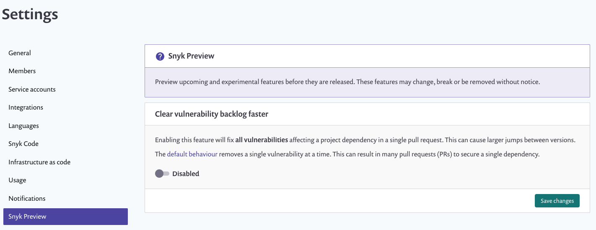

# Snyk Preview

Snyk Preview lets you enable new features, at an "opt-in" level. For example, these may be features that have not yet been rolled out by default for all customers.

Users with Admin permissions can use this option at the org and group level.

To enable a feature using Snyk Preview:

1. Click on settings  &gt; **Snyk Preview**: 
2. Click **Disabled** to enable the relevant feature. 
3. Click **Save changes**.


After the feature is enabled at the group level, all orgs within the group have this feature, and it cannot be disabled individually for these orgs.


## Disabling a feature

To disable a Snyk Preview feature, navigate to the Snyk Preview page and click **Enabled** for that feature.

