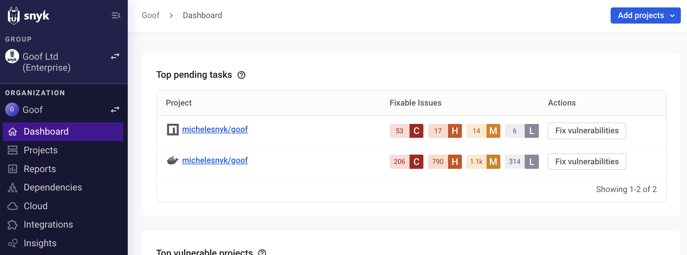
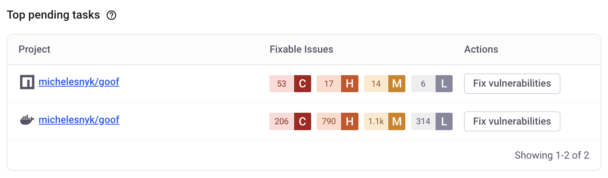

# Snyk Web UI


If you have not done so already, [create an account](quickstart/create-or-log-in-to-a-snyk-account.md) with Snyk.


Use the Snyk Web UI to run Snyk from any [supported browser](quickstart/#supported-browsers).

The following Snyk functions are available with the Web UI:

* [Explore the Dashboard](snyk-web-ui.md#dashboard)
* [View reports](snyk-web-ui.md#view-reports)
* [Manage your Projects](snyk-web-ui.md#manage-your-projects)
* [Manage your integrations](snyk-web-ui.md#manage-your-integrations)
* [Manage Organization or Group members](snyk-web-ui.md#manage-organization-or-group-members)
* [Set Snyk Organization and Group settings](snyk-web-ui.md#snyk-organization-or-group-settings)
* [View helpful resources](snyk-web-ui.md#view-helpful-resources)
* [Manage account preferences and settings](snyk-web-ui.md#manage-account-preferences-and-settings)


You can also use Snyk functions from the [Snyk CLI](../snyk-cli/), [in your IDE](../integrate-with-snyk/use-snyk-in-your-ide/), and with the [Snyk API](../snyk-api/).


## Explore the Dashboard

When you log in to an existing account and select an Organization, the Web UI opens to the Dashboard for that Organization:

<figure><figcaption>
Snyk Dashboard, the view when you log in and select an Organization
</figcaption></figure>

Use the Dashboard to see your top pending tasks and vulnerable Projects, and add new Projects.

### Top pending tasks

The **Pending tasks** section shows the next chores to be handled for the Projects in a Snyk Organization.&#x20;

<figure><figcaption>
Pending tasks on the dashboard
</figcaption></figure>

#### View Projects

Use the links for Projects on the Dashboard to explore and manage the metadata, retest, and fix options for the Target files in your Projects. Each link opens a Project details page where you can view the Project **Overview**, or switch to the **History** and **Settings** tabs.

See [Snyk Projects](../snyk-admin/snyk-projects/) for more information.

#### Fix vulnerabilities

Snyk tracks and flags Pull Requests (PRs) in the top-most vulnerable projects, including:

* PRs that can be raised to fix vulnerabilities in some of the most vulnerable Projects.
* PRs that have already been raised by or through Snyk and are open and awaiting review.

For Projects with the **Fix vulnerabilities** link, use this link to view Project details with an option to open a fix PR. See [Snyk Fix Pull or Merge Requests](../scan-with-snyk/pull-requests/snyk-fix-pull-or-merge-requests/) for more details.


Currently, Snyk tracks and flags PRs in GitHub, GitHub Enterprise, and Bitbucket Cloud only, and only for the top-most vulnerable Projects. If you use another SCM, the **Pending tasks** section shows PRs that can be raised but not PRs that have already been raised.


### Top vulnerable projects

Similarly, the **Top vulnerable projects** section shows the [Snyk Projects](../snyk-admin/snyk-projects/) assessed as the most vulnerable, with similar functions available as the **Pending tasks** section.&#x20;

### Add project

Use the **Add project** link on the Dashboard to add [Snyk Projects](../snyk-admin/snyk-projects/). Select how to add the Project from the dropdown. See [Import a Project](quickstart/import-a-project.md) for more details.

<figure><figcaption>
Demo, add project and Project details tabs
</figcaption></figure>

## **View reports**

You can view [reports](../manage-issues/reporting/) to gain visibility and insights into the state of all your Projects, vulnerabilities, and license issues. You will find detailed definitions for information in the reports in the tooltips in the Reporting user interface.


**Feature availability**\
Reporting is available for Enterprise plans. For more information, see [Plans and pricing](https://snyk.io/plans/).


## **Manage your** **Projects**

Select the **Projects** link in the side menu to open the **Projects** listing page:

<figure><figcaption>
Options on the Projects listing page
</figcaption></figure>

* Add a Project. Select the way you want to add the Project from the **Add projects** dropdown.
* Filter, group, and sort your Projects.
* View tips and the latest import log for your Projects.
* Select the link for each Project to view the Project details page with a summary and Issue information.
* Use the plus icon and add a Target from a custom location when Projects are grouped by Target. This allows for grouping Projects in another Target in the list.
* Use the settings icon on the ungrouped **Projects** listing or the **Settings** tab on the Project detail page to configure General and GitHub integration settings for notifications, Project testing, and pull request (PR) frequency. You can also look up the unique Project ID and deactivate or delete a Project on the Settings tab.
* View the Project history on the **History** tab.

## **Manage your** **Integrations**

Select **Integrations** from the navigation on the Dashboard to open the [Integrations](../integrate-with-snyk/) page, where you can set up a range of integrations with Snyk:

<figure><figcaption>
Integrations page
</figcaption></figure>

## Manage Organization or Group members

Select **Members** from the navigation on the Dashboard to view and manage users, roles, and how users authenticate in your Snyk [Organization](../snyk-admin/groups-and-organizations/organizations/manage-users-in-organizations.md) or [Group](../snyk-admin/groups-and-organizations/groups/manage-users-in-a-group.md).


You must be assigned the [required Admin roles and permissions](../snyk-admin/user-roles/pre-defined-roles.md) to make changes on the **Members** tab.


## Snyk Organization or Group Settings

Use the **Settings** option to view and manage your Organization or Group settings:

<figure><figcaption>
Group and Organization settings
</figcaption></figure>

See [Manage settings](../snyk-admin/groups-and-organizations/group-and-organization-settings.md) for more details.

## View helpful resources

Select the **Help** in the navigation on the Dashboard and then select an option to view resources with information about Snyk.

Select the **Help** > **Product updates** menu option to visit [snyk.io updates](https://updates.snyk.io/).

## Manage account preferences and settings

Select your **name** in the navigation on the Dashboard and then **Account settings** to open your [account settings](https://app.snyk.io/account) page, where you can view and configure your user account settings, including:

* View and manage your API token or the Auth Token for free accounts. See [How to obtain and authenticate with your Snyk API token](how-to-obtain-and-authenticate-with-your-snyk-api-token.md) for more detalis.
* View the list of your **Authorized Applications**.
* Set your preferred Organization. See [Manage Organizations: Set your preferred Organization](../snyk-admin/groups-and-organizations/organizations/create-and-delete-organizations.md#set-your-preferred-organization).
* **Delete** your account.
* Manage your Account Settings for email **Notifications** (link in the left navigation), including Issue email alerts, Weekly report emails, and Usage alerts, as well as email notifications when reports are available and preferences for sales and marketing communications. See the [Manage notifications](../snyk-admin/manage-notifications.md) page for more details.
* Get a referral link to **Share with a Friend**. The link is in the left navigation of your Account Settings.
