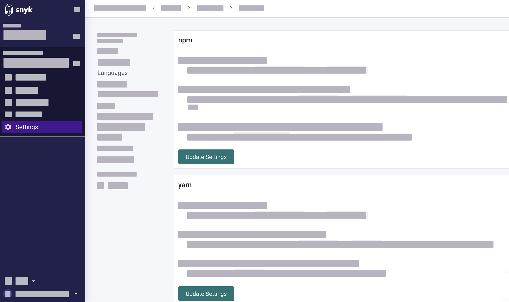

# JavaScript

## Supported frameworks and package managers

### Code analysis

Snyk Code supports the following frameworks:

* React
* Vue.js
* Express
* jQuery
* Angular
* NodeJS

### Open source and licensing


Before testing your Open Source Project for vulnerabilities, with limited exceptions, you must **build your Project**. For details, see [Open Source Projects that must be built before testing with the Snyk CLI](../../../snyk-cli/scan-and-maintain-projects-using-the-cli/snyk-cli-for-open-source/open-source-projects-that-must-be-built-before-testing-with-the-snyk-cli.md).


Snyk Open Source provides full support for both npm and Yarn, as outlined below.

#### npm

The following table shows the npm lockfile versions and Snyk features availability matrix.

| Lockfile version | CLI support | Git support | License scanning | Fix PRs |
| ---------------- | ----------- | ----------- | ---------------- | ------- |
| Lockfile v1      | ✔︎          | ✔︎          | ✔︎               | ✔︎      |
| Lockfile v2      | ✔︎          | ✔︎          | ✔︎               | ✔︎      |
| Lockfile v3      | ✔︎          | ✔︎          | ✔︎               | ✔︎      |

**Peer dependencies**

In npm v7 and above, the behavior of **peer dependencies** changes if they are being installed by default. To match this in npm v7+ Projects, Snyk assumes peer dependencies are installed and scans them by default.

The only case in which an npm v7+ Project ignores peer dependencies is if they are explicitly marked as optional in the `peerDependenciesMeta` object in the `package.json` as shown here for `cache-manager`:

```json
{
    ...
    "peerDependenciesMeta": {
        "cache-manager": {
            "optional": true
        }
    },
    ...
}
```

In npm v6 and below, peer dependencies are not scanned by default, as the package manager does not install them by default. To scan peer dependencies, make sure they are installed, and then run the CLI with the `--peer-dependencies` option.

**Lockfile versions**

Snyk uses the `package-lock.json` lockfile when present to generate a dependency tree for your Project. These lockfiles come in different versions.

Lockfile v1 was used in npm v5 and v6. Two new formats were introduced in npm v7 - lockfile v2 and lockfile v3 (see [lockfileVersion](https://docs.npmjs.com/cli/v9/configuring-npm/package-lock-json#lockfileversion)).

You can see which lockfile format you are using in the `package-lock.json`, as follows:

```json
{
    ...
    "lockfileVersion": 3,
    ...
}
```

If you want to force npm to create a specific lockfile version, use the npm `--lockfile-version` parameter.

```bash
npm install --lockfile-version=2
```

#### **Yarn**

Snyk uses the Yarn lockfile (`yarn.lock`) to generate a representation of Project dependencies.

The files Snyk relies on to scan a Project may change on version upgrades of the package manager. Snyk lists only versions verified internally as supported.

If you are using a newer version of Yarn than is listed on this page, you may find Snyk performs as expected because Yarn is using a lockfile version that is already supported. That version of Yarn has likely not been evaluated and, thus, not added to this page.&#x20;

The following table shows the Yarn versions and Snyk features availability matrix.

| Yarn Version | CLI support | Git support | License scanning | Fix PRs |
| ------------ | ----------- | ----------- | ---------------- | ------- |
| Yarn 1       | ✔︎          | ✔︎          | ✔︎               | ✔︎      |
| Yarn 2       | ✔︎          | ✔︎          | ✔︎               | ✔︎      |
| Yarn 3       | ✔︎          | ✔︎          | ✔︎               | ✔︎      |


Because different versions of Yarn have different feature sets, there are differences in Snyk support in order to match how the package manager works.

**Resolutions** are supported in Yarn v2 and above. Yarn v1 resolutions are not supported.


#### Partially supported package managers

Snyk currently does not fully support **Lerna**. If your Project is set up using Yarn Workspaces, you can scan the Project in the same way you scan any Yarn Workspaces Project.

If your Lerna Project is set up using Yarn Workspaces, you can run `snyk test` and `snyk monitor` as follows:

For each example package, you can use the following:

<pre class="language-javascript"><code class="lang-javascript"><strong>snyk monitor --file=packages/example-package/package.json
</strong></code></pre>

Alternatively, you can specify a script to automate scanning of nested `package.json` files:

```javascript
ls packages | xargs -I PKG_NAME snyk monitor --file=packages/PKG_NAME/package.json
```

#### Open source policy

To manage licenses from your developer workflows through policy, see the following topics:

* [Defining a secure open source policy](https://snyk.io/series/open-source-security/open-source-policy/)
* [Use Snyk security policies to prioritize fixes more efficiently](https://snyk.io/blog/snyk-security-policies/)

#### Open source license compliance

To check compliance for open source licenses, see [Getting Started with Snyk License Compliance Management](https://docs.snyk.io/scan-application-code/snyk-open-source/licenses/getting-started-snyk-licensing-compliance).

## Getting started with Snyk for Javascript across environments

### Snyk CLI&#x20;

#### Prerequisites

* [Create a Snyk account](../../quickstart/create-or-log-in-to-a-snyk-account.md)
* [Install Snyk CLI and authenticate your machine](../../../snyk-cli/getting-started-with-the-snyk-cli.md#install-the-snyk-cli-and-authenticate-your-machine)
* [Set the default Organization for all Snyk tests](../../../snyk-cli/scan-and-maintain-projects-using-the-cli/snyk-cli-for-snyk-code/set-the-snyk-organization-for-the-cli-tests.md) (code analysis)

#### Code analysis

To start testing your code using Snyk Code open your repository in a terminal and run the following  command:

```javascript
snyk code test
```

To customize test options, run other commands, exclude directories and files, and explore the results in different formats, see the following:

* [Snyk CLI commands](../../../snyk-cli/commands/#available-commands)
* [Exclude directories and files from the Snyk tests](../../../snyk-cli/scan-and-maintain-projects-using-the-cli/snyk-cli-for-snyk-code/exclude-directories-and-files-from-snyk-code-cli-tests.md)
* [Explore test results in a JSON or SARIF format in the terminal ](../../../snyk-cli/scan-and-maintain-projects-using-the-cli/snyk-cli-for-snyk-code/view-snyk-code-cli-results.md#output-test-results)
* [Exporting the test results to a JSON or SARIF file](../../../snyk-cli/scan-and-maintain-projects-using-the-cli/snyk-cli-for-snyk-code/view-snyk-code-cli-results.md#export-test-results)

#### Open source and licensing

The following table lists the steps to start scanning your dependencies. It covers basic commands, such as `snyk test` and `snyk monitor`. To check the full list, see [CLI commands and options summary](../../../snyk-cli/cli-commands-and-options-summary.md).


To scan your dependencies, ensure you install the relevant package manager and that your Project contains the supported manifest files.


| Package manager | Getting started                                                                                                                                                                                                                                                                                                                                                                                                                                                                                                                               | Description                                                                                                                                                                                                                                                    |
| --------------- | --------------------------------------------------------------------------------------------------------------------------------------------------------------------------------------------------------------------------------------------------------------------------------------------------------------------------------------------------------------------------------------------------------------------------------------------------------------------------------------------------------------------------------------------- | -------------------------------------------------------------------------------------------------------------------------------------------------------------------------------------------------------------------------------------------------------------- |
| npm             | <ol><li>Install NPM.</li><li>Make sure you are in a directory with NPM Project files, that is, <code>package.json</code> and <code>package-lock.json</code>.</li><li>Run <code>npm install</code>.</li><li>Run <a href="../../../snyk-cli/cli-commands-and-options-summary.md">Snyk commands</a>.</li><li>(Optional) Run command options for <a href="../../../snyk-cli/commands/test.md#options-for-npm-projects">snyk test</a> and <a href="../../../snyk-cli/commands/monitor.md#options-for-npm-projects">snyk monitor</a>.<br></li></ol> | <p>Snyk analyzes your <code>package.json</code> and <code>package-lock.json</code> files to build a fully structured dependency tree. </p><p></p><p>If the <code>package-lock.json</code> is missing, Snyk analyzes your <code>node_modules</code> folder.</p> |
| Yarn            | <ol><li>Install Yarn.</li><li>Make sure you are in a directory with Yarn Project files, that is, <code>package.json</code> and <code>yarn.lock</code>.</li><li>Run <code>yarn</code></li><li>Run <a href="../../../snyk-cli/cli-commands-and-options-summary.md">Snyk commands</a>.</li><li>(Optional) Run command options for <a href="../../../snyk-cli/commands/test.md#options-for-yarn-projects">snyk test</a> and <a href="../../../snyk-cli/commands/monitor.md#options-for-yarn-projects">snyk monitor</a>.</li></ol>                 | <p>Snyk analyzes your <code>package.json</code> and <code>yarn.lock</code> files to build a fully structured dependency tree. </p><p></p><p>If the <code>yarn.lock</code> is missing, Snyk analyzes your <code>node_modules</code> folder.</p>                 |

#### Monorepo Projects

Snyk only scans one manifest file at a time. To scan all manifest files, you can use an argument in the CLI (see [Does the Snyk CLI support monorepos or multiple manifest files?](https://support.snyk.io/hc/en-us/articles/360000910577-Does-the-Snyk-CLI-support-monorepos-or-multiple-manifest-files-)).

**npm workspaces**

NPM v7 introduced the concept of **workspaces**. See [lockfile version and Snyk feature availability matrix](./#npm).&#x20;

**Example**

To detect and scan all workspaces in your npm project, use the `--all-projects` Snyk CLI parameter, as follows:

```javascript
snyk test --all-projects
```

**Yarn workspaces**


`nohoist`is **not** supported by Yarn Workspaces.


For Yarn Workspaces, you can use the following flags:

* `--all-projects` : Test and monitor your packages with other Projects or `--yarn-workspaces` , scanning only Yarn Workspaces Projects. The root lock file is referenced when scanning all the packages.&#x20;
* `--detection-depth` : Find sub-folders that are not auto-discovered by default.
* `--strict-out-of-sync=false` : Relax strict synchronization requirements for packages in a Yarn workspace. When set to `false` , you can run Snyk tests with unsynchronized `package.json` and the `package-lock.json` files without throwing errors. Using different dependency versions can introduce potential risks, such as compatibility issues or security vulnerabilities.
* `--policy-path` : Specify the path to a policy used by Snyk during testing.


For Yarn Workspaces, only the `package.json` file is updated for Snyk Fix PRs. The `yarn.lock` file is not updated.


**Examples**&#x20;

Scan the packages that belong to any discovered workspaces in this directory, five deep sub-directories, and any other Projects detected.

```javascript
snyk test --all-projects --strict-out-of-sync=false --detection-depth=6 
```


Scan only the Yarn Workspace packages that belong to any discovered workspaces in this directory and five deep sub-directories.

```javascript
snyk test --yarn-workspaces --strict-out-of-sync=false --detection-depth=6
```


Use a common `.snyk` policy file, if you maintain ignores and patches in one place to be applied for all detected workspaces by using the policy path (see [The .snyk file](../../../manage-risk/policies/the-.snyk-file.md)).

```javascript
snyk test --all-projects --strict-out-of-sync=false --policy-path=src/.snyk
```

### Snyk Web UI (Git repository integration)

You can import JavaScript repositories from any Git services (Source Control Managers) Snyk supports (see [Git repositories](../../../snyk-scm-ide-and-ci-cd-integrations/git-repositories-scms-integrations-with-snyk/)). After the import, Snyk analyzes your Projects based on their supported manifest files.

Navigate to the [How Snyk works for open source and licensing](../technical-specifications.md#how-snyk-works-for-open-source-and-licensing) page for more details.

#### Import Project

To import Projects from a Git repository integration:

1. Open Snyk Web UI and go to your Group and Organization.
2. Go to **Projects**.&#x20;
3. Click **Add Projects**, select the import source, and choose the repository\
   \
   If you have an integrated Git repository (GitHub) it shows up as an option to choose from.

Navigate to the [Import a Project](../../quickstart/import-a-project.md) page for more details.

#### Configure language settings for open source&#x20;

Configure language settings for your open source and licensing at the Organization level. The configuration settings apply to all Projects in that Organization.

1. Open Snyk Web UI and go to **Settings >** **Languages** section.
2. Under **Languages**, go to **JavaScript** and select **Edit settings.**
3. Configure the settings based on your package manager, **npm** or **Yarn**.

* [ ] **Scan and fix dev dependencies**: If this is selected, Snyk reads the `devDependencies` property on the `package.json` and reports and fixes any vulnerabilities accordingly.
* [ ] **Require package.json and package-lock.json/yarn.lock files to be in sync**: When this is selected, if the `package.json` and `package-lock.json`/`yarn.lock`files are out-of-sync, Snyk fails the import.
* [ ] **Exclude package-lock.json from being generated when fixing vulnerabilities**: If you are using private mirrors or registries, a Snyk-generated lockfile might not be appropriate for you because Snyk uses the npm registry to update the lockfile. This setting allows you to opt out of getting lockfiles generated for you in Snyk fix pull requests and merge requests.

4. **Update Settings** to save changes.

<figure><figcaption><p>JavaScript language settings for open source and licensing</p></figcaption></figure>

#### Workspaces


Yarn and npm workspaces are not explicitly supported in Snyk git repository integration scans.


Root-level `package.json`manifest files with adjacent lockfiles will be scanned as normal.&#x20;

For nested manifest files with no lockfiles Snyk will approximate what the tree will look like at build time without using the root lockfile.

#### Fix PRs and npm save-prefix

When creating a fix for vulnerabilities using npm v7+ Projects, Snyk will use the default npm `save-prefix` rather than inferring it from your Project.

This means if you have dependencies using a range format other than the caret range (`^`), you may see additional changes to the `version` fields in the `package-lock.json` file.&#x20;

These changes should not affect day-to-day functionality, as the ranges will be read from the `package.json`.

#### Fix PRs for Yarn zero-installs users

In Yarn v2, the [zero-installs](https://yarnpkg.com/features/zero-installs) feature was released, which allowed Yarn developers to work on a Project without having to run `yarn` to install dependencies on their machine.&#x20;

Zero-installs achieved this by installing all the dependencies of a Project inside of the `.yarn/cache` directory and asking users to commit this to their version control system , allowing the next developer to pull any new dependencies directly from the repo.


If you use the **zero-installs** feature, Snyk Fix PRs do not update the **.yarn/cache** directory. You must run `yarn` to update this directory.


#### What's next?

* [Open a Fix PR](./#open-a-fix-pr)&#x20;
* [Configure PR Checks](../../../scan-with-snyk/pull-requests/pull-request-checks/configure-pull-request-checks.md)

### Snyk integrations&#x20;

For integrated development environments, see [Use Snyk in your IDE](../../../snyk-scm-ide-and-ci-cd-integrations/use-snyk-in-your-ide/).

If you prefer continuous integration/continuous delivery workflows, you can scan with Snyk based on the integration with your automation software (see [Snyk CI/CD](../../../snyk-scm-ide-and-ci-cd-integrations/snyk-ci-cd-integrations/) and [Snyk API](../../../snyk-api/)).

## Best practices

To apply best practices for Javascript environments, see [Best practices for Javascript](best-practices-for-javascript-and-node.js.md).

## Troubleshooting

If you need help, [contact Snyk Support](https://support.snyk.io/hc/en-us).&#x20;
