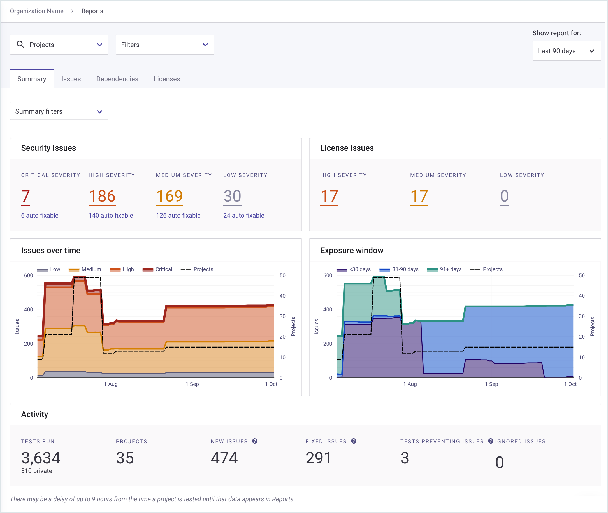

# Manage team work using Reports


**Recap**\
You have seen how to view your Snyk Projects, understand Snyk scan results, fix vulnerabilities, and integrate fix work into your development workflow.


This section describes how to monitor fix work, using [Snyk Reports](../../manage-issues/reporting/legacy-reports/).

## View reports


**Feature availability**\
Reports are available with Enterprise plans. See [pricing plans](https://snyk.io/plans/) for more details.


Click **Reports** to access the vulnerability information for all Snyk Projects in your Organization:

<figure><figcaption>
An overview of Snyk Project vulnerabilities in Reports
</figcaption></figure>


By default, results are shown for the last 90 days: use the **Show report for:** list in the top right to change the duration.


## Report Security issues

The **Security Issues** section shows the number of vulnerabilities, their type, and how many of them Snyk identifies as automatically fixable with an upgrade PR (see [Fix your first vulnerability](fix-your-first-vulnerability.md)).

<figure><figcaption>
Security issues in Reports
</figcaption></figure>

## Show issues over time

The **Issues over time** graph shows the history of vulnerabilities in your Organization:

<figure><figcaption>
View issues over time
</figcaption></figure>

This shows the number of overall vulnerabilities, and the number of Projects being scanned (the dotted line in the graph).

### Why do numbers increase?

If you simply see more vulnerabilities in your codebase over time, this may not accurately reflect your team's work to improve security.

For example, the total number of vulnerabilities is likely to rise when you add more Projects. The graph may display that linkage - when you see jumps in the total numbers of vulnerabilities, you may see corresponding jumps in the total numbers of Projects:

<figure><figcaption>
More Projects, more issues
</figcaption></figure>

### Security metric: ratio of vulnerabilities to Projects

Instead of measuring the total numbers of issues, one useful overall security metric is to compare the number of vulnerabilities with the number of Projects being scanned, and use this ratio as a measure of overall security.

For example, if you double the number of Projects you scan, but only add 10% to the total number of vulnerabilities, your general security is likely to improve. Alternatively, if you see an increase in the number of vulnerabilities, but no increase in the number of Projects being scanned (perhaps because a new vulnerability is discovered in an existing open-source library), then your security is likely to be getting worse.

## View snapshot summary

You can hover over a date to see the summary of “to this date” information at that point:

<figure><figcaption>
View a snapshot summary
</figcaption></figure>

This is especially useful when you see sudden changes in issue numbers on a specific day.

## View activity

The **Activity** section shows the activity over the report period:

<figure><figcaption>
View activity in Reports
</figcaption></figure>

For the reporting period (90 days by default), this activity shows:

* **Tests Run**: the number of tests run. By default, Snyk scans each open source Project daily, so an Organization with 100 projects would generate 9,000 scans over 90 days.
* **Projects**: the number of Snyk Projects scanned.
* **New issues**: new issues detected.
* **Fixed issues**: the vulnerabilities fixed by your team.
* **Tests preventing issues**: occasions when the team attempted to merge code changes, but Snyk scans informed the team that these changes would have created new issues, so helping prevent new security issues.
* **Ignored issues**: a team member decided to ignore that issue.

## Filter search results

If you have many Projects to manage and organize in your Organization, you can use filters to focus on specific Projects or specific types of vulnerability:

<figure><figcaption>
Filter reports on Project or vulnerability
</figcaption></figure>

For example, if your Organization represents your development team, and you want to focus on front-end work in the next Sprint, click the **Projects** dropdown and select a subset of the front-end Projects to scan.


**Why so many Projects?**\
Remember, a Snyk Project represents a single scan item, such as a manifest file. So your application may contain hundreds of Snyk Projects to scan.


For Open Source vulnerabilities, we also have tagging, which lets you add your own tags, including custom values for metadata. See [Project tags](../../snyk-admin/introduction-to-snyk-projects/project-tags.md) and [Project attributes](../../snyk-admin/introduction-to-snyk-projects/project-attributes.md).

## Dashboard results and report results

Filtering results in Reports means that your Dashboard view may show different numbers to your Reports screen.

For example, by default, Snyk does not scan the Dockerfile in the filter, it scans the docker images themselves:

<figure><figcaption>
Dockerfile not scanned by default
</figcaption></figure>

This is because, when Snyk scans the Dockerfile, there will be vulnerabilities in the base OS in the container that you are building. Because these vulnerabilities cannot generally be fixed by your development team, this filtering lets your team focus on the issues that they can fix.


To see a report across all your Organizations, navigate to the Snyk Group level and look at reports there.


## Reports: Issues

Click the **Issues** tab to see a full list of all issues for your Organization:

<figure><figcaption>
Reports Issues tab
</figcaption></figure>

Issues are ranked by their Snyk Priority Score; you can also filter based on columns. For example, you may want to look at the highest scores with the most maturity (which are likely to have more exploits). You can also track the list of issues that got fixed.

Click **Export** to export or print these results.


You cannot currently export charts and data in the reports summary page.


## More information

See [Reports](../../manage-issues/reporting/legacy-reports/) for more details.

## What's next?

This concludes this walkthrough.

Please refer to the Snyk documentation in general for more information.
