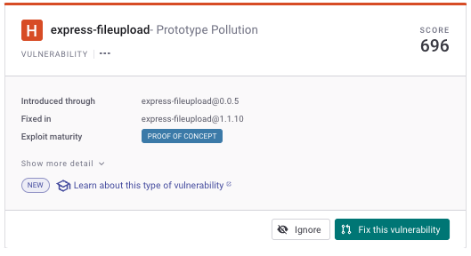
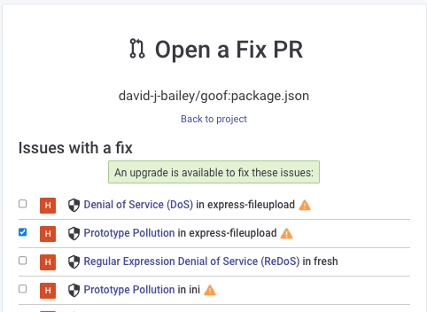

# Fix your first vulnerability


**Recap**\
You have [viewed Snyk Projects](view-your-first-snyk-projects.md) and [understood their vulnerabilities](understand-your-vulnerabilities.md).


You can now start to resolve these vulnerabilities.

## How can I resolve an issue?

When we open a Snyk Project file, we see the list of issues Snyk has found in this Project, and we can research each issue, using Snyk and other sources of information.

Different actions may be available for each vulnerability:

* Fix the vulnerability immediately, by raising a Fix PR. See ["Fix this vulnerability" function](fix-your-first-vulnerability.md#fix-this-vulnerability-function).
* Ignore the vulnerability, permanently or temporarily. See [Ignore the vulnerability](fix-your-first-vulnerability.md#ignore-the-vulnerability).
* Assign the vulnerability to research and fix (see [Assign fix work](assign-fix-work.md) and [Fix your first vulnerability - deeper dive](fix-your-first-vulnerability-deeper-dive.md))


Snyk fix functions available depend on the vulnerability and the type of scanning.


### Fix this vulnerability function


**Reminder**\
We use GitHub in this example, most other supported Git code repository integrations work in a similar way. See [Git repository integrations (SCMs)](../../integrate-with-snyk/git-repositories-scms-integrations-with-snyk/) for details.


For vulnerabilities in open-source libraries, Snyk provides an option to create a Pull Request (PR) to upgrade dependencies to the latest version of a package. This **upgrade PR** will fix the vulnerability, removing it from your code.

Access this function using the **Fix this Vulnerability** button on the issue card:

<figure><figcaption>
Click Fix this vulnerability to create a PR
</figcaption></figure>

Snyk then prompts you to confirm your vulnerability selection:

<figure><figcaption>
Open a Fix PR for a vulnerability
</figcaption></figure>

Your PR is selected by default, but you may wish to raise a PR to upgrade other libraries by selecting them


This list of all fixes may be overwhelming - you may only want to fix the vulnerability you’ve done the research on and know about.


Finally, click **Open a fix PR** at the bottom of that screen to generate a fix PR:

<figure><figcaption>
Generate the fix PR for your vulnerability
</figcaption></figure>

You can then manage this change as you would for any standard code PR in your development process.

### More information

* **Docs**: See [Fixing vulnerabilities](https://docs.snyk.io/snyk-open-source/open-source-basics/fixing-vulnerabilities) for an overview, and [Fixing and prioritizing issues](https://docs.snyk.io/fixing-and-prioritizing-issues) for more details.
* **Training**: see [Fix PRs](https://learn.snyk.io/lesson/fixing-issues).

## Ignore the vulnerability

Snyk also provides an option to ignore a vulnerability, temporarily or permanently; for example, if you think it may not affect your code, or that is is a false positive. If you select to ignore a vulnerability, it does not appear in subsequent scans for that Snyk Project.

To ignore a vulnerability, click the **Ignore** button on the issue card:

<figure><figcaption>
Click Ignore to ignore a vulnerability
</figcaption></figure>

## Fix issues for other types of scans

This example showed you how to apply a fix to an open-source vulnerability. Depending on what items you scan, you can use other Snyk products to resolve issues:

* For scan items built into a container, such as a Docker file, see [Analysis and fixes for your images from the Snyk Web UI](../../scan-using-snyk/snyk-container/use-snyk-container-from-the-web-ui/analyze-and-fix-container-images.md).
* For Kubernetes deployment files, terraform and other IaC files, see [Getting started with current IaC](../../scan-using-snyk/scan-infrastructure/getting-started-with-current-iac.md).
* To scan your team's own code, see [Exploring the Fix analysis page](https://docs.snyk.io/products/snyk-code/exploring-and-working-with-the-snyk-code-results/exploring-the-vulnerability-issues-discovered-by-snyk-code/exploring-the-data-flow-and-fix-analysis-pages-of-an-issue/exploring-the-fix-analysis-page).

## More information and next step

For information about determining which issues to fix, see [Ignore issues](https://docs.snyk.io/features/fixing-and-prioritizing-issues/issue-management/ignore-issues) in the documentation and the [Ignore strategies](https://learn.snyk.io/lesson/ignoring-issues/) training video.

The example on this page shows how to make a simple upgrade to a dependency, based on Snyk advice. Fixes can often be more complex than this.

Continue by [taking a deeper dive](fix-your-first-vulnerability-deeper-dive.md) into fixing a vulnerability in your code.
