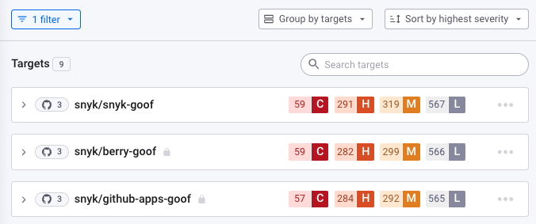

# View your first Snyk Projects

After you have imported one or more Projects, you can see the results of your scans.


In the Snyk Web UI, you see information specific to your Organization, such as your team), which is under a Group, such as your company. This allows your company to organize and collect data for the work your teams are doing. For more information, see [Manage users in an Organization](../../admin/groups-and-organizations/organizations/manage-users-in-organizations.md).


## View imports

In the Snyk Web UI, navigate to your **Projects** page and examine your imported repositories or Targets if you are importing non-code information. An example follows.

<figure><figcaption>
List of imported Targets
</figcaption></figure>

For each entry, the icon shows the number of Snyk Projects in each entry, plus the Git-based repository the Projects are imported from.

## Private versus public repositories: the lock symbol

When [setting up your GitHub integration](../../scm-ide-and-ci-cd-integrations/snyk-scm-integrations/github.md), you can choose whether Snyk has access to public and private repositories or public repositories only:

<figure><figcaption>
Set whether Snyk will have access to a private repository
</figcaption></figure>

When you import a Project, private repositories are identified with a lock symbol in the imported scan details:

<figure><figcaption>
Private repos with lock symbol
</figcaption></figure>

For customers on free plans, private repository scans count toward your test count limit.


Typically, team leads do the original integration setup and Project import, rather than individual developers.


## View lists of Projects

When you open an entry, you see the different Snyk Projects scanned in that entry.


**Reminder: what is a Project?**\
A Snyk Project is an item scanned by Snyk; for example, a manifest file listing all your open-source libraries as dependencies. See [Snyk Projects](../../admin/snyk-projects/).


An example follows:

<figure><figcaption>
List of scanned Projects
</figcaption></figure>

## Understand Project information

### Why are there several items here? What do they mean? Which should I use?

When you import Snyk Projects for the first time, you see a lot of information. As you examine the information, you will see how to use it.

When you write your application, you may write your own code, import Open Source libraries with dependencies, and build all of that into a container for deployment.

Snyk scans different parts of this lifecycle, with different icons and entries showing the results for each of these parts of your work, including:

| Example                                                                                         | Description                                                                                                                                                                                                                            |
| ----------------------------------------------------------------------------------------------- | -------------------------------------------------------------------------------------------------------------------------------------------------------------------------------------------------------------------------------------- |
|                    | Your own code analysis results, scanned by[ Snyk Code](../../scan-with-snyk/snyk-code/).                                                                                                                                               |
|  | Your open-source libraries, scanned by [Snyk Open Source](../../scan-with-snyk/snyk-open-source/), with a resulting display of each detected manifest, such as **pom.xml**, **package.json**, and other manifests for these libraries. |
|                    | Container results, scanned by [Snyk Container](../../scan-with-snyk/snyk-container/), for items built into a container, such as a Docker file.                                                                                         |
|            | Kubernetes deployment files, terraform and other IaC files, scanned by [Snyk Infrastructure as Code (IaC)](../../scan-with-snyk/snyk-iac/scan-your-iac-source-code/).                                                                  |


Other files and types can be displayed; see [View Project information](../../admin/snyk-projects/project-information.md) for more details.


### View Project settings

Snyk treats each item in this list as a separate **Project**.

This allows you to control settings for that Project by clicking on the cog icon to define how that Project is scanned:

<figure><figcaption>
Click cog icon to edit Project settings
</figcaption></figure>

For example, you can change scan frequency, setting how often scans are run by default. See [View Project Settings](https://docs.snyk.io/introducing-snyk/introduction-to-snyk-projects/view-project-settings) for more information.

### Scan results

Look back at the results of your scan:

<figure><figcaption>
Project scan results
</figcaption></figure>

The scan shows all the vulnerabilities in all aspects of your application. Of course, it is unlikely that you are responsible for every entry in this list, but it is important to be aware of the full picture.

If your Snyk Open Source scan shows no vulnerabilities in your open-source libraries, that is great, but there may still be a lot of issues identified by other scans, such as of your container. Even if the developers in your team did not create or manage these issues, you should know about them.

## More information and next step

Refer to the course [Introduction to the Snyk UI](https://learn.snyk.io/lesson/intro-to-snyk-ui/) to learn more about reviewing results from open-source, code, container, and infrastructure file scans.

Now you understand the results you are seeing, you must [understand the vulnerabilities](understand-your-vulnerabilities.md) themselves.
