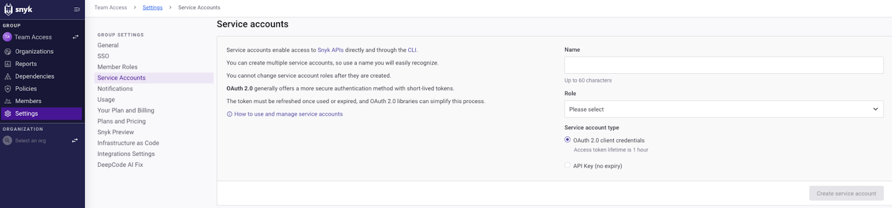
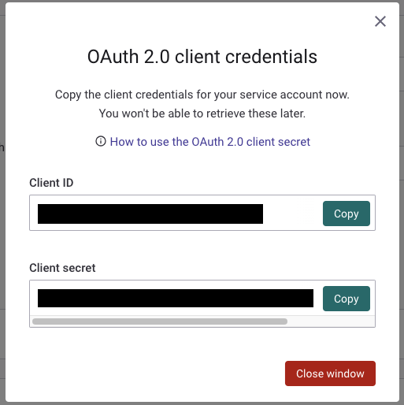
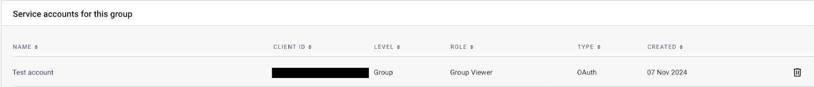
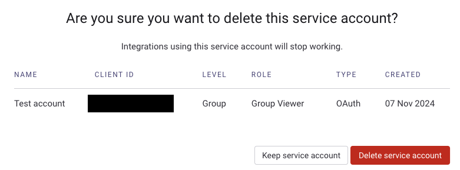

# Service accounts using OAuth 2.0


**Feature availability**\
Service accounts using OAuth 2.0 are available only with Enterprise plans through the Snyk  API. For more information, see [Manage service accounts using the Snyk API](manage-service-accounts-using-the-snyk-api.md).


You can create service accounts that authenticate with the [Auth 2.0 `client_credentials` grant flow](https://datatracker.ietf.org/doc/html/rfc6749#section-4.4) rather than with the Snyk API key. OAuth 2.0 access tokens can be used the same way a Snyk API key would be used, but they have the added security of a short time-to-live (TTL) and can be automatically refreshed.

## OAuth 2.0 with client secret

You can create an `oauth_client_secret` service account at either the Group or Organization level by calling the API endpoint [Create a service account for an organization](../../../snyk-api/reference/serviceaccounts.md#orgs-org_id-service_accounts) or [Create a service account for a group](../../../snyk-api/reference/serviceaccounts.md#groups-group_id-service_accounts), or through the Snyk Web UI.&#x20;

The response returns the `client_secret` and the `client_id`.  You cannot view the `client_secret` again after the service account is created. If you have misplaced it, you can [rotate](manage-service-accounts-using-the-snyk-api.md#manage-a-service-account-client-secret-for-your-group) your `client_secret` and receive a new one.


Never share the `client_secret` publicly, as this is used to authenticate your service account. Keep it secure and private.


### Retrieve an OAuth 2.0 access token

After the service account is created, you can retrieve an `access_token` through the OAuth 2.0 endpoint [Request an access token](../../../snyk-api/oauth2-api.md#token) using the `client_secret`. The body format and `Content-Type` header must be form-urlencoded.

You can use an`access_token` the same way as you would use a Snyk API key, but with the `Authorization: bearer $access_token` header or the `SNYK_OAUTH_TOKEN` environment variable with the Snyk CLI.

The `access_token` has a short time-to-live and must be refreshed once it expires. There are many OAuth 2.0 libraries available that greatly simplify this process.

### Authenticate with the Snyk CLI

You can also use the `client_secret` and the `client_id` to authenticate with the Snyk CLI. For details, see the [`snyk auth`](../../../developer-tools/snyk-cli/commands/auth.md) command help.

## Create OAuth service accounts through the UI

In addition to creating and managing OAuth service accounts through the API, you can create OAuth-based service accounts through the Web UI. The steps follow.


Note: you cannot modify the lifetime of an OAuth service account through the UI, but you can perform this action through the API. &#x20;


1. In the Group settings section, select **Service Accounts**.&#x20;

<figure><figcaption>
Service accounts settings
</figcaption></figure>

2. In the **Service accounts** settings, enter the name for your service account in the **Name** field, and then select a **Role** for your service account from the **Role** dropdown.&#x20;
3.  Select the **OAuth 2.0 client credentials** radio button and click the **Create service account** button.&#x20;

    <figure><figcaption>
OAuth 2.0 client credentials
</figcaption></figure>
4. A window opens, showing your **Client ID** and **Client secret**. Note these credentials and copy them, as you will not be able to retrieve them in the future. After you have copied the credentials to a safe location, click **Close window**.
5.  Your service account will be listed in the service accounts in your Group.&#x20;

    <figure><figcaption>
Service account listed for your Gorup
</figcaption></figure>

## Delete an OAuth-based service account through the UI

1. In the list of the service accounts active in the Group, identify the service account that you want to delete.&#x20;
2. Next to the service account, select the **Delete** button.

&#x20;

<figure><figcaption>
Delete button to delete service account
</figcaption></figure>

3.  A window opens with the prompt **Are you sure you want to delete this service account?** To delete the service account, click the **Delete service account** button.&#x20;

    <figure><figcaption>
Confirmation screen to keep service account or delete sevice account
</figcaption></figure>

Your service account has been deleted.

## OAuth 2.0 with Private Key JWT &#x20;

Service accounts can also use the `private_key_jwt` form of `client_assertion` for authentication, as defined in the [OIDC Core 1.0 spec](https://openid.net/specs/openid-connect-core-1_0.html#ClientAuthentication), rather than the more traditional `client_secret`.

This is an advanced feature for customers who have the infrastructure to host a publicly accessible [JWKS](https://datatracker.ietf.org/doc/html/rfc7517) endpoint and manage public and private signing keys. It creates an added layer of security for OAuth service accounts by requiring access token requests to be sent in the form of signed JWTs rather than with a simple `client_id` and `client_secret` pair in a request body.

### Prerequisites to set up the Private Key JWT service account

Before creating the service account, you must do the following:

* Generate public and private signing keys.
* Host a publicly accessible JWKS endpoint to access the public keys; this must be `https`.

Customer-managed signing keys can be rotated at will.

### Create the Private Key JWT service account

You can create an `oauth_private_key_jwt` service account at either the Group or Organization level by using the Snyk API. To create the service account, you must provide the URL from your publicly accessible JWKS endpoint and the role you wish to assign to the service account. For more information, see [Manage service accounts using the Snyk API](manage-service-accounts-using-the-snyk-api.md).

The response includes the `client_id`, which is needed for the next step.

### Prepare the JWT signed with a private key

Snyk recommends you prepare a tool or script to build a `private_key_jwt` with the proper claims and sign it with the private signing key you generated.

The JWT should include the [claims](https://datatracker.ietf.org/doc/html/rfc7519#section-4) outlined in the [Snyk OAuth 2.0 access token endpoint](../../../snyk-api/oauth2-api.md#token) for the `client_assertion` property. Note that the `aud` claim may vary based on the Snyk instance, for example, `api.snyk.io` or `api.eu.snyk.io`. For more information, see [Regional hosting and data residency](../../../snyk-data-and-governance/regional-hosting-and-data-residency.md).

### Retrieve a Private Key JWT access token

After the service account is created and signed JWT is prepared, you can retrieve an `access_token` using the [Snyk OAuth 2.0 access token endpoint](../../../snyk-api/oauth2-api.md#token). This access token can be used the same way as a Snyk API key would be used. The request body should include the following:

* `grant_type: client_credentials`
* `client_assertion_type: private_key_jwt`
* `client_assertion:` `<signed JWT>`

The `access_token` has a short time to live and must be refreshed once it expires. Many OAuth 2.0 libraries are available that will greatly simplify this process.
