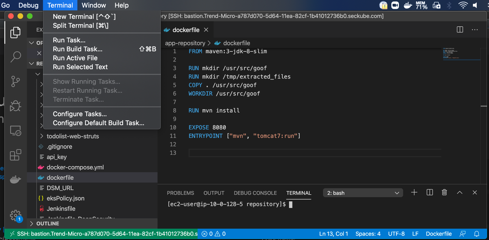
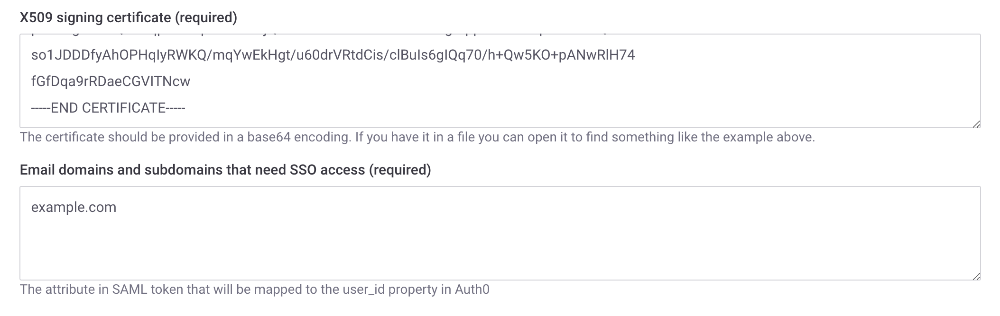
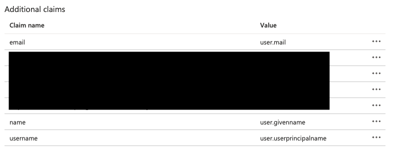

# Entra ID Enterprise application setup

This example shows setting up an Entra ID (formerly Azure AD) Enterprise Application and connecting this to Snyk to facilitate SSO. To configure your Azure Enterprise Application to use SSO with Snyk, first obtain an entity ID and a reply URL (Assertion Consumer Service URL) from Snyk.

1.  From the dropdown at the top left select **GROUP OVERVIEW** and then the cog icon (top right corner) to get to your group settings.

    <figure><figcaption>
Select group overview
</figcaption></figure>
2.  Click on **SSO** and copy the values under **Entity ID** and **ACS URL** or leave the browser tab open for easy access.

    <figure><figcaption>
Group Settings: SSO
</figcaption></figure>
3.  Navigate to Azure and open Entra ID.

    <figure><figcaption>
Entra ID Default Directory
</figcaption></figure>
4.  Click **Add** then **Enterprise application**.

    <figure><figcaption>
Add Enterprise application
</figcaption></figure>
5.  Choose **Create your own application**.

    <figure><figcaption>
Create your own application
</figcaption></figure>
6.  Name the application appropriately, for example, **Snyk-SSO**, making sure that **Integrate any other application you don't find in the gallery (Non-gallery)** is selected and then click **Create**.

    <figure><figcaption>
Application name and integration
</figcaption></figure>
7.  For the new app, select **Set up single sign on** and **Get started**.

    <figure><figcaption>
Set up single sign-on, Get started
</figcaption></figure>
8.  Select **SAML** as the SSO method.

    <figure><figcaption>
Select SAML
</figcaption></figure>
9.  Click **Edit** under **Basic SAML configuration**.

    <figure><figcaption>
Edit basic SAML configuration
</figcaption></figure>
10. Add the Identity (Entity ID) and reply URL (Assertion Consumer Service URL) you obtained from Snyk and click **Save**; then close the edit window.

    <figure><figcaption>
Entity ID and Assertion Consumer Service URL
</figcaption></figure>
11. Scroll to find the login URL needed to finish the configuration in Snyk. Copy it and paste it into the SSO settings in the Snyk portal.

    <figure><figcaption>
Login URL
</figcaption></figure>

    <figure><figcaption>
Sign in URL in Snyk portal
</figcaption></figure>
12. Return to Entra ID and click **Download** next to **Certificate (Base64)**.

    <figure><figcaption>
Download SAML Certificate (Base 64)
</figcaption></figure>
13. Open the downloaded certificate in your preferred text editor, copy the text and paste it into the Snyk **X509 signing certificate** field, and add the relevant domains that are supported by this SSO connection.\
    Finally, verify if an **IdP-initiated workflow** should be enabled and then click **Create Auth0 connection** if you are creating a completely new connection or **Save changes** if you are editing an existing connection.

    <figure><figcaption>
Enter certificate and domains supported, set connection
</figcaption></figure>
14. Decide how new users should be treated when signing in and choose the option you would like to use: **Group member**, **Org collaborator**, or **Org admin**. Finally, modify the **profile attributes** if your settings in Azure deviate from the default; then click **Save changes** and verify you can log in, either with the direct URL at the top of step 3 or by going to the [generic SSO login](https://app.snyk.io/login/sso).\
    \
    If you are not receiving profile values as expected, you may need to add email, name, and username as additional claims within Azure SSO settings and then map those accordingly in the Snyk SSO **Profile attributes** section.

    <figure><figcaption>
Azure claim settings
</figcaption></figure>

    <figure><figcaption>
Profile attributes section
</figcaption></figure>

If you wish to add signature verification of the incoming Snyk request:

1. Download the **Signing certificate** at step 1 of the Snyk SSO settings.
2. Use the following openssl command to convert it to .cer-format `openssl x509 -outform DER -in snyk.pem -out snyk.cer`
3. At the bottom of the **SAML Certificates** settings of your SSO app in Active Directory, click **Edit** next to **Verification certificates.**
4. Check **Require verification certificates** and upload the certificate from the output of the above openssl command and click **Save**.
