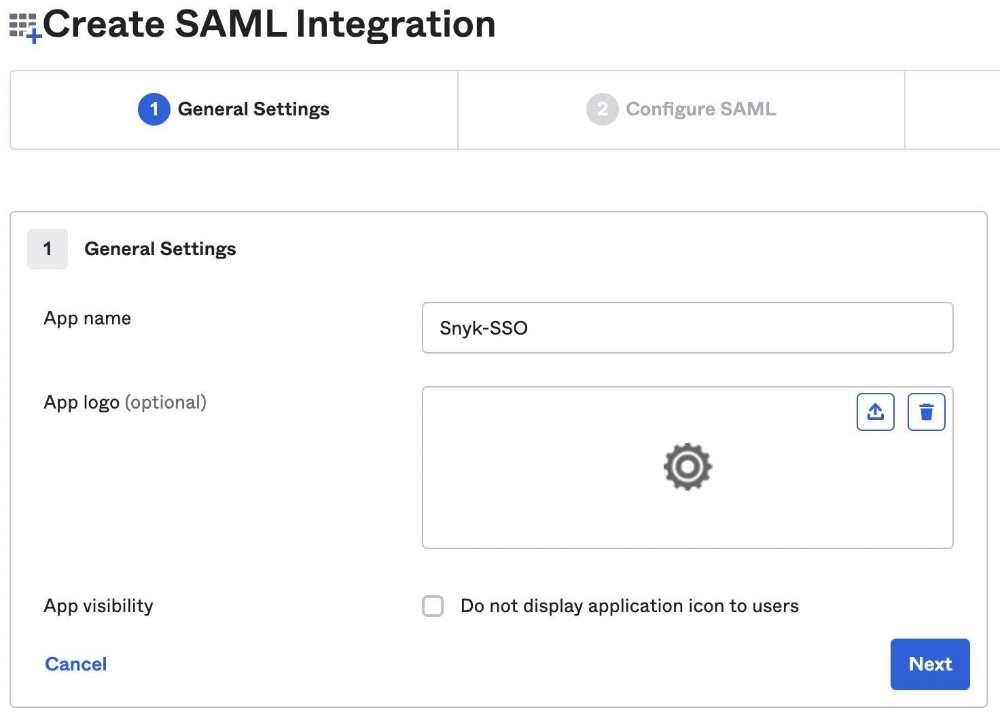

# Okta SAML application setup

This example shows setting up an Okta SAML application and connecting this to Snyk to facilitate SSO. To configure your Okta to use SSO with Snyk, you need an entity ID and a reply URL (Assertion Consumer Service URL) from Snyk.

1.  From the drop-down at the top left select **GROUP OVERVIEW** and then the cog wheel (top right corner) to get to your group settings.

    <figure><figcaption>
Select group overview
</figcaption></figure>
2.  Click on **SSO** and copy the values under **Entity ID** and **ACS URL** or leave the browser tab open for easy access.

    <figure><figcaption>
Group Settings: SSO
</figcaption></figure>
3.  Navigate to [Okta](https://www.okta.com/se/login/), open the application menu, and click on **Create App Integration.**

    <figure><figcaption>
Okta Applications main page
</figcaption></figure>
4.  Choose **SAML 2.0** and name your application appropriately; click **Next**.

    <figure><figcaption>
Okta SAML application creation
</figcaption></figure>
5.  Add the Entity ID and the sign on URL you copied from Snyk to the appropriate fields.

    <figure><figcaption>
Add SSO details in Okta
</figcaption></figure>
6.  Scroll down to **Attribute Statements** and add three attributes named with values as follows:

    * **Name**: email, **Value**: user.email
    * **Name**: name, **Value**: user.firstName + " " + user.lastName
    * **Name**: username, **Value**: user.login

    Click **Next** and enter feedback details if desired or go to the next step.
7. Open your Okta application list again and click on your newly created application and the **Sign on** tab. To the right of the page, click on **View SAML setup instructions** then from the page that opens, copy the **Identity Provider Single Sign-On URL** and the **X.509 certificate**.
8.  Go back to the previous page and go to the **Assignments** tab. Click on **Assign** and choose users, groups, or both according to your needs.

    <figure><figcaption>
Assign the SSO application
</figcaption></figure>
9.  Go back to the Snyk portal, scroll to step 2, and enter the details from step 7, including the domain(s) you wish to use over the SSO connection, verify if an IdP-initiated workflow should be enabled, and then click **Create Auth0 connection.**

    <figure><figcaption>
Snyk SSO step 2
</figcaption></figure>
10. Scroll to step 3 and determine how new users should be treated when signing in. Choose the option you would like to use: **Group member, Org collaborator** or **Org admin**. Finally, enter the profile attributes as you configured them in Okta, click **Save changes** and verify you can log in, either with the direct URL at the top of step 3 or by going to the [generic SSO login](https://app.snyk.io/login/sso).

    <figure><figcaption>
Profile attributes
</figcaption></figure>
