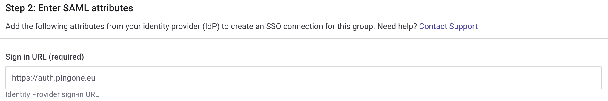

# Ping Identity setup

This page explains how to set up a Ping Identity Application and connect it to Snyk to facilitate SSO.

Before configuring your Ping Identity Application to use SSO with Snyk, obtain an entity ID and a reply URL (Assertion Consumer Service URL) from Snyk. Then follow these steps:

1.  In the left menu, select your **Group**, then **Settings**.

    <figure><figcaption></figcaption></figure>
2.  Select **SSO** and copy the values under **Entity ID** and **ACS URL** or leave the browser tab open for easy access.

    <figure><figcaption>
Group Settings: SSO
</figcaption></figure>
3.  Navigate to Ping Identity and select **Applications** in the **Connections** menu. Click on the plus sign to create a new application.&#x20;

    <figure><figcaption>
Create a new Application
</figcaption></figure>
4.  Name your application appropriately, select **SAML Application**, and click **Configure.**

    <figure><figcaption>
Configure as SAML Application
</figcaption></figure>
5.  Enter the details you copied from Snyk, the **ACS URL** and **Entity ID,** and select **Save**.

    <figure><figcaption>
Add Snyk configuration details
</figcaption></figure>
6.  Select **Configuration** and download the signing certificate in PEM format.

    <figure><figcaption>
Download signing certificate
</figcaption></figure>
7.  Scroll further down and copy the **Single Signon Service** details.

    <figure><figcaption>
Copy the Single Signon Service details
</figcaption></figure>
8.  Return to the the Snyk portal and paste the single sign-in URL copied at step 2 into the **Sign in URL** field. \

    <figure><figcaption>
Paste Sign in URL
</figcaption></figure>
9.  Open the downloaded certificate in your preferred text editor, copy the text and paste it into the Snyk **X509 signing certificate** field, and add the relevant domains that are supported by this SSO connection.\
    Finally, verify if an IdP-initiated workflow should be enabled and then click **Create Auth0 connection** if you are creating a completely new connection or **Save changes** if you are editing an existing connection.&#x20;

    <figure><figcaption>
Enter the Ping Identity details
</figcaption></figure>
10. In Ping Identity, select **Attribute mappings** and click the pencil to edit.

    <figure><figcaption>
Edit attribue mappings
</figcaption></figure>
11. Click the cog icon and add the following attributes:

    **email**: Email Address\
    **username**: Username\
    **name**: the expression `user.name.given + ' ' + user.name.famil`y; click the cog icon to enter an advanced description.&#x20;

    <figure><figcaption>
Add attribute mappings
</figcaption></figure>

    <figure><figcaption>
Add an advanced expression for the name attribute
</figcaption></figure>
12. In the Snyk portal, decide how new users should be treated when signing in and choose the option you would like to use: **Group member**, **Org collaborator**, or **Org admin**.
13. Change the profile attributes to the attribute names you entered in Ping Identity then click **Save changes.**\

    <figure><figcaption>
Step 3 Snyk SSO settings
</figcaption></figure>
14. Verify you can log in, either with the direct URL at the top of **Step 3 Snyk SSO settings** (not shown in the image) or by going to the [generic SSO login](https://app.snyk.io/login/sso).
15. As a final step, enable the application and assign it to users.

    <figure><figcaption>
Enable and assign the application to users
</figcaption></figure>
